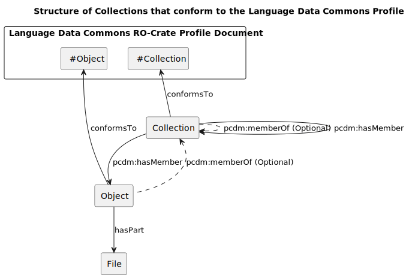
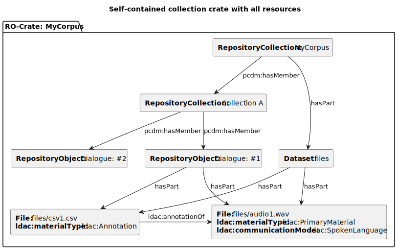
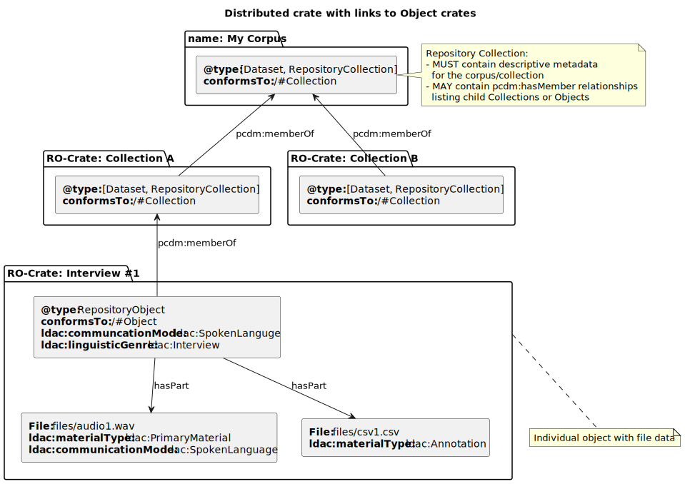
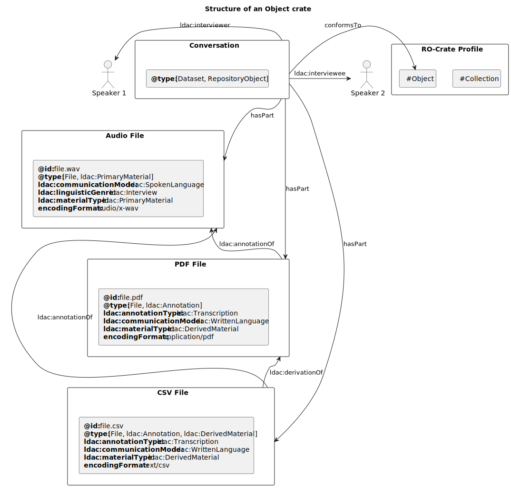

# Language Data Commons RO-Crate Profile

[LDaCA Website →](www.ldaca.edu.au)

This document is a DRAFT RO-Crate profile for Language Data resources. The
profile specifies the contents of RO-Crate Metadata Documents for language
resources and gives guidance on how to structure language data collections both
at the RO-Crate package level and in a repository containing multiple packages.

This profile assumes that the principles and standards set out in the [PILARS protocols](https://w3id.org/ldac/pilars), or similar compatible approaches, are being used.

The core metadata vocabularies for this profile are:

- RO-Crate recommendations for data packaging and basic discoverability metadata,
  which is mostly [Schema.org](https://schema.org/) terms with a handful of additions. Following
  RO-Crate practice, basic metadata terms such as "who, what, where" and
  bibliographic-style descriptions are chosen from Schema.org (in preference to
  other vocabularies such as Dublin Core or FOAF) where possible, with domain-specific
  vocabularies used for things which are not common across domains
  (such as types of language).

- An updated version of the [Open Language Archives Community](http://www.language-archives.org) (OLAC) vocabularies;
  originally expressed as XML schemas. The new vocabulary is under development
  here:
  [https://w3id.org/ldac/terms](https://w3id.org/ldac/terms)

 

# Audience

This document is primarily for use by tool developers, data scientists
and metadata specialists developing scripts or systems for user
communities. It is not intended for use by non-specialists.

Just as we would not expect repository users to type Dublin Core
metadata in XML format by hand, we do not expect our users to have to
deal directly with the JSON-LD presented here. This document is for tool
developers to build systems that crosswalk data from existing systems,
or allow for user-friendly data entry.

 

# About this Profile

This profile covers various kinds of crate metadata:

- **Structural RO-Crate metadata**: how the root dataset links to files, and
  the abstract structure of nested collections (e.g. collections/corpora or other
  curated datasets) and objects of study; linguistic Items, Sessions or Texts).
  This profile assumes that a repository (for example, an OCFL storage root,
  with an API for accessing it) exists and that it can at a minimum support

  (a) listing all items of the repository and returning their RO-Crate metadata, and

  (b) retrieving an item given its ID.

- **Types of language data**: is this resource a dialogue? A written text? A
  transcript or other annotation? Which file has which kind of data in it? What
  is inside CSV and other structured files? The vocabulary used for
  language-specific data is the
  [Language Data Commons vocabulary](https://w3id.org/ldac/terms)
  which is being developed alongside this profile.

- **Contextual metadata**: how to link people who had speaking,
  authoring, collection roles, places, subjects.

 

# Structural Metadata

The structural elements of a Language Data Commons RO-Crate are:

- **A Collection / Object hierarchy** to allow language data to be
  grouped. For example, a corpus with sub-corpora, or collections of
  items (objects) from a particular region.

- **Dataset and File entities** (as per RO-Crate). Files may be referenced
  locally or via URI, for example, from an API. If an RO-Crate contains files, they MUST be linked to the root dataset as per the RO-Crate specification using either:
  - `hasPart` relationships on the object(s), or
  - `isPartOf` relationships on the file(s).

NOTE: The terms Collection and Object
are encoded in RO-Crate metadata using `RepositoryCollection` and
`RepositoryObject` types respectively. These in turn are re-named versions
of the Portland Common Data Model types,
[pcdm:Collection](https://pcdm.org/2016/04/18/models#Collection)
and
[pcdm:Object](https://pcdm.org/2016/04/18/models#Object).

## A conformant RO-Crate:

###  Class: Dataset

A body of structured information describing some topic(s) of interest.

Instances of this type MAY be present in the crate.

| Min Count | Max Count |
| --------- | --------- |
| N/A | N/A |

| Property | Specialization Of | Required | Description | Range | Value |
| -------- | ----------------- | -------- | ----------- | ----- | ----- |
| @type |  | Yes |  |  | <a href="http://schema.org/Dataset" title="http://schema.org/Dataset" target="_blank" rel="noopener">Dataset</a> |
| <a href="#prop_accountablePerson_Dataset" title="#prop_accountablePerson_Dataset">accountablePerson</a> | <a href="http://schema.org/accountablePerson" target="_blank" rel="noopener">http://schema.org/accountablePerson</a> | Yes | The person or organisation who is the data steward for this resource. | <a href="#class_Person" title="#class_Person">Person</a>, <a href="#class_Organization" title="#class_Organization">Organization</a> |  |
| <a href="#prop_author_Dataset" title="#prop_author_Dataset">author</a> | <a href="http://schema.org/author" target="_blank" rel="noopener">http://schema.org/author</a> | Yes | The person or organisation responsible for creating this collection of data. Authors should be identified using URIs such as ORCiD or ROR. | <a href="#class_Person" title="#class_Person">Person</a>, <a href="#class_Organization" title="#class_Organization">Organization</a> |  |
| <a href="#prop_dct:rightsHolder_Dataset" title="#prop_dct:rightsHolder_Dataset">dct:rightsHolder</a> | <a href="http://purl.org/dc/terms/rightsHolder" target="_blank" rel="noopener">http://purl.org/dc/terms/rightsHolder</a> | Yes | The person or organisation owning or managing rights over the resource. | <a href="http://schema.org/Text" title="http://schema.org/Text" target="_blank" rel="noopener">Text</a>, <a href="#class_Person" title="#class_Person">Person</a>, <a href="#class_Organization" title="#class_Organization">Organization</a> |  |
| <a href="#prop_publisher_Dataset" title="#prop_publisher_Dataset">publisher</a> | <a href="http://schema.org/publisher" target="_blank" rel="noopener">http://schema.org/publisher</a> | Yes | The organisation responsible for releasing this dataset. | <a href="#class_Organization" title="#class_Organization">Organization</a> |  |
| <a href="#prop_citation_Dataset" title="#prop_citation_Dataset">citation</a> | <a href="http://schema.org/citation" target="_blank" rel="noopener">http://schema.org/citation</a> | No | Associated publications. | <a href="#class_CreativeWork" title="#class_CreativeWork">CreativeWork</a> |  |
| <a href="#prop_creditText_Dataset" title="#prop_creditText_Dataset">creditText</a> | <a href="http://schema.org/creditText" target="_blank" rel="noopener">http://schema.org/creditText</a> | No | A free text bibliographic citation for this material, e.g. 'Cite as: Musgrave (2023). Title of work. DOI'. | <a href="http://schema.org/Text" title="http://schema.org/Text" target="_blank" rel="noopener">Text</a> |  |
| <a href="#prop_funder_Dataset" title="#prop_funder_Dataset">funder</a> | <a href="http://schema.org/funder" target="_blank" rel="noopener">http://schema.org/funder</a> | No | The organisation(s) responsible for funding the creation or collection of this dataset. | <a href="#class_Organization" title="#class_Organization">Organization</a> |  |
| <a href="#prop_hasPart_Dataset" title="#prop_hasPart_Dataset">hasPart</a> | <a href="http://schema.org/hasPart" target="_blank" rel="noopener">http://schema.org/hasPart</a> | No | An item or CreativeWork that is part of this item, or CreativeWork (in some sense). | <a href="#class_CreativeWork" title="#class_CreativeWork">CreativeWork</a>, <a href="#class_File" title="#class_File">File</a>, <a href="#class_Dataset" title="#class_Dataset">Dataset</a> |  |
| <a href="#prop_isAccessibleForFree_Dataset" title="#prop_isAccessibleForFree_Dataset">isAccessibleForFree</a> | <a href="http://schema.org/isAccessibleForFree" target="_blank" rel="noopener">http://schema.org/isAccessibleForFree</a> | No | This is available under an Open Access license. | <a href="http://schema.org/Boolean" title="http://schema.org/Boolean" target="_blank" rel="noopener">Boolean</a> |  |
| <a href="#prop_isBasedOn_Dataset" title="#prop_isBasedOn_Dataset">isBasedOn</a> | <a href="http://schema.org/isBasedOn" target="_blank" rel="noopener">http://schema.org/isBasedOn</a> | No | Link to or description of an original resource. | <a href="http://schema.org/Text" title="http://schema.org/Text" target="_blank" rel="noopener">Text</a>, <a href="http://schema.org/URL" title="http://schema.org/URL" target="_blank" rel="noopener">URL</a>, <a href="#class_CreativeWork" title="#class_CreativeWork">CreativeWork</a>, <a href="#class_Dataset" title="#class_Dataset">Dataset</a>, <a href="#class_File" title="#class_File">File</a> |  |
| <a href="#prop_isPartOf_Dataset" title="#prop_isPartOf_Dataset">isPartOf</a> | <a href="http://schema.org/isPartOf" target="_blank" rel="noopener">http://schema.org/isPartOf</a> | No | An item or CreativeWork that this item, or CreativeWork (in some sense), is part of. | <a href="http://schema.org/URL" title="http://schema.org/URL" target="_blank" rel="noopener">URL</a>, <a href="#class_CreativeWork" title="#class_CreativeWork">CreativeWork</a> |  |
| <a href="#prop_ldac:annotationOf_Dataset" title="#prop_ldac:annotationOf_Dataset">ldac:annotationOf</a> | <a href="https://w3id.org/ldac/terms#annotationOf" target="_blank" rel="noopener">https://w3id.org/ldac/terms#annotationOf</a> | No | This resource contains some kind of description that adds information to the resource it references. | <a href="#ldac%3APrimaryMaterial" title="ldac:PrimaryMaterial">PrimaryMaterial</a> |  |
| <a href="#prop_ldac:annotator_Dataset" title="#prop_ldac:annotator_Dataset">ldac:annotator</a> | <a href="https://w3id.org/ldac/terms#annotator" target="_blank" rel="noopener">https://w3id.org/ldac/terms#annotator</a> | No | The participant produced an annotation of this or a related resource. | <a href="#class_Person" title="#class_Person">Person</a>, <a href="#class_Organization" title="#class_Organization">Organization</a> |  |
| <a href="#prop_ldac:compiler_Dataset" title="#prop_ldac:compiler_Dataset">ldac:compiler</a> | <a href="https://w3id.org/ldac/terms#compiler" target="_blank" rel="noopener">https://w3id.org/ldac/terms#compiler</a> | No | The participant is responsible for collecting the sub-parts of the resource together. | <a href="#class_Person" title="#class_Person">Person</a>, <a href="#class_Organization" title="#class_Organization">Organization</a> |  |
| <a href="#prop_ldac:consultant_Dataset" title="#prop_ldac:consultant_Dataset">ldac:consultant</a> | <a href="https://w3id.org/ldac/terms#consultant" target="_blank" rel="noopener">https://w3id.org/ldac/terms#consultant</a> | No | The participant contributes expertise to the creation of a work, for example by contributing knowledge of their native language. | <a href="#class_Person" title="#class_Person">Person</a>, <a href="#class_Organization" title="#class_Organization">Organization</a> |  |
| <a href="#prop_ldac:dataInputter_Dataset" title="#prop_ldac:dataInputter_Dataset">ldac:dataInputter</a> | <a href="https://w3id.org/ldac/terms#dataInputter" target="_blank" rel="noopener">https://w3id.org/ldac/terms#dataInputter</a> | No | The participant responsible for entering, re-typing, and/or structuring the data contained in the resource. | <a href="#class_Person" title="#class_Person">Person</a>, <a href="#class_Organization" title="#class_Organization">Organization</a> |  |
| <a href="#prop_ldac:depositor_Dataset" title="#prop_ldac:depositor_Dataset">ldac:depositor</a> | <a href="https://w3id.org/ldac/terms#depositor" target="_blank" rel="noopener">https://w3id.org/ldac/terms#depositor</a> | No | The participant responsible for depositing the resource in an archive. | <a href="#class_Person" title="#class_Person">Person</a>, <a href="#class_Organization" title="#class_Organization">Organization</a> |  |
| <a href="#prop_ldac:developer_Dataset" title="#prop_ldac:developer_Dataset">ldac:developer</a> | <a href="https://w3id.org/ldac/terms#developer" target="_blank" rel="noopener">https://w3id.org/ldac/terms#developer</a> | No | The participant developed the methodology or tools (including software) that constitute the resource, or that were used to create the resource. | <a href="#class_Person" title="#class_Person">Person</a>, <a href="#class_Organization" title="#class_Organization">Organization</a> |  |
| <a href="#prop_ldac:doi_Dataset" title="#prop_ldac:doi_Dataset">ldac:doi</a> | <a href="https://w3id.org/ldac/terms#doi" target="_blank" rel="noopener">https://w3id.org/ldac/terms#doi</a> | No | A Digital Object Identifier, e.g. https://doi.org/10.1000/182. | <a href="http://schema.org/Text" title="http://schema.org/Text" target="_blank" rel="noopener">Text</a> |  |
| <a href="#prop_ldac:editor_Dataset" title="#prop_ldac:editor_Dataset">ldac:editor</a> | <a href="https://w3id.org/ldac/terms#editor" target="_blank" rel="noopener">https://w3id.org/ldac/terms#editor</a> | No | The participant reviewed, corrected, and/or tested the resource. | <a href="#class_Person" title="#class_Person">Person</a>, <a href="#class_Organization" title="#class_Organization">Organization</a> |  |
| <a href="#prop_ldac:hasCollectionProtocol_Dataset" title="#prop_ldac:hasCollectionProtocol_Dataset">ldac:hasCollectionProtocol</a> | <a href="https://w3id.org/ldac/terms#hasCollectionProtocol" target="_blank" rel="noopener">https://w3id.org/ldac/terms#hasCollectionProtocol</a> | No | A link to a CollectionProtocol object with (at least) a summary of how resources were selected or elicited for this collection/sub-collection. | <a href="#class_ldac:CollectionProtocol" title="#class_ldac:CollectionProtocol">CollectionProtocol</a> |  |
| <a href="#prop_ldac:illustrator_Dataset" title="#prop_ldac:illustrator_Dataset">ldac:illustrator</a> | <a href="https://w3id.org/ldac/terms#illustrator" target="_blank" rel="noopener">https://w3id.org/ldac/terms#illustrator</a> | No | The participant contributed drawings or other illustrations to the resource. | <a href="#class_Person" title="#class_Person">Person</a>, <a href="#class_Organization" title="#class_Organization">Organization</a> |  |
| <a href="#prop_ldac:interpreter_Dataset" title="#prop_ldac:interpreter_Dataset">ldac:interpreter</a> | <a href="https://w3id.org/ldac/terms#interpreter" target="_blank" rel="noopener">https://w3id.org/ldac/terms#interpreter</a> | No | The contributor renders the discourse recorded in the resource into another language in real time, or the contributor explains the discourse recorded in the resource. | <a href="#class_Person" title="#class_Person">Person</a>, <a href="#class_Organization" title="#class_Organization">Organization</a> |  |
| <a href="#prop_ldac:interviewee_Dataset" title="#prop_ldac:interviewee_Dataset">ldac:interviewee</a> | <a href="https://w3id.org/ldac/terms#interviewee" target="_blank" rel="noopener">https://w3id.org/ldac/terms#interviewee</a> | No | The participant was a respondent in an interview. | <a href="#class_Person" title="#class_Person">Person</a>, <a href="#class_Organization" title="#class_Organization">Organization</a> |  |
| <a href="#prop_ldac:interviewer_Dataset" title="#prop_ldac:interviewer_Dataset">ldac:interviewer</a> | <a href="https://w3id.org/ldac/terms#interviewer" target="_blank" rel="noopener">https://w3id.org/ldac/terms#interviewer</a> | No | The participant conducted an interview that forms part of the resource. | <a href="#class_Person" title="#class_Person">Person</a>, <a href="#class_Organization" title="#class_Organization">Organization</a> |  |
| <a href="#prop_ldac:participant_Dataset" title="#prop_ldac:participant_Dataset">ldac:participant</a> | <a href="https://w3id.org/ldac/terms#participant" target="_blank" rel="noopener">https://w3id.org/ldac/terms#participant</a> | No | The participant was present during the creation of the resource, but did not contribute substantially to its content. | <a href="#class_Person" title="#class_Person">Person</a>, <a href="#class_Organization" title="#class_Organization">Organization</a> |  |
| <a href="#prop_ldac:performer_Dataset" title="#prop_ldac:performer_Dataset">ldac:performer</a> | <a href="https://w3id.org/ldac/terms#performer" target="_blank" rel="noopener">https://w3id.org/ldac/terms#performer</a> | No | The participant performed some portion of a recorded, filmed, or transcribed resource. It is recommended that this term be used only for creative participants whose role is not better indicated by a more specific term, such as 'speaker', 'signer', or 'singer'. | <a href="#class_Person" title="#class_Person">Person</a>, <a href="#class_Organization" title="#class_Organization">Organization</a> |  |
| <a href="#prop_ldac:photographer_Dataset" title="#prop_ldac:photographer_Dataset">ldac:photographer</a> | <a href="https://w3id.org/ldac/terms#photographer" target="_blank" rel="noopener">https://w3id.org/ldac/terms#photographer</a> | No | The participant took the photograph, or shot the film, that appears in or constitutes the resource. | <a href="#class_Person" title="#class_Person">Person</a>, <a href="#class_Organization" title="#class_Organization">Organization</a> |  |
| <a href="#prop_ldac:recorder_Dataset" title="#prop_ldac:recorder_Dataset">ldac:recorder</a> | <a href="https://w3id.org/ldac/terms#recorder" target="_blank" rel="noopener">https://w3id.org/ldac/terms#recorder</a> | No | The participant operated the recording machinery used to create the resource. | <a href="#class_Person" title="#class_Person">Person</a>, <a href="#class_Organization" title="#class_Organization">Organization</a> |  |
| <a href="#prop_ldac:researcher_Dataset" title="#prop_ldac:researcher_Dataset">ldac:researcher</a> | <a href="https://w3id.org/ldac/terms#researcher" target="_blank" rel="noopener">https://w3id.org/ldac/terms#researcher</a> | No | The resource was created as part of the participant's research, or the research presents interim or final results from the participant's research. | <a href="#class_Person" title="#class_Person">Person</a>, <a href="#class_Organization" title="#class_Organization">Organization</a> |  |
| <a href="#prop_ldac:researchParticipant_Dataset" title="#prop_ldac:researchParticipant_Dataset">ldac:researchParticipant</a> | <a href="https://w3id.org/ldac/terms#researchParticipant" target="_blank" rel="noopener">https://w3id.org/ldac/terms#researchParticipant</a> | No | The participant acted as a research subject or responded to a questionnaire, the results of which study form the basis of the resource. | <a href="#class_Person" title="#class_Person">Person</a>, <a href="#class_Organization" title="#class_Organization">Organization</a> |  |
| <a href="#prop_ldac:responder_Dataset" title="#prop_ldac:responder_Dataset">ldac:responder</a> | <a href="https://w3id.org/ldac/terms#responder" target="_blank" rel="noopener">https://w3id.org/ldac/terms#responder</a> | No | The participant was an interlocutor in some sort of discourse event, but only reacted to the contributions of others. | <a href="#class_Person" title="#class_Person">Person</a>, <a href="#class_Organization" title="#class_Organization">Organization</a> |  |
| <a href="#prop_ldac:signer_Dataset" title="#prop_ldac:signer_Dataset">ldac:signer</a> | <a href="https://w3id.org/ldac/terms#signer" target="_blank" rel="noopener">https://w3id.org/ldac/terms#signer</a> | No | The contributor was a principal signer in a resource that consists of a recording, a film, or a transcription of a recorded resource. Signers are those whose gestures predominate in a recorded or filmed resource. (The resource may be a transcription of that recording). | <a href="#class_Person" title="#class_Person">Person</a>, <a href="#class_Organization" title="#class_Organization">Organization</a> |  |
| <a href="#prop_ldac:singer_Dataset" title="#prop_ldac:singer_Dataset">ldac:singer</a> | <a href="https://w3id.org/ldac/terms#singer" target="_blank" rel="noopener">https://w3id.org/ldac/terms#singer</a> | No | The participant sang, either individually or as part of a group, in a resource that consists of a recording, a film, or a transcription of a recorded resource. | <a href="#class_Person" title="#class_Person">Person</a>, <a href="#class_Organization" title="#class_Organization">Organization</a> |  |
| <a href="#prop_ldac:speaker_Dataset" title="#prop_ldac:speaker_Dataset">ldac:speaker</a> | <a href="https://w3id.org/ldac/terms#speaker" target="_blank" rel="noopener">https://w3id.org/ldac/terms#speaker</a> | No | The contributor was a principal speaker in a resource that consists of a recording, a film, or a transcription of a recorded resource. Speakers are those whose voices predominate in a recorded or filmed resource. (The resource may be a transcription of that recording). | <a href="#class_Person" title="#class_Person">Person</a>, <a href="#class_Organization" title="#class_Organization">Organization</a> |  |
| <a href="#prop_ldac:sponsor_Dataset" title="#prop_ldac:sponsor_Dataset">ldac:sponsor</a> | <a href="https://w3id.org/ldac/terms#sponsor" target="_blank" rel="noopener">https://w3id.org/ldac/terms#sponsor</a> | No | The participant contributed financial support to the creation of the resource. | <a href="#class_Person" title="#class_Person">Person</a>, <a href="#class_Organization" title="#class_Organization">Organization</a> |  |
| <a href="#prop_ldac:transcriber_Dataset" title="#prop_ldac:transcriber_Dataset">ldac:transcriber</a> | <a href="https://w3id.org/ldac/terms#transcriber" target="_blank" rel="noopener">https://w3id.org/ldac/terms#transcriber</a> | No | The participant produced a transcription of this or a related resource. | <a href="#class_Person" title="#class_Person">Person</a>, <a href="#class_Organization" title="#class_Organization">Organization</a> |  |
| <a href="#prop_ldac:translator_Dataset" title="#prop_ldac:translator_Dataset">ldac:translator</a> | <a href="https://w3id.org/ldac/terms#translator" target="_blank" rel="noopener">https://w3id.org/ldac/terms#translator</a> | No | The participant produced a translation of this or a related resource. | <a href="#class_Person" title="#class_Person">Person</a>, <a href="#class_Organization" title="#class_Organization">Organization</a> |  |
| <a href="#prop_pcdm:hasMember_Dataset" title="#prop_pcdm:hasMember_Dataset">pcdm:hasMember</a> | <a href="http://pcdm.org/models#hasMember" target="_blank" rel="noopener">http://pcdm.org/models#hasMember</a> | No | The sub-collections, if any, associated with this collection. | <a href="#class_RepositoryCollection" title="#class_RepositoryCollection">RepositoryCollection</a>, <a href="#class_RepositoryObject" title="#class_RepositoryObject">RepositoryObject</a> |  |
| <a href="#prop_pcdm:memberOf_Dataset" title="#prop_pcdm:memberOf_Dataset">pcdm:memberOf</a> | <a href="http://pcdm.org/models#memberOf" target="_blank" rel="noopener">http://pcdm.org/models#memberOf</a> | No | Links from a Repository Object or Collection to a containing Repository Object or Collection. | <a href="#class_RepositoryCollection" title="#class_RepositoryCollection">RepositoryCollection</a> |  |
| <a href="#prop_spatialCoverage_Dataset" title="#prop_spatialCoverage_Dataset">spatialCoverage</a> | <a href="http://schema.org/spatialCoverage" target="_blank" rel="noopener">http://schema.org/spatialCoverage</a> | No | The place(s) that are the focus of the content. It is a sub-property of contentLocation intended primarily for more technical and detailed materials. For example, with a dataset, it indicates areas that the dataset describes: a dataset Cape York languages would have spatialCoverage which was the place: the outline of the Cape. | <a href="#class_Place" title="#class_Place">Place</a> |  |
| <a href="#prop_temporalCoverage_Dataset" title="#prop_temporalCoverage_Dataset">temporalCoverage</a> | <a href="http://schema.org/temporalCoverage" target="_blank" rel="noopener">http://schema.org/temporalCoverage</a> | No | The range of years of creation for items in this dataset using a slash, e.g. 1900/1945. If there are sub-collections with different coverages put this on the sub-collections not the top-level. | <a href="http://schema.org/DateTime" title="http://schema.org/DateTime" target="_blank" rel="noopener">DateTime</a>, <a href="http://schema.org/Text" title="http://schema.org/Text" target="_blank" rel="noopener">Text</a> |  |
| <a href="#prop_usageInfo_Dataset" title="#prop_usageInfo_Dataset">usageInfo</a> | <a href="http://schema.org/usageInfo" target="_blank" rel="noopener">http://schema.org/usageInfo</a> | No | Additional information on licensing options for using the data, e.g. 'Contact the Data Steward to discuss license terms'. | <a href="http://schema.org/Text" title="http://schema.org/Text" target="_blank" rel="noopener">Text</a> |  |

 

A collection such as a corpus may be stored in a repository or
transmitted either as:

- A **distributed** collection: a set of individual RO-Crates which
  reference separate collection records with one Object and one
  Collection per crate.

- A **bundled** single crate: contains all the Collection and
  Object data.

Distributed collections may reference member collections or Objects in
`pcdm:hasMember` property but should not include descriptions of Objects that
are stored elsewhere in the repository.

 

# Classes

In linked data, a class is a resource that represents a concept or entity. Classes specific to the Language Data Commons Schema include:

| Class                                                                | Description                                                                                                                                                      |
| -------------------------------------------------------------------- | ---------------------------------------------------------------------------------------------------------------------------------------------------------------- |
| [CollectionEvent](https://w3id.org/ldac/terms#CollectionEvent)       | A description of an event at which one or more PrimaryMaterials were captured, e.g. as video or audio.                                                           |
| [CollectionProtocol](https://w3id.org/ldac/terms#CollectionProtocol) | A description of how this Object or Collection was obtained, such as the strategy used for selecting written source texts, or the prompts given to participants. |
| [DataDepositLicense](https://w3id.org/ldac/terms#DataDepositLicense) | A license document setting out terms for deposit into a repository.                                                                                              |
| [DataLicense](https://w3id.org/ldac/terms#DataLicense)               | A license document for data licensing. This is a superclass of DataReuseLicense and DataDepositLicense.                                                          |
| [DataReuseLicense](https://w3id.org/ldac/terms#DataReuseLicense)     | A license document, setting out terms for reuse of data.                                                                                                         |

 

# Bidirectional Relationships

The relational hierachy between Collections, Objects and Files are represented bidirectionally in an RO-Crate by the terms `hasPart`/`isPartOf` and `pcdm:hasMember`/`pcdm:memberOf`.

| Superset Term      | Inverse Of | Subset Term       |
| ------------------ | ---------- | ----------------- |
| `pcdm:hasMember` | ⟷          | `pcdm:memberOf` |
| `hasPart`        | ⟷          | `isPartOf`      |

Objects are placed in a Collection using the `pcdm:memberOf` property, which is required. The inverse will be encoded automatically using the `pcdm:hasMember` property on a Collection. Similarly, if using `pcdm:hasMember`, `pcdm:memberOf` will also be automatically encoded.

The same relationship applies for `hasPart` and `isPartOf` at the Object and File levels.

| Superset Level |     | Relationship       |     | Subset Level |
| -------------- | --- | ------------------ | --- | ------------ |
| Collection     | →   | `pcdm:hasMember` | →   | Object       |
| Collection     | ←   | `pcdm:memberOf`  | ←   | Object       |
| Object         | →   | `hasPart`        | →   | File         |
| Object         | ←   | `isPartOf`       | ←   | File         |

Depending on the data, using one term over another may be preferable when creating the hierarchical relationship. For example, if you are describing multiple files in a spreadsheet, it is easier to use `isPartOf` at the File level referencing the Object it belongs to, rather than listing all the `hasPart` entries at the Object level.

The following diagram shows how these relationships are encoded in a single "bundled" RO-Crate.

The next diagram shows how distributed crates (with one RO-Crate per Object and Collection) are linked.

Which linking strategy is used is an implementation choice for
repository developers.

 

# When to choose collection-as-crate ("bundled") vs collection-in-multiple-crates ("distributed")

- Use a single **bundled crate** for a collection when all of these conditions are true:

  - The collection is final and is expected to be stable, i.e. there is
    negligible chance of having to withdraw any of its contents or
    files.

  - The collection and all its files can easily be transferred in a
    single transaction - say 20 GB total.

  - All the material in the corpus shares the same license for reuse.

- Split a collection into **distributed RepositoryCollection and
  RepositoryObject crates**, with one crate per repository object,
  when any of these conditions are true:

  - The collection is not yet stable:

    - New items are being added or changed.

    - There is a chance that some data may have to be taken down or withdrawn at the request of participants.

  - The total size of the collection will present challenges for
    data transfer.

  - There is more than one data reuse license applicable.

 

# Collection

A collection is a group of related Objects. Examples of collections
include corpora, and sub-corpora, as well as aggregations of cultural
objects such as PARADISEC collections which bring together items
collected in a region or on a session with informants. This follows the
Alveo usage:

> Items \[_Objects_ in this model\] are grouped into collections which might
> correspond to curated corpora such as ACE or informal collections such as a
> sample of documents from the [AustLit](http://www.austlit.edu.au/) archive.

When an RO-Crate is used to package a collection that is part of
another Collection it has a `pcdm:memberOf` property which references a
resolvable ID (within the context of a repository or service) of the
parent Collection. The Collection may also list its members in a `pcdm:hasMember`
property, but this is not required.

The root dataset must have at least these `@type` values: `["Dataset",
"RepositoryCollection"]`

## A RepositoryCollection:

###  Class: RepositoryCollection

A Collection is a group of resources. Collections have descriptive metadata, access metadata, and may links to works and/or collections. By default, member works and collections are an unordered set, but can be ordered using the ORE Proxy class.

Instances of this type MAY be present in the crate.

| Min Count | Max Count |
| --------- | --------- |
| N/A | N/A |

| Property | Specialization Of | Required | Description | Range | Value |
| -------- | ----------------- | -------- | ----------- | ----- | ----- |
| @type |  | Yes |  |  | <a href="http://pcdm.org/models#Collection" title="http://pcdm.org/models#Collection" target="_blank" rel="noopener">Collection</a> |
| <a href="#prop_inLanguage_RepositoryCollection" title="#prop_inLanguage_RepositoryCollection">inLanguage</a> | <a href="http://schema.org/inLanguage" target="_blank" rel="noopener">http://schema.org/inLanguage</a> | Yes | The language in which the resource is written. | <a href="#class_Language" title="#class_Language">Language</a> |  |
| <a href="#prop_conformsTo_RepositoryCollection" title="#prop_conformsTo_RepositoryCollection">conformsTo</a> | <a href="http://purl.org/dc/terms/conformsTo" target="_blank" rel="noopener">http://purl.org/dc/terms/conformsTo</a> | No | A link to the language data commons RO-Crate profile for collections. | <a href="#itemlist_conformsTo_RepositoryCollection" title="#itemlist_conformsTo_RepositoryCollection">Values for conformsTo</a> |  |
| <a href="#prop_contentLocation_RepositoryCollection" title="#prop_contentLocation_RepositoryCollection">contentLocation</a> | <a href="http://schema.org/contentLocation" target="_blank" rel="noopener">http://schema.org/contentLocation</a> | No | The location depicted or described in the content. For example, the location in a photograph or painting. | <a href="#class_Place" title="#class_Place">Place</a> |  |
| <a href="#prop_dateCreated_RepositoryCollection" title="#prop_dateCreated_RepositoryCollection">dateCreated</a> | <a href="http://schema.org/dateCreated" target="_blank" rel="noopener">http://schema.org/dateCreated</a> | No | The (earliest) date the data in this dataset were created. | <a href="http://schema.org/Date" title="http://schema.org/Date" target="_blank" rel="noopener">Date</a> |  |
| <a href="#prop_holdingArchive_RepositoryCollection" title="#prop_holdingArchive_RepositoryCollection">holdingArchive</a> | <a href="http://schema.org/holdingArchive" target="_blank" rel="noopener">http://schema.org/holdingArchive</a> | No | Organisation where the original of this work or collection is housed. | <a href="#class_Organization" title="#class_Organization">Organization</a>, <a href="http://schema.org/Text" title="http://schema.org/Text" target="_blank" rel="noopener">Text</a> |  |
| <a href="#prop_ldac:dateFreeText_RepositoryCollection" title="#prop_ldac:dateFreeText_RepositoryCollection">ldac:dateFreeText</a> | <a href="https://w3id.org/ldac/terms#dateFreeText" target="_blank" rel="noopener">https://w3id.org/ldac/terms#dateFreeText</a> | No | Date information which cannot be put in one of the standard date formats, e.g. 'mid-1970s', or it is not clear, for example, if it is a creation or publication date. | <a href="http://schema.org/Text" title="http://schema.org/Text" target="_blank" rel="noopener">Text</a> |  |
| <a href="#prop_ldac:itemLocation_RepositoryCollection" title="#prop_ldac:itemLocation_RepositoryCollection">ldac:itemLocation</a> | <a href="https://w3id.org/ldac/terms#itemLocation" target="_blank" rel="noopener">https://w3id.org/ldac/terms#itemLocation</a> | No | Current location of the item, e.g. where a set of audio tapes are stored. | <a href="#class_Place" title="#class_Place">Place</a>, <a href="#class_Organization" title="#class_Organization">Organization</a> |  |
| <a href="#prop_ldac:subjectLanguage_RepositoryCollection" title="#prop_ldac:subjectLanguage_RepositoryCollection">ldac:subjectLanguage</a> | <a href="https://w3id.org/ldac/terms#subjectLanguage" target="_blank" rel="noopener">https://w3id.org/ldac/terms#subjectLanguage</a> | No | The languages that the materials in the collection are about (not the language that it is in). | <a href="#class_Language" title="#class_Language">Language</a> |  |

 

# Object

An Object is a single unit linked to tightly related files, for example,
a dialogue or session in a speech study, or a work (document) in a written
corpus. This is based on the use of the term _Item_ in Alveo:

> The data model that we have developed for the storage of language
> resources is built around the concept of an item which corresponds
> (loosely) to a record of a single communication event. An item is
> often associated with a single text, audio or video resource but could
> include a number of resources, for example, the different channels of
> audio recording, or an audio recording and associated textual
> transcript. Items are grouped into collections which might correspond
> to curated corpora such as ACE or informal collections such as a
> sample of documents from the [AustLit](http://www.austlit.edu.au/) archive.
> <https://www.researchonline.mq.edu.au/vital/access/services/Download/mq:37347/DS01>

The definition of an object is necessarily loose and needs to reflect
what data owners have chosen to do with their collections in the past.

If an RO-Crate contains a single Object, the Root Dataset would have a
`@type` property of `["Dataset", "RepositoryObject"]` with a
`conformsTo` property pointing to the Language Data Commons Object profile 
<https://w3id.org/ldac/profile#Object> (this document).

If an RO-Crate contains an entire collection, each Object has a
`@type` property of `["Dataset", "RepositoryObject"]` and a `conformsTo`
property referencing this document. For example:

Objects SHOULD have files (which may be included in an RO-Crate for the
object, or as part of a collection crate).

In this example, the Object in question is an interview from a speech
corpus with three files. The diagram shows the relationships between
the object and its files (and the contextual metadata of a Person who
takes the role of the speaker/informant (discussed in more detail
below).

There are a number of terms that can be used to characterise resources -
these use the Schema.org mechanism of `DefinedTerm` and `DefinedTermSet`.

## Defined Term Sets

### Defined Term Set: AccessTypes

ID: ldac:AccessTypes

Set of defined terms for ldac:access

| Term | Description |
| ---- | ----------- |
| <a id="ldac%3AAuthorizedAccess">AuthorizedAccess</a> | Indicates that a DataReuseLicense requires some kind of authorization step, from SelfAuthorization (click-through) to processes that require a data steward to grant permission. |
| <a id="ldac%3AOpenAccess">OpenAccess</a> | Data covered by this license may be accessed as long as the license is served alongside it, and does not require any specific authorization step. |

### Defined Term Set: AnnotationTypeTerms

ID: ldac:AnnotationTypeTerms

Set of defined terms for ldac:annotationType

| Term | Description |
| ---- | ----------- |
| <a id="ldac%3AGestural">Gestural</a> | The resource describes the gestural content of the resource it annotates. |
| <a id="ldac%3AOrthographic">Orthographic</a> | The resource contains annotations using orthography (a writing system) as opposed to a coded representation such as a phonetic transcription. |
| <a id="ldac%3APartOfSpeech">PartOfSpeech</a> | An annotation that assigns lexical elements of language to classes on the basis of their distributional properties (for sign languages, the term 'sign class' is appropriate). |
| <a id="ldac%3APhonemic">Phonemic</a> | An annotation that represents speech in terms of the sound contrasts made in a language. |
| <a id="ldac%3APhonetic">Phonetic</a> | A representation of speech in terms of the sounds produced, typically using the International Phonetic Alphabet. |
| <a id="ldac%3APhonological">Phonological</a> | An annotation that includes information about the sound system of a language, such as the contrasts between sounds which make up the sound system and the locally conditioned realisations of sounds which characterise speech in the language. |
| <a id="ldac%3AProsodic">Prosodic</a> | An annotation that provides a symbolic record of intonation, stress, tone or other suprasegmental features, which is expressed independently of regular phonetic transcription. |
| <a id="ldac%3ASemantic">Semantic</a> | The resource includes annotation or analysis concerning the encoding of meaning. |
| <a id="ldac%3ASyntactic">Syntactic</a> | The resource contains annotation or analysis describing the combinatorial patterns of words in another resource. |
| <a id="ldac%3ATranscription">Transcription</a> | The resource contains a transcription, which is a written representation (orthographic or coded) of an audio or visual signal. |
| <a id="ldac%3ATranslation">Translation</a> | This is a translation of a resource in another language. |

### Defined Term Set: AuthorizationWorkflows

ID: ldac:AuthorizationWorkflows

Set of defined terms for ldac:authorizationWorkflow

| Term | Description |
| ---- | ----------- |
| <a id="ldac%3AAccessControlList">AccessControlList</a> | License grants access to data based on a list of approved users, specified using the property accessControlList. |
| <a id="ldac%3AAgreeToTerms">AgreeToTerms</a> | A user is expected to explicitly agree to a set of license terms, this may be combined with AccessControlList - to note that even if a user has been pre-approved for a license they must agree to license terms. |
| <a id="ldac%3AAuthorizationByApplication">AuthorizationByApplication</a> | Users may apply for a license via some workflow, such as a form, with the decision being made by a DataSteward or their delegate about whether to grant the license. |
| <a id="ldac%3AAuthorizationByInvitation">AuthorizationByInvitation</a> | A data steward or administrator is expected to use an access control system to invite users, for example, participants, collaborators or students. |
| <a id="ldac%3ASelfAuthorization">SelfAuthorization</a> | A user can be authorised to access data by clicking that they agree to a license, or filling out a form to check their understanding, which can be validated by a machine and does not require human intervention. |

### Defined Term Set: CollectionEventTypeTerms

ID: ldac:CollectionEventTypeTerms

Set of defined terms for ldac:collectionEventType

| Term | Description |
| ---- | ----------- |
| <a id="ldac%3ASession">Session</a> | A collection event that is a recording or elicitation session with participants. |

### Defined Term Set: CollectionProtocolTypeTerms

ID: ldac:CollectionProtocolTypeTerms

Set of defined terms for ldac:collectionProtocolType

| Term | Description |
| ---- | ----------- |
| <a id="ldac%3AElicitationTask">ElicitationTask</a> | The collection protocol includes a task-based prompt to participants. |
| <a id="ldac%3AMaterialSelectionCriteria">MaterialSelectionCriteria</a> | A description of the criteria used to select texts in a collection. |

### Defined Term Set: CommunicationModeTerms

ID: ldac:CommunicationModeTerms

Set of defined terms for ldac:communicationMode

| Term | Description |
| ---- | ----------- |
| <a id="ldac%3AGesture">Gesture</a> | The resource contains non-linguistic gestural communication (i.e. not sign language). |
| <a id="ldac%3ASignedLanguage">SignedLanguage</a> | The resource contains data for which the medium of interaction was signing. |
| <a id="ldac%3ASong">Song</a> | The resource contains data for which the medium of interaction was song. |
| <a id="ldac%3ASpokenLanguage">SpokenLanguage</a> | The resource contains data for which the medium of interaction was speech. |
| <a id="ldac%3AWhistledLanguage">WhistledLanguage</a> | The resource contains data for which the medium of interaction was whistling. |
| <a id="ldac%3AWrittenLanguage">WrittenLanguage</a> | The resource contains data for which the medium of interaction was writing. |

### Defined Term Set: IndexTypes

ID: ldac:IndexTypes

Set of defined terms for ldac:openAccessIndex

| Term | Description |
| ---- | ----------- |
| <a id="ldac%3AFullText">FullText</a> | A text index that makes the full text of a data resource findable via a search interface. |

### Defined Term Set: LinguisticGenreTerms

ID: ldac:LinguisticGenreTerms

Set of defined terms for ldac:linguisticGenre

| Term | Description |
| ---- | ----------- |
| <a id="ldac%3ADialogue">Dialogue</a> | An interactive discourse with two or more participants. Examples of dialogues include conversations, interviews, correspondence, consultations, greetings and leave-takings. |
| <a id="ldac%3ADrama">Drama</a> | A planned, creative rendition of discourse with two or more participants intended for presentation to an audience. |
| <a id="ldac%3AFormulaic">Formulaic</a> | The resource is a ritually or conventionally structured discourse. |
| <a id="ldac%3AInformational">Informational</a> | Discourse whose primary purpose is to inform the audience about the natural or social world. |
| <a id="ldac%3AInterview">Interview</a> | The resource is a conversation where one or more speakers are directing the conversation. |
| <a id="ldac%3ALexicon">Lexicon</a> | The resource includes a systematic listing of lexical items. |
| <a id="ldac%3ALudic">Ludic</a> | Language whose primary function is to be part of play, or a style of speech that involves a creative manipulation of the structures of the language. Examples of ludic discourse are play languages, jokes, secret languages, and speech disguises. |
| <a id="ldac%3ANarrative">Narrative</a> | A discourse, monologic or co-constructed, which represents temporally organised events. Types of narratives include historical, traditional, and personal narratives, myths, folktales, fables, and humorous stories. |
| <a id="ldac%3AOratory">Oratory</a> | The art of public speaking, or of speaking eloquently according to rules or conventions. Examples of oratory include sermons, lectures, political speeches, and invocations. |
| <a id="ldac%3AProcedural">Procedural</a> | An explanation or description of a method, process, or situation having ordered steps. |
| <a id="ldac%3AReport">Report</a> | A factual account of some event or circumstance. |
| <a id="ldac%3AThesaurus">Thesaurus</a> | The resource contains a list or data structure consisting of words or concepts arranged according to sense. |

### Defined Term Set: MaterialTypes

ID: ldac:MaterialTypes

Set of defined terms for ldac:materialType

| Term | Description |
| ---- | ----------- |
| <a id="ldac%3AAnnotation">Annotation</a> | The resource includes material that adds information to some other linguistic record. |
| <a id="ldac%3ADerivedMaterial">DerivedMaterial</a> | This is derived from another source, such as a Primary Material, via some process, e.g. a downsampled video or a sample or an abstract of a resource that is not an annotation (an analysis or description). |
| <a id="ldac%3APrimaryMaterial">PrimaryMaterial</a> | The object of study, such as a literary work, film, or recording of natural discourse. |

### Defined Term Set: WrittenLanguageTypeTerms

ID: ldac:WrittenLanguageTypeTerms

Set of defined terms for ldac:writtenLanguageFormat

| Term | Description |
| ---- | ----------- |
| <a id="ldac%3AHandwritten">Handwritten</a> | The resource was written using a writing implement such as a pen, pencil, brush or computer stylus (except where the digital handwriting is converted to standard text). |
| <a id="ldac%3ATypeset">Typeset</a> | The resource has been formatted for printing or display. |
| <a id="ldac%3ATypewritten">Typewritten</a> | The resource contains text produced on a typewriter. |

## A RepositoryObject:

###  Class: RepositoryObject

An Object is an intellectual entity, sometimes called a "work", "digital object", etc. Objects have descriptive metadata, access metadata, may contain files and other Objects as member "components". Each level of a work is therefore represented by an Object instance, and is capable of standing on its own, being linked to from Collections and other Objects. Member Objects can be ordered using the ORE Proxy class.

Instances of this type MAY be present in the crate.

| Min Count | Max Count |
| --------- | --------- |
| N/A | N/A |

| Property | Specialization Of | Required | Description | Range | Value |
| -------- | ----------------- | -------- | ----------- | ----- | ----- |
| @type |  | Yes |  |  | <a href="http://pcdm.org/models#Object" title="http://pcdm.org/models#Object" target="_blank" rel="noopener">Object</a> |
| <a href="#prop_conformsTo_RepositoryObject" title="#prop_conformsTo_RepositoryObject">conformsTo</a> | <a href="http://purl.org/dc/terms/conformsTo" target="_blank" rel="noopener">http://purl.org/dc/terms/conformsTo</a> | No | A link to the language data commons RO-Crate profile for collections. | <a href="http://schema.org/Text" title="http://schema.org/Text" target="_blank" rel="noopener">Text</a> |  |
| <a href="#prop_creator_RepositoryObject" title="#prop_creator_RepositoryObject">creator</a> | <a href="http://schema.org/creator" target="_blank" rel="noopener">http://schema.org/creator</a> | No | The creator/author of this CreativeWork. This is the same as the Author property for CreativeWork. | <a href="#class_Person" title="#class_Person">Person</a> |  |
| <a href="#prop_dateCreated_RepositoryObject" title="#prop_dateCreated_RepositoryObject">dateCreated</a> | <a href="http://schema.org/dateCreated" target="_blank" rel="noopener">http://schema.org/dateCreated</a> | No | The date on which the CreativeWork was created or the item was added to a DataFeed. | <a href="http://schema.org/Text" title="http://schema.org/Text" target="_blank" rel="noopener">Text</a> |  |
| <a href="#prop_description_RepositoryObject" title="#prop_description_RepositoryObject">description</a> | <a href="http://schema.org/description" target="_blank" rel="noopener">http://schema.org/description</a> | No | A description of the item. | <a href="http://schema.org/Text" title="http://schema.org/Text" target="_blank" rel="noopener">Text</a> |  |
| <a href="#prop_identifier_RepositoryObject" title="#prop_identifier_RepositoryObject">identifier</a> | <a href="http://schema.org/identifier" target="_blank" rel="noopener">http://schema.org/identifier</a> | No | The identifier property represents any kind of identifier for any kind of [[Thing]], such as ISBNs, GTIN codes, UUIDs etc. Schema.org provides dedicated properties for representing many of these, either as textual strings or as URL (URI) links. See [background notes](/docs/datamodel.html#identifierBg) for more details.  | <a href="http://schema.org/PropertyValue" title="http://schema.org/PropertyValue" target="_blank" rel="noopener">PropertyValue</a>, <a href="http://schema.org/Text" title="http://schema.org/Text" target="_blank" rel="noopener">Text</a>, <a href="http://schema.org/URL" title="http://schema.org/URL" target="_blank" rel="noopener">URL</a> |  |
| <a href="#prop_ldac:hasAnnotation_RepositoryObject" title="#prop_ldac:hasAnnotation_RepositoryObject">ldac:hasAnnotation</a> | <a href="https://w3id.org/ldac/terms#hasAnnotation" target="_blank" rel="noopener">https://w3id.org/ldac/terms#hasAnnotation</a> | No | This resource is referenced by another resource that adds information to it such as a translation, transcription or other analysis. | <a href="#ldac%3AAnnotation" title="ldac:Annotation">Annotation</a> |  |
| <a href="#prop_license_RepositoryObject" title="#prop_license_RepositoryObject">license</a> | <a href="http://schema.org/license" target="_blank" rel="noopener">http://schema.org/license</a> | No | A license document that applies to this content, typically indicated by URL. | <a href="#class_DataReuseLicense" title="#class_DataReuseLicense">DataReuseLicense</a> |  |
| <a href="#prop_temporalCoverage_RepositoryObject" title="#prop_temporalCoverage_RepositoryObject">temporalCoverage</a> | <a href="http://schema.org/temporalCoverage" target="_blank" rel="noopener">http://schema.org/temporalCoverage</a> | No | The temporalCoverage of a CreativeWork indicates the period that the content applies to, i.e. that it describes, either as a DateTime or as a textual string indicating a time period in [ISO 8601 time interval format](https://en.wikipedia.org/wiki/ISO_8601#Time_intervals). In the case of a Dataset it will typically indicate the relevant time period in a precise notation (e.g. for a 2011 census dataset, the year 2011 would be written "2011/2012"). Other forms of content, e.g. ScholarlyArticle, Book, TVSeries or TVEpisode, may indicate their temporalCoverage in broader terms - textually or via well-known URL. Written works such as books may sometimes have precise temporal coverage too, e.g. a work set in 1939 - 1945 can be indicated in ISO 8601 interval format format via "1939/1945". Open-ended date ranges can be written with ".." in place of the end date. For example, "2015-11/.." indicates a range beginning in November 2015 and with no specified final date. This is tentative and might be updated in future when ISO 8601 is officially updated. | <a href="http://schema.org/Text" title="http://schema.org/Text" target="_blank" rel="noopener">Text</a> |  |

 

# Files

There are three important types of files (or references to other
works) that may be included: `ldac:PrimaryMaterial` which is a recording or
original text, or a citation of or proxy for it, `ldac:DerivedMaterial` which
has been generated or sampled from primary material by a process such as format
conversion or digitization, and `ldac:Annotation`, which contains one or more types of
analysis of the `ldac:PrimaryMaterial` or `ldac:DerivedMaterial`.

## A File:

###  Class: File

A media object, such as an image, video, audio, or text object embedded in a web page or a downloadable dataset i.e. DataDownload.

Instances of this type MAY be present in the crate.

| Min Count | Max Count |
| --------- | --------- |
| N/A | N/A |

| Property | Specialization Of | Required | Description | Range | Value |
| -------- | ----------------- | -------- | ----------- | ----- | ----- |
| @type |  | Yes |  |  | <a href="http://schema.org/MediaObject" title="http://schema.org/MediaObject" target="_blank" rel="noopener">MediaObject</a> |
| <a href="#prop_contentSize_File" title="#prop_contentSize_File">contentSize</a> | <a href="http://schema.org/contentSize" target="_blank" rel="noopener">http://schema.org/contentSize</a> | No | File size in (mega/kilo)bytes. | <a href="http://schema.org/Text" title="http://schema.org/Text" target="_blank" rel="noopener">Text</a> |  |
| <a href="#prop_encodingFormat_File" title="#prop_encodingFormat_File">encodingFormat</a> | <a href="http://schema.org/encodingFormat" target="_blank" rel="noopener">http://schema.org/encodingFormat</a> | No | The media type typically expressed using a MIME format. | <a href="http://schema.org/Text" title="http://schema.org/Text" target="_blank" rel="noopener">Text</a>, <a href="http://schema.org/WebPage" title="http://schema.org/WebPage" target="_blank" rel="noopener">WebPage</a>, <a href="http://schema.org/CreativeWork" title="http://schema.org/CreativeWork" target="_blank" rel="noopener">CreativeWork</a> |  |
| <a href="#prop_hasPart_File" title="#prop_hasPart_File">hasPart</a> | <a href="http://schema.org/hasPart" target="_blank" rel="noopener">http://schema.org/hasPart</a> | No | An item or CreativeWork that is part of this item, or CreativeWork (in some sense). | <a href="#class_CreativeWork" title="#class_CreativeWork">CreativeWork</a>, <a href="#class_File" title="#class_File">File</a> |  |
| <a href="#prop_ldac:derivationOf_File" title="#prop_ldac:derivationOf_File">ldac:derivationOf</a> | <a href="https://w3id.org/ldac/terms#derivationOf" target="_blank" rel="noopener">https://w3id.org/ldac/terms#derivationOf</a> | No | This property references another resource from which the current resource is derived, e.g. downsampling audio or video files, or extracting text from a PDF. | <a href="#ldac%3AAnnotation" title="ldac:Annotation">Annotation</a>, <a href="#ldac%3APrimaryMaterial" title="ldac:PrimaryMaterial">PrimaryMaterial</a> |  |
| <a href="#prop_ldac:hasDerivation_File" title="#prop_ldac:hasDerivation_File">ldac:hasDerivation</a> | <a href="https://w3id.org/ldac/terms#hasDerivation" target="_blank" rel="noopener">https://w3id.org/ldac/terms#hasDerivation</a> | No | This property references another resource that is derived from it, such as a downsampled audio or video file, or text extracted from a PDF. | <a href="#ldac%3ADerivedMaterial" title="ldac:DerivedMaterial">DerivedMaterial</a> |  |
| <a href="#prop_ldac:materialType_File" title="#prop_ldac:materialType_File">ldac:materialType</a> | <a href="https://w3id.org/ldac/terms#materialType" target="_blank" rel="noopener">https://w3id.org/ldac/terms#materialType</a> | No | Indicates whether the material in a file is the original (primary) source or is derived from it or describes it via annotation. | <a href="#ldac%3AMaterialTypes" title="ldac:MaterialTypes">MaterialTypes</a> |  |

## ldac:PrimaryMaterial

`ldac:PrimaryMaterial` may be a video or audio file if it is available, or may be a ContextualEntity referencing a primary text such as a book.

## ldac:DerivedMaterial

`ldac:DerivedMaterial` is a non-analytical derivation from `ldac:PrimaryMaterial`, for example, downsampled video or excerpted text.

## ldac:Annotation

`ldac:Annotation` is a description or analysis of other material. More than one type of annotation may be present in a file.

### Describing the columns in CSV or other tabular data

CSV or similar tabular files are often used to represent transcribed
speech or sign language data, sometimes also with time codes. To enable
automated location of which column is which, use a [frictionless Table
Schema](https://specs.frictionlessdata.io/table-schema/) described by a `File` entity in the crate.

For example:
${exampleEntities('art', ['art_schema.json'])}

 

# Places

The place in which data was collected may be indicated using the `contentLocation` property.

${exampleEntities('paradisec-item-NT1-001', ['./', 'https://www.ethnologue.com/country/VU', '#Vanuatu'])}

 

# Identifiers

Identifiers for Objects and Collections MUST be URIs.

Internally, identifiers for all entities that do not have their own URIs
may use the Archive and Packaging identifier scheme (ARCP), which allows for a DNS-like namespacing of
identifiers. For example, the Sydney Speaks corpus top-level
collection would have the ID:

    arcp://name,http://www.dynamicsoflanguage.edu.au/sydney-speaks/corpus/

A sub-corpus (collection) would have an ID like:

    arcp://name,http://www.dynamicsoflanguage.edu.au/sydney-speaks/corpus/collection/SSP

An object:

    arcp://name,http://www.dynamicsoflanguage.edu.au/sydney-speaks/corpus/object/331

A person:

    arcp://name,http://www.dynamicsoflanguage.edu.au/sydney-speaks/corpus/person/54

 

# How to record people's contributions

Some corpora express ages and other demographics of participants - this
presents a data modelling challenge, as age and some other variables change
over time, so if the same person appears over time then we need to have a
base `Person` with date of birth etc. as well as time-based instances of the person
with an age, social status, gender etc. _at that time_.

There are three levels at which contributions to an object can be
modelled:

1.  Include one or more `Person` items as context in a crate and reference
    them with properties such as [creator](http://schema.org/creator) or the
    Language Data Commons Vocabulary properties such as [ldac:compiler]
    or [ldac:depositor]. The `@id` of the person MUST be a URI and SHOULD
    be re-used where the same person appears in multiple objects in a
    collection or repository.

2.  For longitudinal studies where it is important to record changing
    demographic information for a `Person`, or where precision is
    required in listing contributions to a work use
    [ldac:PersonSnapshot].

3.  If it is important to record lots of contributions to a work (e.g. in
    analysis of a joint work) use [Action](http://schema.org/Action). If more precision is
    required in describing the provenance of items, e.g. this work on
    [The Declaration of Rights of Man and of the
    Citizen](https://www.uts.edu.au/about/faculty-design-architecture-and-building/staff-showcase/writing-rights)
    (Lorber-Kasunic & Sweetapple).

    NOTE: If this approach is used, special care will have to be taken in
    developing user interfaces and/or training communities to use this way
    of modelling metadata; the user need not see the underlying
    structure. This profile does not give advice about how to do this as
    we have not seen a use case that requires it.

 

# Collection events such as "Sessions"

Where data is collected from participants in a speech study with
elicitation tasks such as "sessions" (see this [IMDI
document](https://www.mpi.nl/ISLE/documents/draft/ISLE_MetaData_2.5.pdf))
or field interviews, this can be recorded in metadata via the
`CollectionEvent` class.

The indirection in this conforms-to relationship is to allow multiple
objects to have a `conformsTo` property which indicates that they conform
to the _same_ schema while having a local copy of the schema, as per
RO-Crate best practice of having all local context to use a data
packages in the package where possible.

 

# References

Himmelmann, Nikolaus P. 2012. Linguistic data types and the interface
between language documentation and description. _Language documentation
& conservation_. University of Hawai'i Press 6. 187--207.

Paterson, Hugh Joseph. 2021. _Language Archive Records: Interoperability
of Referencing Practices and Metadata Models_. United States \-- North
Dakota: The University of North Dakota M.A.
[https://www.proquest.com/docview/2550236802/abstract/22686A0E508D4E5CPQ/1](https://www.proquest.com/docview/2550236802/abstract/22686A0E508D4E5CPQ/1)
(3 May 2022).

 

# Examples

[https://www.mpi.nl/ISLE/documents/docs_frame.html](https://www.mpi.nl/ISLE/documents/docs_frame.html)

[ldac:PersonSnapshot]: https://w3id.org/ldac/terms#PersonSnapshot
[ldac:depositor]: https://w3id.org/ldac/terms#depositor
[ldac:compiler]: https://w3id.org/ldac/terms#compiler

## Types of entities (specializations of Classes) and expected Properties

###  Class: CollectionEvent

A description of an event at which one or more PrimaryMaterials were captured, e.g. as video or audio.

Instances of this type MAY be present in the crate.

| Min Count | Max Count |
| --------- | --------- |
| N/A | N/A |

| Property | Specialization Of | Required | Description | Range | Value |
| -------- | ----------------- | -------- | ----------- | ----- | ----- |
| @type |  | Yes |  |  | <a href="https://w3id.org/ldac/terms#CollectionEvent" title="https://w3id.org/ldac/terms#CollectionEvent" target="_blank" rel="noopener">CollectionEvent</a> |
| <a href="#prop_ldac:collectionEventType_CollectionEvent" title="#prop_ldac:collectionEventType_CollectionEvent">ldac:collectionEventType</a> | <a href="https://w3id.org/ldac/terms#collectionEventType" target="_blank" rel="noopener">https://w3id.org/ldac/terms#collectionEventType</a> | No | A kind of CollectionEvent characterised by some specific procedures, e.g. a psycholinguistic experiment. | <a href="#ldac%3ACollectionEventTypeTerms" title="ldac:CollectionEventTypeTerms">CollectionEventTypeTerms</a> |  |

###  Class: CreativeWork

The most generic kind of creative work, including books, movies, photographs, software programs, etc.

Instances of this type MAY be present in the crate.

| Min Count | Max Count |
| --------- | --------- |
| N/A | N/A |

| Property | Specialization Of | Required | Description | Range | Value |
| -------- | ----------------- | -------- | ----------- | ----- | ----- |
| @type |  | Yes |  |  | <a href="http://schema.org/CreativeWork" title="http://schema.org/CreativeWork" target="_blank" rel="noopener">CreativeWork</a> |
| <a href="#prop_author_CreativeWork" title="#prop_author_CreativeWork">author</a> | <a href="http://schema.org/author" target="_blank" rel="noopener">http://schema.org/author</a> | No | The person or organisation responsible for creating this work. Authors should be identified using URIs such as ORCiD or ROR. | <a href="http://schema.org/Text" title="http://schema.org/Text" target="_blank" rel="noopener">Text</a>, <a href="#class_Person" title="#class_Person">Person</a>, <a href="#class_Organization" title="#class_Organization">Organization</a> |  |
| <a href="#prop_isbn_CreativeWork" title="#prop_isbn_CreativeWork">isbn</a> | <a href="http://schema.org/isbn" target="_blank" rel="noopener">http://schema.org/isbn</a> | No | The ISBN for this work, if applicable. | <a href="http://schema.org/Text" title="http://schema.org/Text" target="_blank" rel="noopener">Text</a> |  |
| <a href="#prop_issn_CreativeWork" title="#prop_issn_CreativeWork">issn</a> | <a href="http://schema.org/issn" target="_blank" rel="noopener">http://schema.org/issn</a> | No | The ISSN for this publication. | <a href="http://schema.org/Text" title="http://schema.org/Text" target="_blank" rel="noopener">Text</a> |  |
| <a href="#prop_ldac:annotationType_CreativeWork" title="#prop_ldac:annotationType_CreativeWork">ldac:annotationType</a> | <a href="https://w3id.org/ldac/terms#annotationType" target="_blank" rel="noopener">https://w3id.org/ldac/terms#annotationType</a> | No | The type of an Annotation resource. | <a href="#ldac%3AAnnotationTypeTerms" title="ldac:AnnotationTypeTerms">AnnotationTypeTerms</a> |  |
| <a href="#prop_ldac:channels_CreativeWork" title="#prop_ldac:channels_CreativeWork">ldac:channels</a> | <a href="https://w3id.org/ldac/terms#channels" target="_blank" rel="noopener">https://w3id.org/ldac/terms#channels</a> | No | The number of audio channels this resource contains (e.g. 1, 2, 5.1). | <a href="http://schema.org/Text" title="http://schema.org/Text" target="_blank" rel="noopener">Text</a> |  |
| <a href="#prop_ldac:communicationMode_CreativeWork" title="#prop_ldac:communicationMode_CreativeWork">ldac:communicationMode</a> | <a href="https://w3id.org/ldac/terms#communicationMode" target="_blank" rel="noopener">https://w3id.org/ldac/terms#communicationMode</a> | No | The mode (spoken, written, signed etc.) of this resource. There may be more than one value for this property. | <a href="#ldac%3ACommunicationModeTerms" title="ldac:CommunicationModeTerms">CommunicationModeTerms</a> |  |
| <a href="#prop_ldac:indexableText_CreativeWork" title="#prop_ldac:indexableText_CreativeWork">ldac:indexableText</a> | <a href="https://w3id.org/ldac/terms#indexableText" target="_blank" rel="noopener">https://w3id.org/ldac/terms#indexableText</a> | No | One or more target File(s) that together contain the full text of an item – each file should indicate its language. | <a href="http://schema.org/MediaObject" title="http://schema.org/MediaObject" target="_blank" rel="noopener">MediaObject</a> |  |
| <a href="#prop_ldac:isDeIdentified_CreativeWork" title="#prop_ldac:isDeIdentified_CreativeWork">ldac:isDeIdentified</a> | <a href="https://w3id.org/ldac/terms#isDeIdentified" target="_blank" rel="noopener">https://w3id.org/ldac/terms#isDeIdentified</a> | No | The data in this item has had potentially identifying information removed, which may include replacing names with pseudonyms. | <a href="http://schema.org/Boolean" title="http://schema.org/Boolean" target="_blank" rel="noopener">Boolean</a> |  |
| <a href="#prop_ldac:linguisticGenre_CreativeWork" title="#prop_ldac:linguisticGenre_CreativeWork">ldac:linguisticGenre</a> | <a href="https://w3id.org/ldac/terms#linguisticGenre" target="_blank" rel="noopener">https://w3id.org/ldac/terms#linguisticGenre</a> | No | A linguistic classification of the genre of this resource. | <a href="#ldac%3ALinguisticGenreTerms" title="ldac:LinguisticGenreTerms">LinguisticGenreTerms</a> |  |
| <a href="#prop_ldac:material_CreativeWork" title="#prop_ldac:material_CreativeWork">ldac:material</a> | <a href="https://w3id.org/ldac/terms#material" target="_blank" rel="noopener">https://w3id.org/ldac/terms#material</a> | No | Description of the original media, e.g. audio cassette tapes, participant questionnaires, field notes. | <a href="http://schema.org/Text" title="http://schema.org/Text" target="_blank" rel="noopener">Text</a> |  |
| <a href="#prop_ldac:openAccessIndex_CreativeWork" title="#prop_ldac:openAccessIndex_CreativeWork">ldac:openAccessIndex</a> | <a href="https://w3id.org/ldac/terms#openAccessIndex" target="_blank" rel="noopener">https://w3id.org/ldac/terms#openAccessIndex</a> | No | One or more public index types allowed by a license, e.g. FullText indexing may be allowed for discovery even when an item is not. | <a href="#ldac%3AIndexTypes" title="ldac:IndexTypes">IndexTypes</a> |  |
| <a href="#prop_ldac:register_CreativeWork" title="#prop_ldac:register_CreativeWork">ldac:register</a> | <a href="https://w3id.org/ldac/terms#register" target="_blank" rel="noopener">https://w3id.org/ldac/terms#register</a> | No | The type of register (any of the varieties of a language that a speaker uses in a particular social context [Merriam-Webster]) of the contents of a language resource. | <a href="http://schema.org/Text" title="http://schema.org/Text" target="_blank" rel="noopener">Text</a> |  |
| <a href="#prop_ldac:writtenLanguageFormat_CreativeWork" title="#prop_ldac:writtenLanguageFormat_CreativeWork">ldac:writtenLanguageFormat</a> | <a href="https://w3id.org/ldac/terms#writtenLanguageFormat" target="_blank" rel="noopener">https://w3id.org/ldac/terms#writtenLanguageFormat</a> | No | The format of the resource resulting from the way the text was produced (handwritten, typeset, typewritten). | <a href="#ldac%3AWrittenLanguageTypeTerms" title="ldac:WrittenLanguageTypeTerms">WrittenLanguageTypeTerms</a> |  |
| <a href="#prop_publisher_CreativeWork" title="#prop_publisher_CreativeWork">publisher</a> | <a href="http://schema.org/publisher" target="_blank" rel="noopener">http://schema.org/publisher</a> | No | The organisation that published this work. | <a href="http://schema.org/Text" title="http://schema.org/Text" target="_blank" rel="noopener">Text</a>, <a href="#class_Organization" title="#class_Organization">Organization</a> |  |
| <a href="#prop_recipient_CreativeWork" title="#prop_recipient_CreativeWork">recipient</a> | <a href="http://schema.org/recipient" target="_blank" rel="noopener">http://schema.org/recipient</a> | No | The person or organisation responsible for creating this work. Authors should be identified using URIs such as ORCiD or ROR. | <a href="http://schema.org/Text" title="http://schema.org/Text" target="_blank" rel="noopener">Text</a>, <a href="#class_Person" title="#class_Person">Person</a>, <a href="#class_Organization" title="#class_Organization">Organization</a> |  |

###  Class: DataDepositLicense

A license document setting out terms for deposit into a repository.

Instances of this type MAY be present in the crate.

| Min Count | Max Count |
| --------- | --------- |
| N/A | N/A |

| Property | Specialization Of | Required | Description | Range | Value |
| -------- | ----------------- | -------- | ----------- | ----- | ----- |
| @type |  | Yes |  |  | <a href="https://w3id.org/ldac/terms#DataDepositLicense" title="https://w3id.org/ldac/terms#DataDepositLicense" target="_blank" rel="noopener">DataDepositLicense</a> |
*No properties defined for this class*

###  Class: DataLicense

A license document for data licensing. This is a superclass of DataReuseLicense and DataDepositLicense.

Instances of this type MAY be present in the crate.

| Min Count | Max Count |
| --------- | --------- |
| N/A | N/A |

| Property | Specialization Of | Required | Description | Range | Value |
| -------- | ----------------- | -------- | ----------- | ----- | ----- |
| @type |  | Yes |  |  | <a href="https://w3id.org/ldac/terms#DataLicense" title="https://w3id.org/ldac/terms#DataLicense" target="_blank" rel="noopener">DataLicense</a> |
| <a href="#prop_ldac:reviewDate_DataLicense" title="#prop_ldac:reviewDate_DataLicense">ldac:reviewDate</a> | <a href="https://w3id.org/ldac/terms#reviewDate" target="_blank" rel="noopener">https://w3id.org/ldac/terms#reviewDate</a> | No | The date that this license should be reviewed. | <a href="http://schema.org/Text" title="http://schema.org/Text" target="_blank" rel="noopener">Text</a> |  |

###  Class: DataReuseLicense

A license document, setting out terms for reuse of data.

Instances of this type MAY be present in the crate.

| Min Count | Max Count |
| --------- | --------- |
| N/A | N/A |

| Property | Specialization Of | Required | Description | Range | Value |
| -------- | ----------------- | -------- | ----------- | ----- | ----- |
| @type |  | Yes |  |  | <a href="https://w3id.org/ldac/terms#DataReuseLicense" title="https://w3id.org/ldac/terms#DataReuseLicense" target="_blank" rel="noopener">DataReuseLicense</a> |
| <a href="#prop_ldac:access_DataReuseLicense" title="#prop_ldac:access_DataReuseLicense">ldac:access</a> | <a href="https://w3id.org/ldac/terms#access" target="_blank" rel="noopener">https://w3id.org/ldac/terms#access</a> | No | Whether this is an open or restricted access license. | <a href="#ldac%3AAccessTypes" title="ldac:AccessTypes">AccessTypes</a> |  |
| <a href="#prop_ldac:accessControlList_DataReuseLicense" title="#prop_ldac:accessControlList_DataReuseLicense">ldac:accessControlList</a> | <a href="https://w3id.org/ldac/terms#accessControlList" target="_blank" rel="noopener">https://w3id.org/ldac/terms#accessControlList</a> | No | When a license has an authorizationWorkflow property with a value of the DefinedTerm AccessControlList this property has a URI value that points to a list of userIDs. | <a href="http://schema.org/URL" title="http://schema.org/URL" target="_blank" rel="noopener">URL</a> |  |
| <a href="#prop_ldac:authorizationWorkflow_DataReuseLicense" title="#prop_ldac:authorizationWorkflow_DataReuseLicense">ldac:authorizationWorkflow</a> | <a href="https://w3id.org/ldac/terms#authorizationWorkflow" target="_blank" rel="noopener">https://w3id.org/ldac/terms#authorizationWorkflow</a> | No | By what process a user is granted authorization to a license. | <a href="#ldac%3AAuthorizationWorkflows" title="ldac:AuthorizationWorkflows">AuthorizationWorkflows</a> |  |

###  Class: Dataset

A body of structured information describing some topic(s) of interest.

Instances of this type MAY be present in the crate.

| Min Count | Max Count |
| --------- | --------- |
| N/A | N/A |

| Property | Specialization Of | Required | Description | Range | Value |
| -------- | ----------------- | -------- | ----------- | ----- | ----- |
| @type |  | Yes |  |  | <a href="http://schema.org/Dataset" title="http://schema.org/Dataset" target="_blank" rel="noopener">Dataset</a> |
| <a href="#prop_accountablePerson_Dataset" title="#prop_accountablePerson_Dataset">accountablePerson</a> | <a href="http://schema.org/accountablePerson" target="_blank" rel="noopener">http://schema.org/accountablePerson</a> | Yes | The person or organisation who is the data steward for this resource. | <a href="#class_Person" title="#class_Person">Person</a>, <a href="#class_Organization" title="#class_Organization">Organization</a> |  |
| <a href="#prop_author_Dataset" title="#prop_author_Dataset">author</a> | <a href="http://schema.org/author" target="_blank" rel="noopener">http://schema.org/author</a> | Yes | The person or organisation responsible for creating this collection of data. Authors should be identified using URIs such as ORCiD or ROR. | <a href="#class_Person" title="#class_Person">Person</a>, <a href="#class_Organization" title="#class_Organization">Organization</a> |  |
| <a href="#prop_dct:rightsHolder_Dataset" title="#prop_dct:rightsHolder_Dataset">dct:rightsHolder</a> | <a href="http://purl.org/dc/terms/rightsHolder" target="_blank" rel="noopener">http://purl.org/dc/terms/rightsHolder</a> | Yes | The person or organisation owning or managing rights over the resource. | <a href="http://schema.org/Text" title="http://schema.org/Text" target="_blank" rel="noopener">Text</a>, <a href="#class_Person" title="#class_Person">Person</a>, <a href="#class_Organization" title="#class_Organization">Organization</a> |  |
| <a href="#prop_publisher_Dataset" title="#prop_publisher_Dataset">publisher</a> | <a href="http://schema.org/publisher" target="_blank" rel="noopener">http://schema.org/publisher</a> | Yes | The organisation responsible for releasing this dataset. | <a href="#class_Organization" title="#class_Organization">Organization</a> |  |
| <a href="#prop_citation_Dataset" title="#prop_citation_Dataset">citation</a> | <a href="http://schema.org/citation" target="_blank" rel="noopener">http://schema.org/citation</a> | No | Associated publications. | <a href="#class_CreativeWork" title="#class_CreativeWork">CreativeWork</a> |  |
| <a href="#prop_creditText_Dataset" title="#prop_creditText_Dataset">creditText</a> | <a href="http://schema.org/creditText" target="_blank" rel="noopener">http://schema.org/creditText</a> | No | A free text bibliographic citation for this material, e.g. 'Cite as: Musgrave (2023). Title of work. DOI'. | <a href="http://schema.org/Text" title="http://schema.org/Text" target="_blank" rel="noopener">Text</a> |  |
| <a href="#prop_funder_Dataset" title="#prop_funder_Dataset">funder</a> | <a href="http://schema.org/funder" target="_blank" rel="noopener">http://schema.org/funder</a> | No | The organisation(s) responsible for funding the creation or collection of this dataset. | <a href="#class_Organization" title="#class_Organization">Organization</a> |  |
| <a href="#prop_hasPart_Dataset" title="#prop_hasPart_Dataset">hasPart</a> | <a href="http://schema.org/hasPart" target="_blank" rel="noopener">http://schema.org/hasPart</a> | No | An item or CreativeWork that is part of this item, or CreativeWork (in some sense). | <a href="#class_CreativeWork" title="#class_CreativeWork">CreativeWork</a>, <a href="#class_File" title="#class_File">File</a>, <a href="#class_Dataset" title="#class_Dataset">Dataset</a> |  |
| <a href="#prop_isAccessibleForFree_Dataset" title="#prop_isAccessibleForFree_Dataset">isAccessibleForFree</a> | <a href="http://schema.org/isAccessibleForFree" target="_blank" rel="noopener">http://schema.org/isAccessibleForFree</a> | No | This is available under an Open Access license. | <a href="http://schema.org/Boolean" title="http://schema.org/Boolean" target="_blank" rel="noopener">Boolean</a> |  |
| <a href="#prop_isBasedOn_Dataset" title="#prop_isBasedOn_Dataset">isBasedOn</a> | <a href="http://schema.org/isBasedOn" target="_blank" rel="noopener">http://schema.org/isBasedOn</a> | No | Link to or description of an original resource. | <a href="http://schema.org/Text" title="http://schema.org/Text" target="_blank" rel="noopener">Text</a>, <a href="http://schema.org/URL" title="http://schema.org/URL" target="_blank" rel="noopener">URL</a>, <a href="#class_CreativeWork" title="#class_CreativeWork">CreativeWork</a>, <a href="#class_Dataset" title="#class_Dataset">Dataset</a>, <a href="#class_File" title="#class_File">File</a> |  |
| <a href="#prop_isPartOf_Dataset" title="#prop_isPartOf_Dataset">isPartOf</a> | <a href="http://schema.org/isPartOf" target="_blank" rel="noopener">http://schema.org/isPartOf</a> | No | An item or CreativeWork that this item, or CreativeWork (in some sense), is part of. | <a href="http://schema.org/URL" title="http://schema.org/URL" target="_blank" rel="noopener">URL</a>, <a href="#class_CreativeWork" title="#class_CreativeWork">CreativeWork</a> |  |
| <a href="#prop_ldac:annotationOf_Dataset" title="#prop_ldac:annotationOf_Dataset">ldac:annotationOf</a> | <a href="https://w3id.org/ldac/terms#annotationOf" target="_blank" rel="noopener">https://w3id.org/ldac/terms#annotationOf</a> | No | This resource contains some kind of description that adds information to the resource it references. | <a href="#ldac%3APrimaryMaterial" title="ldac:PrimaryMaterial">PrimaryMaterial</a> |  |
| <a href="#prop_ldac:annotator_Dataset" title="#prop_ldac:annotator_Dataset">ldac:annotator</a> | <a href="https://w3id.org/ldac/terms#annotator" target="_blank" rel="noopener">https://w3id.org/ldac/terms#annotator</a> | No | The participant produced an annotation of this or a related resource. | <a href="#class_Person" title="#class_Person">Person</a>, <a href="#class_Organization" title="#class_Organization">Organization</a> |  |
| <a href="#prop_ldac:compiler_Dataset" title="#prop_ldac:compiler_Dataset">ldac:compiler</a> | <a href="https://w3id.org/ldac/terms#compiler" target="_blank" rel="noopener">https://w3id.org/ldac/terms#compiler</a> | No | The participant is responsible for collecting the sub-parts of the resource together. | <a href="#class_Person" title="#class_Person">Person</a>, <a href="#class_Organization" title="#class_Organization">Organization</a> |  |
| <a href="#prop_ldac:consultant_Dataset" title="#prop_ldac:consultant_Dataset">ldac:consultant</a> | <a href="https://w3id.org/ldac/terms#consultant" target="_blank" rel="noopener">https://w3id.org/ldac/terms#consultant</a> | No | The participant contributes expertise to the creation of a work, for example by contributing knowledge of their native language. | <a href="#class_Person" title="#class_Person">Person</a>, <a href="#class_Organization" title="#class_Organization">Organization</a> |  |
| <a href="#prop_ldac:dataInputter_Dataset" title="#prop_ldac:dataInputter_Dataset">ldac:dataInputter</a> | <a href="https://w3id.org/ldac/terms#dataInputter" target="_blank" rel="noopener">https://w3id.org/ldac/terms#dataInputter</a> | No | The participant responsible for entering, re-typing, and/or structuring the data contained in the resource. | <a href="#class_Person" title="#class_Person">Person</a>, <a href="#class_Organization" title="#class_Organization">Organization</a> |  |
| <a href="#prop_ldac:depositor_Dataset" title="#prop_ldac:depositor_Dataset">ldac:depositor</a> | <a href="https://w3id.org/ldac/terms#depositor" target="_blank" rel="noopener">https://w3id.org/ldac/terms#depositor</a> | No | The participant responsible for depositing the resource in an archive. | <a href="#class_Person" title="#class_Person">Person</a>, <a href="#class_Organization" title="#class_Organization">Organization</a> |  |
| <a href="#prop_ldac:developer_Dataset" title="#prop_ldac:developer_Dataset">ldac:developer</a> | <a href="https://w3id.org/ldac/terms#developer" target="_blank" rel="noopener">https://w3id.org/ldac/terms#developer</a> | No | The participant developed the methodology or tools (including software) that constitute the resource, or that were used to create the resource. | <a href="#class_Person" title="#class_Person">Person</a>, <a href="#class_Organization" title="#class_Organization">Organization</a> |  |
| <a href="#prop_ldac:doi_Dataset" title="#prop_ldac:doi_Dataset">ldac:doi</a> | <a href="https://w3id.org/ldac/terms#doi" target="_blank" rel="noopener">https://w3id.org/ldac/terms#doi</a> | No | A Digital Object Identifier, e.g. https://doi.org/10.1000/182. | <a href="http://schema.org/Text" title="http://schema.org/Text" target="_blank" rel="noopener">Text</a> |  |
| <a href="#prop_ldac:editor_Dataset" title="#prop_ldac:editor_Dataset">ldac:editor</a> | <a href="https://w3id.org/ldac/terms#editor" target="_blank" rel="noopener">https://w3id.org/ldac/terms#editor</a> | No | The participant reviewed, corrected, and/or tested the resource. | <a href="#class_Person" title="#class_Person">Person</a>, <a href="#class_Organization" title="#class_Organization">Organization</a> |  |
| <a href="#prop_ldac:hasCollectionProtocol_Dataset" title="#prop_ldac:hasCollectionProtocol_Dataset">ldac:hasCollectionProtocol</a> | <a href="https://w3id.org/ldac/terms#hasCollectionProtocol" target="_blank" rel="noopener">https://w3id.org/ldac/terms#hasCollectionProtocol</a> | No | A link to a CollectionProtocol object with (at least) a summary of how resources were selected or elicited for this collection/sub-collection. | <a href="#class_ldac:CollectionProtocol" title="#class_ldac:CollectionProtocol">CollectionProtocol</a> |  |
| <a href="#prop_ldac:illustrator_Dataset" title="#prop_ldac:illustrator_Dataset">ldac:illustrator</a> | <a href="https://w3id.org/ldac/terms#illustrator" target="_blank" rel="noopener">https://w3id.org/ldac/terms#illustrator</a> | No | The participant contributed drawings or other illustrations to the resource. | <a href="#class_Person" title="#class_Person">Person</a>, <a href="#class_Organization" title="#class_Organization">Organization</a> |  |
| <a href="#prop_ldac:interpreter_Dataset" title="#prop_ldac:interpreter_Dataset">ldac:interpreter</a> | <a href="https://w3id.org/ldac/terms#interpreter" target="_blank" rel="noopener">https://w3id.org/ldac/terms#interpreter</a> | No | The contributor renders the discourse recorded in the resource into another language in real time, or the contributor explains the discourse recorded in the resource. | <a href="#class_Person" title="#class_Person">Person</a>, <a href="#class_Organization" title="#class_Organization">Organization</a> |  |
| <a href="#prop_ldac:interviewee_Dataset" title="#prop_ldac:interviewee_Dataset">ldac:interviewee</a> | <a href="https://w3id.org/ldac/terms#interviewee" target="_blank" rel="noopener">https://w3id.org/ldac/terms#interviewee</a> | No | The participant was a respondent in an interview. | <a href="#class_Person" title="#class_Person">Person</a>, <a href="#class_Organization" title="#class_Organization">Organization</a> |  |
| <a href="#prop_ldac:interviewer_Dataset" title="#prop_ldac:interviewer_Dataset">ldac:interviewer</a> | <a href="https://w3id.org/ldac/terms#interviewer" target="_blank" rel="noopener">https://w3id.org/ldac/terms#interviewer</a> | No | The participant conducted an interview that forms part of the resource. | <a href="#class_Person" title="#class_Person">Person</a>, <a href="#class_Organization" title="#class_Organization">Organization</a> |  |
| <a href="#prop_ldac:participant_Dataset" title="#prop_ldac:participant_Dataset">ldac:participant</a> | <a href="https://w3id.org/ldac/terms#participant" target="_blank" rel="noopener">https://w3id.org/ldac/terms#participant</a> | No | The participant was present during the creation of the resource, but did not contribute substantially to its content. | <a href="#class_Person" title="#class_Person">Person</a>, <a href="#class_Organization" title="#class_Organization">Organization</a> |  |
| <a href="#prop_ldac:performer_Dataset" title="#prop_ldac:performer_Dataset">ldac:performer</a> | <a href="https://w3id.org/ldac/terms#performer" target="_blank" rel="noopener">https://w3id.org/ldac/terms#performer</a> | No | The participant performed some portion of a recorded, filmed, or transcribed resource. It is recommended that this term be used only for creative participants whose role is not better indicated by a more specific term, such as 'speaker', 'signer', or 'singer'. | <a href="#class_Person" title="#class_Person">Person</a>, <a href="#class_Organization" title="#class_Organization">Organization</a> |  |
| <a href="#prop_ldac:photographer_Dataset" title="#prop_ldac:photographer_Dataset">ldac:photographer</a> | <a href="https://w3id.org/ldac/terms#photographer" target="_blank" rel="noopener">https://w3id.org/ldac/terms#photographer</a> | No | The participant took the photograph, or shot the film, that appears in or constitutes the resource. | <a href="#class_Person" title="#class_Person">Person</a>, <a href="#class_Organization" title="#class_Organization">Organization</a> |  |
| <a href="#prop_ldac:recorder_Dataset" title="#prop_ldac:recorder_Dataset">ldac:recorder</a> | <a href="https://w3id.org/ldac/terms#recorder" target="_blank" rel="noopener">https://w3id.org/ldac/terms#recorder</a> | No | The participant operated the recording machinery used to create the resource. | <a href="#class_Person" title="#class_Person">Person</a>, <a href="#class_Organization" title="#class_Organization">Organization</a> |  |
| <a href="#prop_ldac:researcher_Dataset" title="#prop_ldac:researcher_Dataset">ldac:researcher</a> | <a href="https://w3id.org/ldac/terms#researcher" target="_blank" rel="noopener">https://w3id.org/ldac/terms#researcher</a> | No | The resource was created as part of the participant's research, or the research presents interim or final results from the participant's research. | <a href="#class_Person" title="#class_Person">Person</a>, <a href="#class_Organization" title="#class_Organization">Organization</a> |  |
| <a href="#prop_ldac:researchParticipant_Dataset" title="#prop_ldac:researchParticipant_Dataset">ldac:researchParticipant</a> | <a href="https://w3id.org/ldac/terms#researchParticipant" target="_blank" rel="noopener">https://w3id.org/ldac/terms#researchParticipant</a> | No | The participant acted as a research subject or responded to a questionnaire, the results of which study form the basis of the resource. | <a href="#class_Person" title="#class_Person">Person</a>, <a href="#class_Organization" title="#class_Organization">Organization</a> |  |
| <a href="#prop_ldac:responder_Dataset" title="#prop_ldac:responder_Dataset">ldac:responder</a> | <a href="https://w3id.org/ldac/terms#responder" target="_blank" rel="noopener">https://w3id.org/ldac/terms#responder</a> | No | The participant was an interlocutor in some sort of discourse event, but only reacted to the contributions of others. | <a href="#class_Person" title="#class_Person">Person</a>, <a href="#class_Organization" title="#class_Organization">Organization</a> |  |
| <a href="#prop_ldac:signer_Dataset" title="#prop_ldac:signer_Dataset">ldac:signer</a> | <a href="https://w3id.org/ldac/terms#signer" target="_blank" rel="noopener">https://w3id.org/ldac/terms#signer</a> | No | The contributor was a principal signer in a resource that consists of a recording, a film, or a transcription of a recorded resource. Signers are those whose gestures predominate in a recorded or filmed resource. (The resource may be a transcription of that recording). | <a href="#class_Person" title="#class_Person">Person</a>, <a href="#class_Organization" title="#class_Organization">Organization</a> |  |
| <a href="#prop_ldac:singer_Dataset" title="#prop_ldac:singer_Dataset">ldac:singer</a> | <a href="https://w3id.org/ldac/terms#singer" target="_blank" rel="noopener">https://w3id.org/ldac/terms#singer</a> | No | The participant sang, either individually or as part of a group, in a resource that consists of a recording, a film, or a transcription of a recorded resource. | <a href="#class_Person" title="#class_Person">Person</a>, <a href="#class_Organization" title="#class_Organization">Organization</a> |  |
| <a href="#prop_ldac:speaker_Dataset" title="#prop_ldac:speaker_Dataset">ldac:speaker</a> | <a href="https://w3id.org/ldac/terms#speaker" target="_blank" rel="noopener">https://w3id.org/ldac/terms#speaker</a> | No | The contributor was a principal speaker in a resource that consists of a recording, a film, or a transcription of a recorded resource. Speakers are those whose voices predominate in a recorded or filmed resource. (The resource may be a transcription of that recording). | <a href="#class_Person" title="#class_Person">Person</a>, <a href="#class_Organization" title="#class_Organization">Organization</a> |  |
| <a href="#prop_ldac:sponsor_Dataset" title="#prop_ldac:sponsor_Dataset">ldac:sponsor</a> | <a href="https://w3id.org/ldac/terms#sponsor" target="_blank" rel="noopener">https://w3id.org/ldac/terms#sponsor</a> | No | The participant contributed financial support to the creation of the resource. | <a href="#class_Person" title="#class_Person">Person</a>, <a href="#class_Organization" title="#class_Organization">Organization</a> |  |
| <a href="#prop_ldac:transcriber_Dataset" title="#prop_ldac:transcriber_Dataset">ldac:transcriber</a> | <a href="https://w3id.org/ldac/terms#transcriber" target="_blank" rel="noopener">https://w3id.org/ldac/terms#transcriber</a> | No | The participant produced a transcription of this or a related resource. | <a href="#class_Person" title="#class_Person">Person</a>, <a href="#class_Organization" title="#class_Organization">Organization</a> |  |
| <a href="#prop_ldac:translator_Dataset" title="#prop_ldac:translator_Dataset">ldac:translator</a> | <a href="https://w3id.org/ldac/terms#translator" target="_blank" rel="noopener">https://w3id.org/ldac/terms#translator</a> | No | The participant produced a translation of this or a related resource. | <a href="#class_Person" title="#class_Person">Person</a>, <a href="#class_Organization" title="#class_Organization">Organization</a> |  |
| <a href="#prop_pcdm:hasMember_Dataset" title="#prop_pcdm:hasMember_Dataset">pcdm:hasMember</a> | <a href="http://pcdm.org/models#hasMember" target="_blank" rel="noopener">http://pcdm.org/models#hasMember</a> | No | The sub-collections, if any, associated with this collection. | <a href="#class_RepositoryCollection" title="#class_RepositoryCollection">RepositoryCollection</a>, <a href="#class_RepositoryObject" title="#class_RepositoryObject">RepositoryObject</a> |  |
| <a href="#prop_pcdm:memberOf_Dataset" title="#prop_pcdm:memberOf_Dataset">pcdm:memberOf</a> | <a href="http://pcdm.org/models#memberOf" target="_blank" rel="noopener">http://pcdm.org/models#memberOf</a> | No | Links from a Repository Object or Collection to a containing Repository Object or Collection. | <a href="#class_RepositoryCollection" title="#class_RepositoryCollection">RepositoryCollection</a> |  |
| <a href="#prop_spatialCoverage_Dataset" title="#prop_spatialCoverage_Dataset">spatialCoverage</a> | <a href="http://schema.org/spatialCoverage" target="_blank" rel="noopener">http://schema.org/spatialCoverage</a> | No | The place(s) that are the focus of the content. It is a sub-property of contentLocation intended primarily for more technical and detailed materials. For example, with a dataset, it indicates areas that the dataset describes: a dataset Cape York languages would have spatialCoverage which was the place: the outline of the Cape. | <a href="#class_Place" title="#class_Place">Place</a> |  |
| <a href="#prop_temporalCoverage_Dataset" title="#prop_temporalCoverage_Dataset">temporalCoverage</a> | <a href="http://schema.org/temporalCoverage" target="_blank" rel="noopener">http://schema.org/temporalCoverage</a> | No | The range of years of creation for items in this dataset using a slash, e.g. 1900/1945. If there are sub-collections with different coverages put this on the sub-collections not the top-level. | <a href="http://schema.org/DateTime" title="http://schema.org/DateTime" target="_blank" rel="noopener">DateTime</a>, <a href="http://schema.org/Text" title="http://schema.org/Text" target="_blank" rel="noopener">Text</a> |  |
| <a href="#prop_usageInfo_Dataset" title="#prop_usageInfo_Dataset">usageInfo</a> | <a href="http://schema.org/usageInfo" target="_blank" rel="noopener">http://schema.org/usageInfo</a> | No | Additional information on licensing options for using the data, e.g. 'Contact the Data Steward to discuss license terms'. | <a href="http://schema.org/Text" title="http://schema.org/Text" target="_blank" rel="noopener">Text</a> |  |

###  Class: dct:Collection

An aggregation of resources.

Instances of this type MAY be present in the crate.

| Min Count | Max Count |
| --------- | --------- |
| N/A | N/A |

| Property | Specialization Of | Required | Description | Range | Value |
| -------- | ----------------- | -------- | ----------- | ----- | ----- |
| @type |  | Yes |  |  | <a href="http://purl.org/dc/terms/Collection" title="http://purl.org/dc/terms/Collection" target="_blank" rel="noopener">Collection</a> |
*No properties defined for this class*

###  Class: dct:Dataset

Data encoded in a defined structure.

Instances of this type MAY be present in the crate.

| Min Count | Max Count |
| --------- | --------- |
| N/A | N/A |

| Property | Specialization Of | Required | Description | Range | Value |
| -------- | ----------------- | -------- | ----------- | ----- | ----- |
| @type |  | Yes |  |  | <a href="http://purl.org/dc/terms/Dataset" title="http://purl.org/dc/terms/Dataset" target="_blank" rel="noopener">Dataset</a> |
*No properties defined for this class*

###  Class: dct:Event

A non-persistent, time-based occurrence.

Instances of this type MAY be present in the crate.

| Min Count | Max Count |
| --------- | --------- |
| N/A | N/A |

| Property | Specialization Of | Required | Description | Range | Value |
| -------- | ----------------- | -------- | ----------- | ----- | ----- |
| @type |  | Yes |  |  | <a href="http://purl.org/dc/terms/Event" title="http://purl.org/dc/terms/Event" target="_blank" rel="noopener">Event</a> |
*No properties defined for this class*

###  Class: dct:Image

A visual representation other than text.

Instances of this type MAY be present in the crate.

| Min Count | Max Count |
| --------- | --------- |
| N/A | N/A |

| Property | Specialization Of | Required | Description | Range | Value |
| -------- | ----------------- | -------- | ----------- | ----- | ----- |
| @type |  | Yes |  |  | <a href="http://purl.org/dc/terms/Image" title="http://purl.org/dc/terms/Image" target="_blank" rel="noopener">Image</a> |
*No properties defined for this class*

###  Class: dct:InteractiveResource

A resource requiring interaction from the user to be understood, executed, or experienced.

Instances of this type MAY be present in the crate.

| Min Count | Max Count |
| --------- | --------- |
| N/A | N/A |

| Property | Specialization Of | Required | Description | Range | Value |
| -------- | ----------------- | -------- | ----------- | ----- | ----- |
| @type |  | Yes |  |  | <a href="http://purl.org/dc/terms/InteractiveResource" title="http://purl.org/dc/terms/InteractiveResource" target="_blank" rel="noopener">InteractiveResource</a> |
*No properties defined for this class*

###  Class: dct:MovingImage

A series of visual representations imparting an impression of motion when shown in succession.

Instances of this type MAY be present in the crate.

| Min Count | Max Count |
| --------- | --------- |
| N/A | N/A |

| Property | Specialization Of | Required | Description | Range | Value |
| -------- | ----------------- | -------- | ----------- | ----- | ----- |
| @type |  | Yes |  |  | <a href="http://purl.org/dc/terms/MovingImage" title="http://purl.org/dc/terms/MovingImage" target="_blank" rel="noopener">MovingImage</a> |
*No properties defined for this class*

###  Class: dct:PhysicalObject

An inanimate, three-dimensional object or substance.

Instances of this type MAY be present in the crate.

| Min Count | Max Count |
| --------- | --------- |
| N/A | N/A |

| Property | Specialization Of | Required | Description | Range | Value |
| -------- | ----------------- | -------- | ----------- | ----- | ----- |
| @type |  | Yes |  |  | <a href="http://purl.org/dc/terms/PhysicalObject" title="http://purl.org/dc/terms/PhysicalObject" target="_blank" rel="noopener">PhysicalObject</a> |
*No properties defined for this class*

###  Class: dct:Service

A system that provides one or more functions.

Instances of this type MAY be present in the crate.

| Min Count | Max Count |
| --------- | --------- |
| N/A | N/A |

| Property | Specialization Of | Required | Description | Range | Value |
| -------- | ----------------- | -------- | ----------- | ----- | ----- |
| @type |  | Yes |  |  | <a href="http://purl.org/dc/terms/Service" title="http://purl.org/dc/terms/Service" target="_blank" rel="noopener">Service</a> |
*No properties defined for this class*

###  Class: dct:Software

A computer program in source or compiled form.

Instances of this type MAY be present in the crate.

| Min Count | Max Count |
| --------- | --------- |
| N/A | N/A |

| Property | Specialization Of | Required | Description | Range | Value |
| -------- | ----------------- | -------- | ----------- | ----- | ----- |
| @type |  | Yes |  |  | <a href="http://purl.org/dc/terms/Software" title="http://purl.org/dc/terms/Software" target="_blank" rel="noopener">Software</a> |
*No properties defined for this class*

###  Class: dct:Sound

A resource primarily intended to be heard.

Instances of this type MAY be present in the crate.

| Min Count | Max Count |
| --------- | --------- |
| N/A | N/A |

| Property | Specialization Of | Required | Description | Range | Value |
| -------- | ----------------- | -------- | ----------- | ----- | ----- |
| @type |  | Yes |  |  | <a href="http://purl.org/dc/terms/Sound" title="http://purl.org/dc/terms/Sound" target="_blank" rel="noopener">Sound</a> |
*No properties defined for this class*

###  Class: dct:StillImage

A static visual representation.

Instances of this type MAY be present in the crate.

| Min Count | Max Count |
| --------- | --------- |
| N/A | N/A |

| Property | Specialization Of | Required | Description | Range | Value |
| -------- | ----------------- | -------- | ----------- | ----- | ----- |
| @type |  | Yes |  |  | <a href="http://purl.org/dc/terms/StillImage" title="http://purl.org/dc/terms/StillImage" target="_blank" rel="noopener">StillImage</a> |
*No properties defined for this class*

###  Class: dct:Text

A resource consisting primarily of words for reading.

Instances of this type MAY be present in the crate.

| Min Count | Max Count |
| --------- | --------- |
| N/A | N/A |

| Property | Specialization Of | Required | Description | Range | Value |
| -------- | ----------------- | -------- | ----------- | ----- | ----- |
| @type |  | Yes |  |  | <a href="http://purl.org/dc/terms/Text" title="http://purl.org/dc/terms/Text" target="_blank" rel="noopener">Text</a> |
*No properties defined for this class*

###  Class: File

A media object, such as an image, video, audio, or text object embedded in a web page or a downloadable dataset i.e. DataDownload.

Instances of this type MAY be present in the crate.

| Min Count | Max Count |
| --------- | --------- |
| N/A | N/A |

| Property | Specialization Of | Required | Description | Range | Value |
| -------- | ----------------- | -------- | ----------- | ----- | ----- |
| @type |  | Yes |  |  | <a href="http://schema.org/MediaObject" title="http://schema.org/MediaObject" target="_blank" rel="noopener">MediaObject</a> |
| <a href="#prop_contentSize_File" title="#prop_contentSize_File">contentSize</a> | <a href="http://schema.org/contentSize" target="_blank" rel="noopener">http://schema.org/contentSize</a> | No | File size in (mega/kilo)bytes. | <a href="http://schema.org/Text" title="http://schema.org/Text" target="_blank" rel="noopener">Text</a> |  |
| <a href="#prop_encodingFormat_File" title="#prop_encodingFormat_File">encodingFormat</a> | <a href="http://schema.org/encodingFormat" target="_blank" rel="noopener">http://schema.org/encodingFormat</a> | No | The media type typically expressed using a MIME format. | <a href="http://schema.org/Text" title="http://schema.org/Text" target="_blank" rel="noopener">Text</a>, <a href="http://schema.org/WebPage" title="http://schema.org/WebPage" target="_blank" rel="noopener">WebPage</a>, <a href="http://schema.org/CreativeWork" title="http://schema.org/CreativeWork" target="_blank" rel="noopener">CreativeWork</a> |  |
| <a href="#prop_hasPart_File" title="#prop_hasPart_File">hasPart</a> | <a href="http://schema.org/hasPart" target="_blank" rel="noopener">http://schema.org/hasPart</a> | No | An item or CreativeWork that is part of this item, or CreativeWork (in some sense). | <a href="#class_CreativeWork" title="#class_CreativeWork">CreativeWork</a>, <a href="#class_File" title="#class_File">File</a> |  |
| <a href="#prop_ldac:derivationOf_File" title="#prop_ldac:derivationOf_File">ldac:derivationOf</a> | <a href="https://w3id.org/ldac/terms#derivationOf" target="_blank" rel="noopener">https://w3id.org/ldac/terms#derivationOf</a> | No | This property references another resource from which the current resource is derived, e.g. downsampling audio or video files, or extracting text from a PDF. | <a href="#ldac%3AAnnotation" title="ldac:Annotation">Annotation</a>, <a href="#ldac%3APrimaryMaterial" title="ldac:PrimaryMaterial">PrimaryMaterial</a> |  |
| <a href="#prop_ldac:hasDerivation_File" title="#prop_ldac:hasDerivation_File">ldac:hasDerivation</a> | <a href="https://w3id.org/ldac/terms#hasDerivation" target="_blank" rel="noopener">https://w3id.org/ldac/terms#hasDerivation</a> | No | This property references another resource that is derived from it, such as a downsampled audio or video file, or text extracted from a PDF. | <a href="#ldac%3ADerivedMaterial" title="ldac:DerivedMaterial">DerivedMaterial</a> |  |
| <a href="#prop_ldac:materialType_File" title="#prop_ldac:materialType_File">ldac:materialType</a> | <a href="https://w3id.org/ldac/terms#materialType" target="_blank" rel="noopener">https://w3id.org/ldac/terms#materialType</a> | No | Indicates whether the material in a file is the original (primary) source or is derived from it or describes it via annotation. | <a href="#ldac%3AMaterialTypes" title="ldac:MaterialTypes">MaterialTypes</a> |  |

###  Class: Geometry

A coherent set of direct positions in space. The positions are held within a Spatial Reference System (SRS).

Instances of this type MAY be present in the crate.

| Min Count | Max Count |
| --------- | --------- |
| N/A | N/A |

| Property | Specialization Of | Required | Description | Range | Value |
| -------- | ----------------- | -------- | ----------- | ----- | ----- |
| @type |  | Yes |  |  | <a href="http://www.opengis.net/ont/geosparql#Geometry" title="http://www.opengis.net/ont/geosparql#Geometry" target="_blank" rel="noopener">Geometry</a> |
| <a href="#prop_geosparql:asWKT_Geometry" title="#prop_geosparql:asWKT_Geometry">geosparql:asWKT</a> | <a href="http://www.opengis.net/ont/geosparql#asWKT" target="_blank" rel="noopener">http://www.opengis.net/ont/geosparql#asWKT</a> | No | The WKT serialisation of the geometry. | <a href="http://schema.org/Text" title="http://schema.org/Text" target="_blank" rel="noopener">Text</a> |  |

###  Class: Language

Natural languages such as Spanish, Tamil, Hindi, English, etc.

Instances of this type MAY be present in the crate.

| Min Count | Max Count |
| --------- | --------- |
| N/A | N/A |

| Property | Specialization Of | Required | Description | Range | Value |
| -------- | ----------------- | -------- | ----------- | ----- | ----- |
| @type |  | Yes |  |  | <a href="http://schema.org/Language" title="http://schema.org/Language" target="_blank" rel="noopener">Language</a> |
*No properties defined for this class*

###  Class: ldac:CollectionProtocol

A description of how this Object or Collection was obtained, such as the strategy used for selecting written source texts, or the prompts given to participants.

Instances of this type MAY be present in the crate.

| Min Count | Max Count |
| --------- | --------- |
| N/A | N/A |

| Property | Specialization Of | Required | Description | Range | Value |
| -------- | ----------------- | -------- | ----------- | ----- | ----- |
| @type |  | Yes |  |  | <a href="https://w3id.org/ldac/terms#CollectionProtocol" title="https://w3id.org/ldac/terms#CollectionProtocol" target="_blank" rel="noopener">CollectionProtocol</a> |
| <a href="#prop_ldac:collectionProtocolType_ldac:CollectionProtocol" title="#prop_ldac:collectionProtocolType_ldac:CollectionProtocol">ldac:collectionProtocolType</a> | <a href="https://w3id.org/ldac/terms#collectionProtocolType" target="_blank" rel="noopener">https://w3id.org/ldac/terms#collectionProtocolType</a> | No | A description of the process used to collect or collate data, such as prompts given to participants, or how texts are selected for inclusion in a collection. | <a href="#ldac%3ACollectionProtocolTypeTerms" title="ldac:CollectionProtocolTypeTerms">CollectionProtocolTypeTerms</a> |  |

###  Class: Organization

An organization such as a school, NGO, corporation, club, etc.

Instances of this type MAY be present in the crate.

| Min Count | Max Count |
| --------- | --------- |
| N/A | N/A |

| Property | Specialization Of | Required | Description | Range | Value |
| -------- | ----------------- | -------- | ----------- | ----- | ----- |
| @type |  | Yes |  |  | <a href="http://schema.org/Organization" title="http://schema.org/Organization" target="_blank" rel="noopener">Organization</a> |
| <a href="#prop_location_Organization" title="#prop_location_Organization">location</a> | <a href="http://schema.org/location" target="_blank" rel="noopener">http://schema.org/location</a> | No | A location for the organisation, e.g. a city for a publisher. | <a href="http://schema.org/Text" title="http://schema.org/Text" target="_blank" rel="noopener">Text</a> |  |

###  Class: Person

A person (alive, dead, undead, or fictional).

Instances of this type MAY be present in the crate.

| Min Count | Max Count |
| --------- | --------- |
| N/A | N/A |

| Property | Specialization Of | Required | Description | Range | Value |
| -------- | ----------------- | -------- | ----------- | ----- | ----- |
| @type |  | Yes |  |  | <a href="http://schema.org/Person" title="http://schema.org/Person" target="_blank" rel="noopener">Person</a> |
| <a href="#prop_affiliation_Person" title="#prop_affiliation_Person">affiliation</a> | <a href="http://schema.org/affiliation" target="_blank" rel="noopener">http://schema.org/affiliation</a> | No | The organisation that this person is affiliated with. For example, a university or school. | <a href="#class_Organization" title="#class_Organization">Organization</a> |  |
| <a href="#prop_ldac:age_Person" title="#prop_ldac:age_Person">ldac:age</a> | <a href="https://w3id.org/ldac/terms#age" target="_blank" rel="noopener">https://w3id.org/ldac/terms#age</a> | No | The age or age range of a person, e.g. 25, 30-50, >50. If an age is specified, a specializationOf pointing to a 'canonical' ageless version of that Person can also be included. | <a href="http://schema.org/Text" title="http://schema.org/Text" target="_blank" rel="noopener">Text</a> |  |

###  Class: Place

Entities that have a somewhat fixed, physical extension.

Instances of this type MAY be present in the crate.

| Min Count | Max Count |
| --------- | --------- |
| N/A | N/A |

| Property | Specialization Of | Required | Description | Range | Value |
| -------- | ----------------- | -------- | ----------- | ----- | ----- |
| @type |  | Yes |  |  | <a href="http://schema.org/Place" title="http://schema.org/Place" target="_blank" rel="noopener">Place</a> |
| <a href="#prop_address_Place" title="#prop_address_Place">address</a> | <a href="http://schema.org/address" target="_blank" rel="noopener">http://schema.org/address</a> | No | The physical address of the place. | <a href="http://schema.org/Text" title="http://schema.org/Text" target="_blank" rel="noopener">Text</a> |  |
| <a href="#prop_geo_Place" title="#prop_geo_Place">geo</a> | <a href="http://schema.org/geo" target="_blank" rel="noopener">http://schema.org/geo</a> | No | The geographic coordinates of the place. | <a href="#class_Geometry" title="#class_Geometry">Geometry</a> |  |

###  Class: RepositoryCollection

A Collection is a group of resources. Collections have descriptive metadata, access metadata, and may links to works and/or collections. By default, member works and collections are an unordered set, but can be ordered using the ORE Proxy class.

Instances of this type MAY be present in the crate.

| Min Count | Max Count |
| --------- | --------- |
| N/A | N/A |

| Property | Specialization Of | Required | Description | Range | Value |
| -------- | ----------------- | -------- | ----------- | ----- | ----- |
| @type |  | Yes |  |  | <a href="http://pcdm.org/models#Collection" title="http://pcdm.org/models#Collection" target="_blank" rel="noopener">Collection</a> |
| <a href="#prop_inLanguage_RepositoryCollection" title="#prop_inLanguage_RepositoryCollection">inLanguage</a> | <a href="http://schema.org/inLanguage" target="_blank" rel="noopener">http://schema.org/inLanguage</a> | Yes | The language in which the resource is written. | <a href="#class_Language" title="#class_Language">Language</a> |  |
| <a href="#prop_conformsTo_RepositoryCollection" title="#prop_conformsTo_RepositoryCollection">conformsTo</a> | <a href="http://purl.org/dc/terms/conformsTo" target="_blank" rel="noopener">http://purl.org/dc/terms/conformsTo</a> | No | A link to the language data commons RO-Crate profile for collections. | <a href="#itemlist_conformsTo_RepositoryCollection" title="#itemlist_conformsTo_RepositoryCollection">Values for conformsTo</a> |  |
| <a href="#prop_contentLocation_RepositoryCollection" title="#prop_contentLocation_RepositoryCollection">contentLocation</a> | <a href="http://schema.org/contentLocation" target="_blank" rel="noopener">http://schema.org/contentLocation</a> | No | The location depicted or described in the content. For example, the location in a photograph or painting. | <a href="#class_Place" title="#class_Place">Place</a> |  |
| <a href="#prop_dateCreated_RepositoryCollection" title="#prop_dateCreated_RepositoryCollection">dateCreated</a> | <a href="http://schema.org/dateCreated" target="_blank" rel="noopener">http://schema.org/dateCreated</a> | No | The (earliest) date the data in this dataset were created. | <a href="http://schema.org/Date" title="http://schema.org/Date" target="_blank" rel="noopener">Date</a> |  |
| <a href="#prop_holdingArchive_RepositoryCollection" title="#prop_holdingArchive_RepositoryCollection">holdingArchive</a> | <a href="http://schema.org/holdingArchive" target="_blank" rel="noopener">http://schema.org/holdingArchive</a> | No | Organisation where the original of this work or collection is housed. | <a href="#class_Organization" title="#class_Organization">Organization</a>, <a href="http://schema.org/Text" title="http://schema.org/Text" target="_blank" rel="noopener">Text</a> |  |
| <a href="#prop_ldac:dateFreeText_RepositoryCollection" title="#prop_ldac:dateFreeText_RepositoryCollection">ldac:dateFreeText</a> | <a href="https://w3id.org/ldac/terms#dateFreeText" target="_blank" rel="noopener">https://w3id.org/ldac/terms#dateFreeText</a> | No | Date information which cannot be put in one of the standard date formats, e.g. 'mid-1970s', or it is not clear, for example, if it is a creation or publication date. | <a href="http://schema.org/Text" title="http://schema.org/Text" target="_blank" rel="noopener">Text</a> |  |
| <a href="#prop_ldac:itemLocation_RepositoryCollection" title="#prop_ldac:itemLocation_RepositoryCollection">ldac:itemLocation</a> | <a href="https://w3id.org/ldac/terms#itemLocation" target="_blank" rel="noopener">https://w3id.org/ldac/terms#itemLocation</a> | No | Current location of the item, e.g. where a set of audio tapes are stored. | <a href="#class_Place" title="#class_Place">Place</a>, <a href="#class_Organization" title="#class_Organization">Organization</a> |  |
| <a href="#prop_ldac:subjectLanguage_RepositoryCollection" title="#prop_ldac:subjectLanguage_RepositoryCollection">ldac:subjectLanguage</a> | <a href="https://w3id.org/ldac/terms#subjectLanguage" target="_blank" rel="noopener">https://w3id.org/ldac/terms#subjectLanguage</a> | No | The languages that the materials in the collection are about (not the language that it is in). | <a href="#class_Language" title="#class_Language">Language</a> |  |

###  Class: RepositoryObject

An Object is an intellectual entity, sometimes called a "work", "digital object", etc. Objects have descriptive metadata, access metadata, may contain files and other Objects as member "components". Each level of a work is therefore represented by an Object instance, and is capable of standing on its own, being linked to from Collections and other Objects. Member Objects can be ordered using the ORE Proxy class.

Instances of this type MAY be present in the crate.

| Min Count | Max Count |
| --------- | --------- |
| N/A | N/A |

| Property | Specialization Of | Required | Description | Range | Value |
| -------- | ----------------- | -------- | ----------- | ----- | ----- |
| @type |  | Yes |  |  | <a href="http://pcdm.org/models#Object" title="http://pcdm.org/models#Object" target="_blank" rel="noopener">Object</a> |
| <a href="#prop_conformsTo_RepositoryObject" title="#prop_conformsTo_RepositoryObject">conformsTo</a> | <a href="http://purl.org/dc/terms/conformsTo" target="_blank" rel="noopener">http://purl.org/dc/terms/conformsTo</a> | No | A link to the language data commons RO-Crate profile for collections. | <a href="http://schema.org/Text" title="http://schema.org/Text" target="_blank" rel="noopener">Text</a> |  |
| <a href="#prop_creator_RepositoryObject" title="#prop_creator_RepositoryObject">creator</a> | <a href="http://schema.org/creator" target="_blank" rel="noopener">http://schema.org/creator</a> | No | The creator/author of this CreativeWork. This is the same as the Author property for CreativeWork. | <a href="#class_Person" title="#class_Person">Person</a> |  |
| <a href="#prop_dateCreated_RepositoryObject" title="#prop_dateCreated_RepositoryObject">dateCreated</a> | <a href="http://schema.org/dateCreated" target="_blank" rel="noopener">http://schema.org/dateCreated</a> | No | The date on which the CreativeWork was created or the item was added to a DataFeed. | <a href="http://schema.org/Text" title="http://schema.org/Text" target="_blank" rel="noopener">Text</a> |  |
| <a href="#prop_description_RepositoryObject" title="#prop_description_RepositoryObject">description</a> | <a href="http://schema.org/description" target="_blank" rel="noopener">http://schema.org/description</a> | No | A description of the item. | <a href="http://schema.org/Text" title="http://schema.org/Text" target="_blank" rel="noopener">Text</a> |  |
| <a href="#prop_identifier_RepositoryObject" title="#prop_identifier_RepositoryObject">identifier</a> | <a href="http://schema.org/identifier" target="_blank" rel="noopener">http://schema.org/identifier</a> | No | The identifier property represents any kind of identifier for any kind of [[Thing]], such as ISBNs, GTIN codes, UUIDs etc. Schema.org provides dedicated properties for representing many of these, either as textual strings or as URL (URI) links. See [background notes](/docs/datamodel.html#identifierBg) for more details.  | <a href="http://schema.org/PropertyValue" title="http://schema.org/PropertyValue" target="_blank" rel="noopener">PropertyValue</a>, <a href="http://schema.org/Text" title="http://schema.org/Text" target="_blank" rel="noopener">Text</a>, <a href="http://schema.org/URL" title="http://schema.org/URL" target="_blank" rel="noopener">URL</a> |  |
| <a href="#prop_ldac:hasAnnotation_RepositoryObject" title="#prop_ldac:hasAnnotation_RepositoryObject">ldac:hasAnnotation</a> | <a href="https://w3id.org/ldac/terms#hasAnnotation" target="_blank" rel="noopener">https://w3id.org/ldac/terms#hasAnnotation</a> | No | This resource is referenced by another resource that adds information to it such as a translation, transcription or other analysis. | <a href="#ldac%3AAnnotation" title="ldac:Annotation">Annotation</a> |  |
| <a href="#prop_license_RepositoryObject" title="#prop_license_RepositoryObject">license</a> | <a href="http://schema.org/license" target="_blank" rel="noopener">http://schema.org/license</a> | No | A license document that applies to this content, typically indicated by URL. | <a href="#class_DataReuseLicense" title="#class_DataReuseLicense">DataReuseLicense</a> |  |
| <a href="#prop_temporalCoverage_RepositoryObject" title="#prop_temporalCoverage_RepositoryObject">temporalCoverage</a> | <a href="http://schema.org/temporalCoverage" target="_blank" rel="noopener">http://schema.org/temporalCoverage</a> | No | The temporalCoverage of a CreativeWork indicates the period that the content applies to, i.e. that it describes, either as a DateTime or as a textual string indicating a time period in [ISO 8601 time interval format](https://en.wikipedia.org/wiki/ISO_8601#Time_intervals). In the case of a Dataset it will typically indicate the relevant time period in a precise notation (e.g. for a 2011 census dataset, the year 2011 would be written "2011/2012"). Other forms of content, e.g. ScholarlyArticle, Book, TVSeries or TVEpisode, may indicate their temporalCoverage in broader terms - textually or via well-known URL. Written works such as books may sometimes have precise temporal coverage too, e.g. a work set in 1939 - 1945 can be indicated in ISO 8601 interval format format via "1939/1945". Open-ended date ranges can be written with ".." in place of the end date. For example, "2015-11/.." indicates a range beginning in November 2015 and with no specified final date. This is tentative and might be updated in future when ISO 8601 is officially updated. | <a href="http://schema.org/Text" title="http://schema.org/Text" target="_blank" rel="noopener">Text</a> |  |

###  Class: RO-Crate Metadata Descriptor

An RO-Crate @graph must contain an entity of Type @CreativeWork which is known as the RO-Crate Metadata descriptor.

At least 1 instances of this type MUST be present in the crate.

 A maximum of 1 instances of this type  MAY be present in the crate.

| Min Count | Max Count |
| --------- | --------- |
| 1 | 1 |

| Property | Specialization Of | Required | Description | Range | Value |
| -------- | ----------------- | -------- | ----------- | ----- | ----- |
| @type |  | Yes |  |  | <a href="http://schema.org/CreativeWork" title="http://schema.org/CreativeWork" target="_blank" rel="noopener">CreativeWork</a> |
| <a href="#RO-Crate_Metadata_Descriptor.id" title="#RO-Crate_Metadata_Descriptor.id">@id</a> |  | Yes | This is the 'magic' entity that identifies the RO-Crate Metadata Descriptor, which is the root of the graph and the entry point for validation. It must have a @type of RO-Crate_Metadata_Descriptor and its @id must be 'ro-crate-metadata.json'. | <a href="#Root_Data_Entity" title="#Root_Data_Entity">Root Data Entity</a> | ro-crate-metadata.json |
| <a href="#RO-Crate_Metadata_Descriptor.about" title="#RO-Crate_Metadata_Descriptor.about">about</a> | <a href="http://schema.org/about" target="_blank" rel="noopener">http://schema.org/about</a> | Yes | This property on the RO-Crate Metadata Descriptor references the Root Data Entity. In a SoSS+ profile there may be Schemas present for more than one 'flavour' of Root Data Entity with different @type arrays or `@conformsTo` references (or other specializations). | <a href="#Root_Data_Entity" title="#Root_Data_Entity">Root Data Entity</a> |  |

###  Class: README Entity

An Data Package MUST contain a README file that describes the contents of the package. This entity represents the README.html file.

At least 1 instances of this type MUST be present in the crate.

 A maximum of 1 instances of this type  MAY be present in the crate.

| Min Count | Max Count |
| --------- | --------- |
| 1 | 1 |

| Property | Specialization Of | Required | Description | Range | Value |
| -------- | ----------------- | -------- | ----------- | ----- | ----- |
| @type |  | Yes |  |  | <a href="http://schema.org/MediaObject" title="http://schema.org/MediaObject" target="_blank" rel="noopener">MediaObject</a> |
| <a href="#README.id" title="#README.id">@id</a> |  | Yes | There must with the path `README.html` in the root of the RO-Crate, and it must be described by an entity of type README_Entity with an @id of `README.html`. | <a href="#README_Entity" title="#README_Entity">README Entity</a> | README.html |

###  Class: Root Data Entity

The Root Data Entity for an RO-Crate. This is the main entity of the RO-Crate and is the one that is referenced by the RO-Crate Metadata Descriptor. In this profile, it is a Dataset and RepositoryCollection.

At least 1 instances of this type MUST be present in the crate.

 A maximum of 1 instances of this type  MAY be present in the crate.

| Min Count | Max Count |
| --------- | --------- |
| 1 | 1 |

| Property | Specialization Of | Required | Description | Range | Value |
| -------- | ----------------- | -------- | ----------- | ----- | ----- |
| @type |  | Yes |  |  | <a href="http://schema.org/Dataset" title="http://schema.org/Dataset" target="_blank" rel="noopener">Dataset</a>, <a href="http://pcdm.org/models#Collection" title="http://pcdm.org/models#Collection" target="_blank" rel="noopener">Collection</a> |
| <a href="#prop_datePublished_Dataset" title="#prop_datePublished_Dataset">datePublished</a> | <a href="http://schema.org/datePublished" target="_blank" rel="noopener">http://schema.org/datePublished</a> | Yes | A date that this collection was published. This should be the date that the collection was first made available. | <a href="http://schema.org/Date" title="http://schema.org/Date" target="_blank" rel="noopener">Date</a> |  |
| <a href="#prop_description_Dataset" title="#prop_description_Dataset">description</a> | <a href="http://schema.org/description" target="_blank" rel="noopener">http://schema.org/description</a> | Yes | An abstract of the collection. Include as much detail as possible about the motivation and use of the collection. | <a href="http://schema.org/Text" title="http://schema.org/Text" target="_blank" rel="noopener">Text</a> |  |
| <a href="#prop_license_Dataset" title="#prop_license_Dataset">license</a> | <a href="http://schema.org/license" target="_blank" rel="noopener">http://schema.org/license</a> | Yes | A license document that applies to this content, typically indicated by URL. | <a href="#class_DataReuseLicense" title="#class_DataReuseLicense">DataReuseLicense</a>, <a href="http://schema.org/URL" title="http://schema.org/URL" target="_blank" rel="noopener">URL</a>, <a href="http://schema.org/Text" title="http://schema.org/Text" target="_blank" rel="noopener">Text</a> |  |
| <a href="#prop_name_Dataset" title="#prop_name_Dataset">name</a> | <a href="http://schema.org/name" target="_blank" rel="noopener">http://schema.org/name</a> | Yes | The name of this data collection. | <a href="http://schema.org/Text" title="http://schema.org/Text" target="_blank" rel="noopener">Text</a> |  |

## All Properties

###  Property: @id

| Property | Specialization Of | Description | Range | Occurs in Domain(s) |
| -------- | ----------------- | ----------- | ----------- | ----------- |
| <a href="#README.id" title="#README.id">@id</a> |  | There must with the path `README.html` in the root of the RO-Crate, and it must be described by an entity of type README_Entity with an @id of `README.html`. | <a href="#README_Entity" title="#README_Entity">README Entity</a> | <a href="#README_Entity" title="#README_Entity">README Entity</a> |
###  Property: @id

| Property | Specialization Of | Description | Range | Occurs in Domain(s) |
| -------- | ----------------- | ----------- | ----------- | ----------- |
| <a href="#RO-Crate_Metadata_Descriptor.id" title="#RO-Crate_Metadata_Descriptor.id">@id</a> |  | This is the 'magic' entity that identifies the RO-Crate Metadata Descriptor, which is the root of the graph and the entry point for validation. It must have a @type of RO-Crate_Metadata_Descriptor and its @id must be 'ro-crate-metadata.json'. | <a href="#Root_Data_Entity" title="#Root_Data_Entity">Root Data Entity</a> | <a href="#RO-Crate_Metadata_Descriptor" title="#RO-Crate_Metadata_Descriptor">RO-Crate Metadata Descriptor</a> |
###  Property: about

| Property | Specialization Of | Description | Range | Occurs in Domain(s) |
| -------- | ----------------- | ----------- | ----------- | ----------- |
| <a href="#RO-Crate_Metadata_Descriptor.about" title="#RO-Crate_Metadata_Descriptor.about">about</a> | <a href="http://schema.org/about" target="_blank" rel="noopener">http://schema.org/about</a> | This property on the RO-Crate Metadata Descriptor references the Root Data Entity. In a SoSS+ profile there may be Schemas present for more than one 'flavour' of Root Data Entity with different @type arrays or `@conformsTo` references (or other specializations). | <a href="#Root_Data_Entity" title="#Root_Data_Entity">Root Data Entity</a> | <a href="#RO-Crate_Metadata_Descriptor" title="#RO-Crate_Metadata_Descriptor">RO-Crate Metadata Descriptor</a> |
###  Property: accountablePerson

| Property | Specialization Of | Description | Range | Occurs in Domain(s) |
| -------- | ----------------- | ----------- | ----------- | ----------- |
| <a href="#prop_accountablePerson_Dataset" title="#prop_accountablePerson_Dataset">accountablePerson</a> | <a href="http://schema.org/accountablePerson" target="_blank" rel="noopener">http://schema.org/accountablePerson</a> | The person or organisation who is the data steward for this resource. | <a href="#class_Person" title="#class_Person">Person</a>, <a href="#class_Organization" title="#class_Organization">Organization</a> | <a href="#class_Dataset" title="#class_Dataset">Dataset</a> |
###  Property: address

| Property | Specialization Of | Description | Range | Occurs in Domain(s) |
| -------- | ----------------- | ----------- | ----------- | ----------- |
| <a href="#prop_address_Place" title="#prop_address_Place">address</a> | <a href="http://schema.org/address" target="_blank" rel="noopener">http://schema.org/address</a> | The physical address of the place. | <a href="http://schema.org/Text" title="http://schema.org/Text" target="_blank" rel="noopener">Text</a> | <a href="#class_Place" title="#class_Place">Place</a> |
###  Property: affiliation

| Property | Specialization Of | Description | Range | Occurs in Domain(s) |
| -------- | ----------------- | ----------- | ----------- | ----------- |
| <a href="#prop_affiliation_Person" title="#prop_affiliation_Person">affiliation</a> | <a href="http://schema.org/affiliation" target="_blank" rel="noopener">http://schema.org/affiliation</a> | The organisation that this person is affiliated with. For example, a university or school. | <a href="#class_Organization" title="#class_Organization">Organization</a> | <a href="#class_Person" title="#class_Person">Person</a> |
###  Property: author

| Property | Specialization Of | Description | Range | Occurs in Domain(s) |
| -------- | ----------------- | ----------- | ----------- | ----------- |
| <a href="#prop_author_CreativeWork" title="#prop_author_CreativeWork">author</a> | <a href="http://schema.org/author" target="_blank" rel="noopener">http://schema.org/author</a> | The person or organisation responsible for creating this work. Authors should be identified using URIs such as ORCiD or ROR. | <a href="http://schema.org/Text" title="http://schema.org/Text" target="_blank" rel="noopener">Text</a>, <a href="#class_Person" title="#class_Person">Person</a>, <a href="#class_Organization" title="#class_Organization">Organization</a> | <a href="#class_CreativeWork" title="#class_CreativeWork">CreativeWork</a> |
###  Property: author

| Property | Specialization Of | Description | Range | Occurs in Domain(s) |
| -------- | ----------------- | ----------- | ----------- | ----------- |
| <a href="#prop_author_Dataset" title="#prop_author_Dataset">author</a> | <a href="http://schema.org/author" target="_blank" rel="noopener">http://schema.org/author</a> | The person or organisation responsible for creating this collection of data. Authors should be identified using URIs such as ORCiD or ROR. | <a href="#class_Person" title="#class_Person">Person</a>, <a href="#class_Organization" title="#class_Organization">Organization</a> | <a href="#class_Dataset" title="#class_Dataset">Dataset</a> |
###  Property: citation

| Property | Specialization Of | Description | Range | Occurs in Domain(s) |
| -------- | ----------------- | ----------- | ----------- | ----------- |
| <a href="#prop_citation_Dataset" title="#prop_citation_Dataset">citation</a> | <a href="http://schema.org/citation" target="_blank" rel="noopener">http://schema.org/citation</a> | Associated publications. | <a href="#class_CreativeWork" title="#class_CreativeWork">CreativeWork</a> | <a href="#class_Dataset" title="#class_Dataset">Dataset</a> |
###  Property: conformsTo

| Property | Specialization Of | Description | Range | Occurs in Domain(s) |
| -------- | ----------------- | ----------- | ----------- | ----------- |
| <a href="#prop_conformsTo_RepositoryCollection" title="#prop_conformsTo_RepositoryCollection">conformsTo</a> | <a href="http://purl.org/dc/terms/conformsTo" target="_blank" rel="noopener">http://purl.org/dc/terms/conformsTo</a> | A link to the language data commons RO-Crate profile for collections. | <a href="#itemlist_conformsTo_RepositoryCollection" title="#itemlist_conformsTo_RepositoryCollection">Values for conformsTo</a> | <a href="#class_RepositoryCollection" title="#class_RepositoryCollection">RepositoryCollection</a> |
###  Property: conformsTo

| Property | Specialization Of | Description | Range | Occurs in Domain(s) |
| -------- | ----------------- | ----------- | ----------- | ----------- |
| <a href="#prop_conformsTo_RepositoryObject" title="#prop_conformsTo_RepositoryObject">conformsTo</a> | <a href="http://purl.org/dc/terms/conformsTo" target="_blank" rel="noopener">http://purl.org/dc/terms/conformsTo</a> | A link to the language data commons RO-Crate profile for collections. | <a href="http://schema.org/Text" title="http://schema.org/Text" target="_blank" rel="noopener">Text</a> | <a href="#class_RepositoryObject" title="#class_RepositoryObject">RepositoryObject</a> |
###  Property: contentLocation

| Property | Specialization Of | Description | Range | Occurs in Domain(s) |
| -------- | ----------------- | ----------- | ----------- | ----------- |
| <a href="#prop_contentLocation_RepositoryCollection" title="#prop_contentLocation_RepositoryCollection">contentLocation</a> | <a href="http://schema.org/contentLocation" target="_blank" rel="noopener">http://schema.org/contentLocation</a> | The location depicted or described in the content. For example, the location in a photograph or painting. | <a href="#class_Place" title="#class_Place">Place</a> | <a href="#class_RepositoryCollection" title="#class_RepositoryCollection">RepositoryCollection</a> |
###  Property: contentSize

| Property | Specialization Of | Description | Range | Occurs in Domain(s) |
| -------- | ----------------- | ----------- | ----------- | ----------- |
| <a href="#prop_contentSize_File" title="#prop_contentSize_File">contentSize</a> | <a href="http://schema.org/contentSize" target="_blank" rel="noopener">http://schema.org/contentSize</a> | File size in (mega/kilo)bytes. | <a href="http://schema.org/Text" title="http://schema.org/Text" target="_blank" rel="noopener">Text</a> | <a href="#class_File" title="#class_File">File</a> |
###  Property: creator

| Property | Specialization Of | Description | Range | Occurs in Domain(s) |
| -------- | ----------------- | ----------- | ----------- | ----------- |
| <a href="#prop_creator_RepositoryObject" title="#prop_creator_RepositoryObject">creator</a> | <a href="http://schema.org/creator" target="_blank" rel="noopener">http://schema.org/creator</a> | The creator/author of this CreativeWork. This is the same as the Author property for CreativeWork. | <a href="#class_Person" title="#class_Person">Person</a> | <a href="#class_RepositoryObject" title="#class_RepositoryObject">RepositoryObject</a> |
###  Property: creditText

| Property | Specialization Of | Description | Range | Occurs in Domain(s) |
| -------- | ----------------- | ----------- | ----------- | ----------- |
| <a href="#prop_creditText_Dataset" title="#prop_creditText_Dataset">creditText</a> | <a href="http://schema.org/creditText" target="_blank" rel="noopener">http://schema.org/creditText</a> | A free text bibliographic citation for this material, e.g. 'Cite as: Musgrave (2023). Title of work. DOI'. | <a href="http://schema.org/Text" title="http://schema.org/Text" target="_blank" rel="noopener">Text</a> | <a href="#class_Dataset" title="#class_Dataset">Dataset</a> |
###  Property: dateCreated

| Property | Specialization Of | Description | Range | Occurs in Domain(s) |
| -------- | ----------------- | ----------- | ----------- | ----------- |
| <a href="#prop_dateCreated_RepositoryCollection" title="#prop_dateCreated_RepositoryCollection">dateCreated</a> | <a href="http://schema.org/dateCreated" target="_blank" rel="noopener">http://schema.org/dateCreated</a> | The (earliest) date the data in this dataset were created. | <a href="http://schema.org/Date" title="http://schema.org/Date" target="_blank" rel="noopener">Date</a> | <a href="#class_RepositoryCollection" title="#class_RepositoryCollection">RepositoryCollection</a> |
###  Property: dateCreated

| Property | Specialization Of | Description | Range | Occurs in Domain(s) |
| -------- | ----------------- | ----------- | ----------- | ----------- |
| <a href="#prop_dateCreated_RepositoryObject" title="#prop_dateCreated_RepositoryObject">dateCreated</a> | <a href="http://schema.org/dateCreated" target="_blank" rel="noopener">http://schema.org/dateCreated</a> | The date on which the CreativeWork was created or the item was added to a DataFeed. | <a href="http://schema.org/Text" title="http://schema.org/Text" target="_blank" rel="noopener">Text</a> | <a href="#class_RepositoryObject" title="#class_RepositoryObject">RepositoryObject</a> |
###  Property: datePublished

| Property | Specialization Of | Description | Range | Occurs in Domain(s) |
| -------- | ----------------- | ----------- | ----------- | ----------- |
| <a href="#prop_datePublished_Dataset" title="#prop_datePublished_Dataset">datePublished</a> | <a href="http://schema.org/datePublished" target="_blank" rel="noopener">http://schema.org/datePublished</a> | A date that this collection was published. This should be the date that the collection was first made available. | <a href="http://schema.org/Date" title="http://schema.org/Date" target="_blank" rel="noopener">Date</a> | <a href="#Root_Data_Entity" title="#Root_Data_Entity">Root Data Entity</a> |
###  Property: dct:rightsHolder

| Property | Specialization Of | Description | Range | Occurs in Domain(s) |
| -------- | ----------------- | ----------- | ----------- | ----------- |
| <a href="#prop_dct:rightsHolder_Dataset" title="#prop_dct:rightsHolder_Dataset">dct:rightsHolder</a> | <a href="http://purl.org/dc/terms/rightsHolder" target="_blank" rel="noopener">http://purl.org/dc/terms/rightsHolder</a> | The person or organisation owning or managing rights over the resource. | <a href="http://schema.org/Text" title="http://schema.org/Text" target="_blank" rel="noopener">Text</a>, <a href="#class_Person" title="#class_Person">Person</a>, <a href="#class_Organization" title="#class_Organization">Organization</a> | <a href="#class_Dataset" title="#class_Dataset">Dataset</a> |
###  Property: description

| Property | Specialization Of | Description | Range | Occurs in Domain(s) |
| -------- | ----------------- | ----------- | ----------- | ----------- |
| <a href="#prop_description_Dataset" title="#prop_description_Dataset">description</a> | <a href="http://schema.org/description" target="_blank" rel="noopener">http://schema.org/description</a> | An abstract of the collection. Include as much detail as possible about the motivation and use of the collection. | <a href="http://schema.org/Text" title="http://schema.org/Text" target="_blank" rel="noopener">Text</a> | <a href="#Root_Data_Entity" title="#Root_Data_Entity">Root Data Entity</a> |
###  Property: description

| Property | Specialization Of | Description | Range | Occurs in Domain(s) |
| -------- | ----------------- | ----------- | ----------- | ----------- |
| <a href="#prop_description_RepositoryObject" title="#prop_description_RepositoryObject">description</a> | <a href="http://schema.org/description" target="_blank" rel="noopener">http://schema.org/description</a> | A description of the item. | <a href="http://schema.org/Text" title="http://schema.org/Text" target="_blank" rel="noopener">Text</a> | <a href="#class_RepositoryObject" title="#class_RepositoryObject">RepositoryObject</a> |
###  Property: encodingFormat

| Property | Specialization Of | Description | Range | Occurs in Domain(s) |
| -------- | ----------------- | ----------- | ----------- | ----------- |
| <a href="#prop_encodingFormat_File" title="#prop_encodingFormat_File">encodingFormat</a> | <a href="http://schema.org/encodingFormat" target="_blank" rel="noopener">http://schema.org/encodingFormat</a> | The media type typically expressed using a MIME format. | <a href="http://schema.org/Text" title="http://schema.org/Text" target="_blank" rel="noopener">Text</a>, <a href="http://schema.org/WebPage" title="http://schema.org/WebPage" target="_blank" rel="noopener">WebPage</a>, <a href="http://schema.org/CreativeWork" title="http://schema.org/CreativeWork" target="_blank" rel="noopener">CreativeWork</a> | <a href="#class_File" title="#class_File">File</a> |
###  Property: funder

| Property | Specialization Of | Description | Range | Occurs in Domain(s) |
| -------- | ----------------- | ----------- | ----------- | ----------- |
| <a href="#prop_funder_Dataset" title="#prop_funder_Dataset">funder</a> | <a href="http://schema.org/funder" target="_blank" rel="noopener">http://schema.org/funder</a> | The organisation(s) responsible for funding the creation or collection of this dataset. | <a href="#class_Organization" title="#class_Organization">Organization</a> | <a href="#class_Dataset" title="#class_Dataset">Dataset</a> |
###  Property: geo

| Property | Specialization Of | Description | Range | Occurs in Domain(s) |
| -------- | ----------------- | ----------- | ----------- | ----------- |
| <a href="#prop_geo_Place" title="#prop_geo_Place">geo</a> | <a href="http://schema.org/geo" target="_blank" rel="noopener">http://schema.org/geo</a> | The geographic coordinates of the place. | <a href="#class_Geometry" title="#class_Geometry">Geometry</a> | <a href="#class_Place" title="#class_Place">Place</a> |
###  Property: geosparql:asWKT

| Property | Specialization Of | Description | Range | Occurs in Domain(s) |
| -------- | ----------------- | ----------- | ----------- | ----------- |
| <a href="#prop_geosparql:asWKT_Geometry" title="#prop_geosparql:asWKT_Geometry">geosparql:asWKT</a> | <a href="http://www.opengis.net/ont/geosparql#asWKT" target="_blank" rel="noopener">http://www.opengis.net/ont/geosparql#asWKT</a> | The WKT serialisation of the geometry. | <a href="http://schema.org/Text" title="http://schema.org/Text" target="_blank" rel="noopener">Text</a> | <a href="#class_Geometry" title="#class_Geometry">Geometry</a> |
###  Property: hasPart

| Property | Specialization Of | Description | Range | Occurs in Domain(s) |
| -------- | ----------------- | ----------- | ----------- | ----------- |
| <a href="#prop_hasPart_Dataset" title="#prop_hasPart_Dataset">hasPart</a> | <a href="http://schema.org/hasPart" target="_blank" rel="noopener">http://schema.org/hasPart</a> | An item or CreativeWork that is part of this item, or CreativeWork (in some sense). | <a href="#class_CreativeWork" title="#class_CreativeWork">CreativeWork</a>, <a href="#class_File" title="#class_File">File</a>, <a href="#class_Dataset" title="#class_Dataset">Dataset</a> | <a href="#class_Dataset" title="#class_Dataset">Dataset</a> |
###  Property: hasPart

| Property | Specialization Of | Description | Range | Occurs in Domain(s) |
| -------- | ----------------- | ----------- | ----------- | ----------- |
| <a href="#prop_hasPart_File" title="#prop_hasPart_File">hasPart</a> | <a href="http://schema.org/hasPart" target="_blank" rel="noopener">http://schema.org/hasPart</a> | An item or CreativeWork that is part of this item, or CreativeWork (in some sense). | <a href="#class_CreativeWork" title="#class_CreativeWork">CreativeWork</a>, <a href="#class_File" title="#class_File">File</a> | <a href="#class_File" title="#class_File">File</a> |
###  Property: holdingArchive

| Property | Specialization Of | Description | Range | Occurs in Domain(s) |
| -------- | ----------------- | ----------- | ----------- | ----------- |
| <a href="#prop_holdingArchive_RepositoryCollection" title="#prop_holdingArchive_RepositoryCollection">holdingArchive</a> | <a href="http://schema.org/holdingArchive" target="_blank" rel="noopener">http://schema.org/holdingArchive</a> | Organisation where the original of this work or collection is housed. | <a href="#class_Organization" title="#class_Organization">Organization</a>, <a href="http://schema.org/Text" title="http://schema.org/Text" target="_blank" rel="noopener">Text</a> | <a href="#class_RepositoryCollection" title="#class_RepositoryCollection">RepositoryCollection</a> |
###  Property: identifier

| Property | Specialization Of | Description | Range | Occurs in Domain(s) |
| -------- | ----------------- | ----------- | ----------- | ----------- |
| <a href="#prop_identifier_RepositoryObject" title="#prop_identifier_RepositoryObject">identifier</a> | <a href="http://schema.org/identifier" target="_blank" rel="noopener">http://schema.org/identifier</a> | The identifier property represents any kind of identifier for any kind of [[Thing]], such as ISBNs, GTIN codes, UUIDs etc. Schema.org provides dedicated properties for representing many of these, either as textual strings or as URL (URI) links. See [background notes](/docs/datamodel.html#identifierBg) for more details.  | <a href="http://schema.org/PropertyValue" title="http://schema.org/PropertyValue" target="_blank" rel="noopener">PropertyValue</a>, <a href="http://schema.org/Text" title="http://schema.org/Text" target="_blank" rel="noopener">Text</a>, <a href="http://schema.org/URL" title="http://schema.org/URL" target="_blank" rel="noopener">URL</a> | <a href="#class_RepositoryObject" title="#class_RepositoryObject">RepositoryObject</a> |
###  Property: inLanguage

| Property | Specialization Of | Description | Range | Occurs in Domain(s) |
| -------- | ----------------- | ----------- | ----------- | ----------- |
| <a href="#prop_inLanguage_RepositoryCollection" title="#prop_inLanguage_RepositoryCollection">inLanguage</a> | <a href="http://schema.org/inLanguage" target="_blank" rel="noopener">http://schema.org/inLanguage</a> | The language in which the resource is written. | <a href="#class_Language" title="#class_Language">Language</a> | <a href="#class_RepositoryCollection" title="#class_RepositoryCollection">RepositoryCollection</a> |
###  Property: isAccessibleForFree

| Property | Specialization Of | Description | Range | Occurs in Domain(s) |
| -------- | ----------------- | ----------- | ----------- | ----------- |
| <a href="#prop_isAccessibleForFree_Dataset" title="#prop_isAccessibleForFree_Dataset">isAccessibleForFree</a> | <a href="http://schema.org/isAccessibleForFree" target="_blank" rel="noopener">http://schema.org/isAccessibleForFree</a> | This is available under an Open Access license. | <a href="http://schema.org/Boolean" title="http://schema.org/Boolean" target="_blank" rel="noopener">Boolean</a> | <a href="#class_Dataset" title="#class_Dataset">Dataset</a> |
###  Property: isBasedOn

| Property | Specialization Of | Description | Range | Occurs in Domain(s) |
| -------- | ----------------- | ----------- | ----------- | ----------- |
| <a href="#prop_isBasedOn_Dataset" title="#prop_isBasedOn_Dataset">isBasedOn</a> | <a href="http://schema.org/isBasedOn" target="_blank" rel="noopener">http://schema.org/isBasedOn</a> | Link to or description of an original resource. | <a href="http://schema.org/Text" title="http://schema.org/Text" target="_blank" rel="noopener">Text</a>, <a href="http://schema.org/URL" title="http://schema.org/URL" target="_blank" rel="noopener">URL</a>, <a href="#class_CreativeWork" title="#class_CreativeWork">CreativeWork</a>, <a href="#class_Dataset" title="#class_Dataset">Dataset</a>, <a href="#class_File" title="#class_File">File</a> | <a href="#class_Dataset" title="#class_Dataset">Dataset</a> |
###  Property: isbn

| Property | Specialization Of | Description | Range | Occurs in Domain(s) |
| -------- | ----------------- | ----------- | ----------- | ----------- |
| <a href="#prop_isbn_CreativeWork" title="#prop_isbn_CreativeWork">isbn</a> | <a href="http://schema.org/isbn" target="_blank" rel="noopener">http://schema.org/isbn</a> | The ISBN for this work, if applicable. | <a href="http://schema.org/Text" title="http://schema.org/Text" target="_blank" rel="noopener">Text</a> | <a href="#class_CreativeWork" title="#class_CreativeWork">CreativeWork</a> |
###  Property: isPartOf

| Property | Specialization Of | Description | Range | Occurs in Domain(s) |
| -------- | ----------------- | ----------- | ----------- | ----------- |
| <a href="#prop_isPartOf_Dataset" title="#prop_isPartOf_Dataset">isPartOf</a> | <a href="http://schema.org/isPartOf" target="_blank" rel="noopener">http://schema.org/isPartOf</a> | An item or CreativeWork that this item, or CreativeWork (in some sense), is part of. | <a href="http://schema.org/URL" title="http://schema.org/URL" target="_blank" rel="noopener">URL</a>, <a href="#class_CreativeWork" title="#class_CreativeWork">CreativeWork</a> | <a href="#class_Dataset" title="#class_Dataset">Dataset</a> |
###  Property: issn

| Property | Specialization Of | Description | Range | Occurs in Domain(s) |
| -------- | ----------------- | ----------- | ----------- | ----------- |
| <a href="#prop_issn_CreativeWork" title="#prop_issn_CreativeWork">issn</a> | <a href="http://schema.org/issn" target="_blank" rel="noopener">http://schema.org/issn</a> | The ISSN for this publication. | <a href="http://schema.org/Text" title="http://schema.org/Text" target="_blank" rel="noopener">Text</a> | <a href="#class_CreativeWork" title="#class_CreativeWork">CreativeWork</a> |
###  Property: ldac:access

| Property | Specialization Of | Description | Range | Occurs in Domain(s) |
| -------- | ----------------- | ----------- | ----------- | ----------- |
| <a href="#prop_ldac:access_DataReuseLicense" title="#prop_ldac:access_DataReuseLicense">ldac:access</a> | <a href="https://w3id.org/ldac/terms#access" target="_blank" rel="noopener">https://w3id.org/ldac/terms#access</a> | Whether this is an open or restricted access license. | <a href="#ldac%3AAccessTypes" title="ldac:AccessTypes">AccessTypes</a> | <a href="#class_DataReuseLicense" title="#class_DataReuseLicense">DataReuseLicense</a> |
###  Property: ldac:accessControlList

| Property | Specialization Of | Description | Range | Occurs in Domain(s) |
| -------- | ----------------- | ----------- | ----------- | ----------- |
| <a href="#prop_ldac:accessControlList_DataReuseLicense" title="#prop_ldac:accessControlList_DataReuseLicense">ldac:accessControlList</a> | <a href="https://w3id.org/ldac/terms#accessControlList" target="_blank" rel="noopener">https://w3id.org/ldac/terms#accessControlList</a> | When a license has an authorizationWorkflow property with a value of the DefinedTerm AccessControlList this property has a URI value that points to a list of userIDs. | <a href="http://schema.org/URL" title="http://schema.org/URL" target="_blank" rel="noopener">URL</a> | <a href="#class_DataReuseLicense" title="#class_DataReuseLicense">DataReuseLicense</a> |
###  Property: ldac:age

| Property | Specialization Of | Description | Range | Occurs in Domain(s) |
| -------- | ----------------- | ----------- | ----------- | ----------- |
| <a href="#prop_ldac:age_Person" title="#prop_ldac:age_Person">ldac:age</a> | <a href="https://w3id.org/ldac/terms#age" target="_blank" rel="noopener">https://w3id.org/ldac/terms#age</a> | The age or age range of a person, e.g. 25, 30-50, >50. If an age is specified, a specializationOf pointing to a 'canonical' ageless version of that Person can also be included. | <a href="http://schema.org/Text" title="http://schema.org/Text" target="_blank" rel="noopener">Text</a> | <a href="#class_Person" title="#class_Person">Person</a> |
###  Property: ldac:annotationOf

| Property | Specialization Of | Description | Range | Occurs in Domain(s) |
| -------- | ----------------- | ----------- | ----------- | ----------- |
| <a href="#prop_ldac:annotationOf_Dataset" title="#prop_ldac:annotationOf_Dataset">ldac:annotationOf</a> | <a href="https://w3id.org/ldac/terms#annotationOf" target="_blank" rel="noopener">https://w3id.org/ldac/terms#annotationOf</a> | This resource contains some kind of description that adds information to the resource it references. | <a href="#ldac%3APrimaryMaterial" title="ldac:PrimaryMaterial">PrimaryMaterial</a> | <a href="#class_Dataset" title="#class_Dataset">Dataset</a> |
###  Property: ldac:annotationType

| Property | Specialization Of | Description | Range | Occurs in Domain(s) |
| -------- | ----------------- | ----------- | ----------- | ----------- |
| <a href="#prop_ldac:annotationType_CreativeWork" title="#prop_ldac:annotationType_CreativeWork">ldac:annotationType</a> | <a href="https://w3id.org/ldac/terms#annotationType" target="_blank" rel="noopener">https://w3id.org/ldac/terms#annotationType</a> | The type of an Annotation resource. | <a href="#ldac%3AAnnotationTypeTerms" title="ldac:AnnotationTypeTerms">AnnotationTypeTerms</a> | <a href="#class_CreativeWork" title="#class_CreativeWork">CreativeWork</a> |
###  Property: ldac:annotator

| Property | Specialization Of | Description | Range | Occurs in Domain(s) |
| -------- | ----------------- | ----------- | ----------- | ----------- |
| <a href="#prop_ldac:annotator_Dataset" title="#prop_ldac:annotator_Dataset">ldac:annotator</a> | <a href="https://w3id.org/ldac/terms#annotator" target="_blank" rel="noopener">https://w3id.org/ldac/terms#annotator</a> | The participant produced an annotation of this or a related resource. | <a href="#class_Person" title="#class_Person">Person</a>, <a href="#class_Organization" title="#class_Organization">Organization</a> | <a href="#class_Dataset" title="#class_Dataset">Dataset</a> |
###  Property: ldac:authorizationWorkflow

| Property | Specialization Of | Description | Range | Occurs in Domain(s) |
| -------- | ----------------- | ----------- | ----------- | ----------- |
| <a href="#prop_ldac:authorizationWorkflow_DataReuseLicense" title="#prop_ldac:authorizationWorkflow_DataReuseLicense">ldac:authorizationWorkflow</a> | <a href="https://w3id.org/ldac/terms#authorizationWorkflow" target="_blank" rel="noopener">https://w3id.org/ldac/terms#authorizationWorkflow</a> | By what process a user is granted authorization to a license. | <a href="#ldac%3AAuthorizationWorkflows" title="ldac:AuthorizationWorkflows">AuthorizationWorkflows</a> | <a href="#class_DataReuseLicense" title="#class_DataReuseLicense">DataReuseLicense</a> |
###  Property: ldac:channels

| Property | Specialization Of | Description | Range | Occurs in Domain(s) |
| -------- | ----------------- | ----------- | ----------- | ----------- |
| <a href="#prop_ldac:channels_CreativeWork" title="#prop_ldac:channels_CreativeWork">ldac:channels</a> | <a href="https://w3id.org/ldac/terms#channels" target="_blank" rel="noopener">https://w3id.org/ldac/terms#channels</a> | The number of audio channels this resource contains (e.g. 1, 2, 5.1). | <a href="http://schema.org/Text" title="http://schema.org/Text" target="_blank" rel="noopener">Text</a> | <a href="#class_CreativeWork" title="#class_CreativeWork">CreativeWork</a> |
###  Property: ldac:collectionEventType

| Property | Specialization Of | Description | Range | Occurs in Domain(s) |
| -------- | ----------------- | ----------- | ----------- | ----------- |
| <a href="#prop_ldac:collectionEventType_CollectionEvent" title="#prop_ldac:collectionEventType_CollectionEvent">ldac:collectionEventType</a> | <a href="https://w3id.org/ldac/terms#collectionEventType" target="_blank" rel="noopener">https://w3id.org/ldac/terms#collectionEventType</a> | A kind of CollectionEvent characterised by some specific procedures, e.g. a psycholinguistic experiment. | <a href="#ldac%3ACollectionEventTypeTerms" title="ldac:CollectionEventTypeTerms">CollectionEventTypeTerms</a> | <a href="#class_CollectionEvent" title="#class_CollectionEvent">CollectionEvent</a> |
###  Property: ldac:collectionProtocolType

| Property | Specialization Of | Description | Range | Occurs in Domain(s) |
| -------- | ----------------- | ----------- | ----------- | ----------- |
| <a href="#prop_ldac:collectionProtocolType_ldac:CollectionProtocol" title="#prop_ldac:collectionProtocolType_ldac:CollectionProtocol">ldac:collectionProtocolType</a> | <a href="https://w3id.org/ldac/terms#collectionProtocolType" target="_blank" rel="noopener">https://w3id.org/ldac/terms#collectionProtocolType</a> | A description of the process used to collect or collate data, such as prompts given to participants, or how texts are selected for inclusion in a collection. | <a href="#ldac%3ACollectionProtocolTypeTerms" title="ldac:CollectionProtocolTypeTerms">CollectionProtocolTypeTerms</a> | <a href="#class_ldac:CollectionProtocol" title="#class_ldac:CollectionProtocol">CollectionProtocol</a> |
###  Property: ldac:communicationMode

| Property | Specialization Of | Description | Range | Occurs in Domain(s) |
| -------- | ----------------- | ----------- | ----------- | ----------- |
| <a href="#prop_ldac:communicationMode_CreativeWork" title="#prop_ldac:communicationMode_CreativeWork">ldac:communicationMode</a> | <a href="https://w3id.org/ldac/terms#communicationMode" target="_blank" rel="noopener">https://w3id.org/ldac/terms#communicationMode</a> | The mode (spoken, written, signed etc.) of this resource. There may be more than one value for this property. | <a href="#ldac%3ACommunicationModeTerms" title="ldac:CommunicationModeTerms">CommunicationModeTerms</a> | <a href="#class_CreativeWork" title="#class_CreativeWork">CreativeWork</a> |
###  Property: ldac:compiler

| Property | Specialization Of | Description | Range | Occurs in Domain(s) |
| -------- | ----------------- | ----------- | ----------- | ----------- |
| <a href="#prop_ldac:compiler_Dataset" title="#prop_ldac:compiler_Dataset">ldac:compiler</a> | <a href="https://w3id.org/ldac/terms#compiler" target="_blank" rel="noopener">https://w3id.org/ldac/terms#compiler</a> | The participant is responsible for collecting the sub-parts of the resource together. | <a href="#class_Person" title="#class_Person">Person</a>, <a href="#class_Organization" title="#class_Organization">Organization</a> | <a href="#class_Dataset" title="#class_Dataset">Dataset</a> |
###  Property: ldac:consultant

| Property | Specialization Of | Description | Range | Occurs in Domain(s) |
| -------- | ----------------- | ----------- | ----------- | ----------- |
| <a href="#prop_ldac:consultant_Dataset" title="#prop_ldac:consultant_Dataset">ldac:consultant</a> | <a href="https://w3id.org/ldac/terms#consultant" target="_blank" rel="noopener">https://w3id.org/ldac/terms#consultant</a> | The participant contributes expertise to the creation of a work, for example by contributing knowledge of their native language. | <a href="#class_Person" title="#class_Person">Person</a>, <a href="#class_Organization" title="#class_Organization">Organization</a> | <a href="#class_Dataset" title="#class_Dataset">Dataset</a> |
###  Property: ldac:dataInputter

| Property | Specialization Of | Description | Range | Occurs in Domain(s) |
| -------- | ----------------- | ----------- | ----------- | ----------- |
| <a href="#prop_ldac:dataInputter_Dataset" title="#prop_ldac:dataInputter_Dataset">ldac:dataInputter</a> | <a href="https://w3id.org/ldac/terms#dataInputter" target="_blank" rel="noopener">https://w3id.org/ldac/terms#dataInputter</a> | The participant responsible for entering, re-typing, and/or structuring the data contained in the resource. | <a href="#class_Person" title="#class_Person">Person</a>, <a href="#class_Organization" title="#class_Organization">Organization</a> | <a href="#class_Dataset" title="#class_Dataset">Dataset</a> |
###  Property: ldac:dateFreeText

| Property | Specialization Of | Description | Range | Occurs in Domain(s) |
| -------- | ----------------- | ----------- | ----------- | ----------- |
| <a href="#prop_ldac:dateFreeText_RepositoryCollection" title="#prop_ldac:dateFreeText_RepositoryCollection">ldac:dateFreeText</a> | <a href="https://w3id.org/ldac/terms#dateFreeText" target="_blank" rel="noopener">https://w3id.org/ldac/terms#dateFreeText</a> | Date information which cannot be put in one of the standard date formats, e.g. 'mid-1970s', or it is not clear, for example, if it is a creation or publication date. | <a href="http://schema.org/Text" title="http://schema.org/Text" target="_blank" rel="noopener">Text</a> | <a href="#class_RepositoryCollection" title="#class_RepositoryCollection">RepositoryCollection</a> |
###  Property: ldac:depositor

| Property | Specialization Of | Description | Range | Occurs in Domain(s) |
| -------- | ----------------- | ----------- | ----------- | ----------- |
| <a href="#prop_ldac:depositor_Dataset" title="#prop_ldac:depositor_Dataset">ldac:depositor</a> | <a href="https://w3id.org/ldac/terms#depositor" target="_blank" rel="noopener">https://w3id.org/ldac/terms#depositor</a> | The participant responsible for depositing the resource in an archive. | <a href="#class_Person" title="#class_Person">Person</a>, <a href="#class_Organization" title="#class_Organization">Organization</a> | <a href="#class_Dataset" title="#class_Dataset">Dataset</a> |
###  Property: ldac:derivationOf

| Property | Specialization Of | Description | Range | Occurs in Domain(s) |
| -------- | ----------------- | ----------- | ----------- | ----------- |
| <a href="#prop_ldac:derivationOf_File" title="#prop_ldac:derivationOf_File">ldac:derivationOf</a> | <a href="https://w3id.org/ldac/terms#derivationOf" target="_blank" rel="noopener">https://w3id.org/ldac/terms#derivationOf</a> | This property references another resource from which the current resource is derived, e.g. downsampling audio or video files, or extracting text from a PDF. | <a href="#ldac%3AAnnotation" title="ldac:Annotation">Annotation</a>, <a href="#ldac%3APrimaryMaterial" title="ldac:PrimaryMaterial">PrimaryMaterial</a> | <a href="#class_File" title="#class_File">File</a> |
###  Property: ldac:developer

| Property | Specialization Of | Description | Range | Occurs in Domain(s) |
| -------- | ----------------- | ----------- | ----------- | ----------- |
| <a href="#prop_ldac:developer_Dataset" title="#prop_ldac:developer_Dataset">ldac:developer</a> | <a href="https://w3id.org/ldac/terms#developer" target="_blank" rel="noopener">https://w3id.org/ldac/terms#developer</a> | The participant developed the methodology or tools (including software) that constitute the resource, or that were used to create the resource. | <a href="#class_Person" title="#class_Person">Person</a>, <a href="#class_Organization" title="#class_Organization">Organization</a> | <a href="#class_Dataset" title="#class_Dataset">Dataset</a> |
###  Property: ldac:doi

| Property | Specialization Of | Description | Range | Occurs in Domain(s) |
| -------- | ----------------- | ----------- | ----------- | ----------- |
| <a href="#prop_ldac:doi_Dataset" title="#prop_ldac:doi_Dataset">ldac:doi</a> | <a href="https://w3id.org/ldac/terms#doi" target="_blank" rel="noopener">https://w3id.org/ldac/terms#doi</a> | A Digital Object Identifier, e.g. https://doi.org/10.1000/182. | <a href="http://schema.org/Text" title="http://schema.org/Text" target="_blank" rel="noopener">Text</a> | <a href="#class_Dataset" title="#class_Dataset">Dataset</a> |
###  Property: ldac:editor

| Property | Specialization Of | Description | Range | Occurs in Domain(s) |
| -------- | ----------------- | ----------- | ----------- | ----------- |
| <a href="#prop_ldac:editor_Dataset" title="#prop_ldac:editor_Dataset">ldac:editor</a> | <a href="https://w3id.org/ldac/terms#editor" target="_blank" rel="noopener">https://w3id.org/ldac/terms#editor</a> | The participant reviewed, corrected, and/or tested the resource. | <a href="#class_Person" title="#class_Person">Person</a>, <a href="#class_Organization" title="#class_Organization">Organization</a> | <a href="#class_Dataset" title="#class_Dataset">Dataset</a> |
###  Property: ldac:hasAnnotation

| Property | Specialization Of | Description | Range | Occurs in Domain(s) |
| -------- | ----------------- | ----------- | ----------- | ----------- |
| <a href="#prop_ldac:hasAnnotation_RepositoryObject" title="#prop_ldac:hasAnnotation_RepositoryObject">ldac:hasAnnotation</a> | <a href="https://w3id.org/ldac/terms#hasAnnotation" target="_blank" rel="noopener">https://w3id.org/ldac/terms#hasAnnotation</a> | This resource is referenced by another resource that adds information to it such as a translation, transcription or other analysis. | <a href="#ldac%3AAnnotation" title="ldac:Annotation">Annotation</a> | <a href="#class_RepositoryObject" title="#class_RepositoryObject">RepositoryObject</a> |
###  Property: ldac:hasCollectionProtocol

| Property | Specialization Of | Description | Range | Occurs in Domain(s) |
| -------- | ----------------- | ----------- | ----------- | ----------- |
| <a href="#prop_ldac:hasCollectionProtocol_Dataset" title="#prop_ldac:hasCollectionProtocol_Dataset">ldac:hasCollectionProtocol</a> | <a href="https://w3id.org/ldac/terms#hasCollectionProtocol" target="_blank" rel="noopener">https://w3id.org/ldac/terms#hasCollectionProtocol</a> | A link to a CollectionProtocol object with (at least) a summary of how resources were selected or elicited for this collection/sub-collection. | <a href="#class_ldac:CollectionProtocol" title="#class_ldac:CollectionProtocol">CollectionProtocol</a> | <a href="#class_Dataset" title="#class_Dataset">Dataset</a> |
###  Property: ldac:hasDerivation

| Property | Specialization Of | Description | Range | Occurs in Domain(s) |
| -------- | ----------------- | ----------- | ----------- | ----------- |
| <a href="#prop_ldac:hasDerivation_File" title="#prop_ldac:hasDerivation_File">ldac:hasDerivation</a> | <a href="https://w3id.org/ldac/terms#hasDerivation" target="_blank" rel="noopener">https://w3id.org/ldac/terms#hasDerivation</a> | This property references another resource that is derived from it, such as a downsampled audio or video file, or text extracted from a PDF. | <a href="#ldac%3ADerivedMaterial" title="ldac:DerivedMaterial">DerivedMaterial</a> | <a href="#class_File" title="#class_File">File</a> |
###  Property: ldac:illustrator

| Property | Specialization Of | Description | Range | Occurs in Domain(s) |
| -------- | ----------------- | ----------- | ----------- | ----------- |
| <a href="#prop_ldac:illustrator_Dataset" title="#prop_ldac:illustrator_Dataset">ldac:illustrator</a> | <a href="https://w3id.org/ldac/terms#illustrator" target="_blank" rel="noopener">https://w3id.org/ldac/terms#illustrator</a> | The participant contributed drawings or other illustrations to the resource. | <a href="#class_Person" title="#class_Person">Person</a>, <a href="#class_Organization" title="#class_Organization">Organization</a> | <a href="#class_Dataset" title="#class_Dataset">Dataset</a> |
###  Property: ldac:indexableText

| Property | Specialization Of | Description | Range | Occurs in Domain(s) |
| -------- | ----------------- | ----------- | ----------- | ----------- |
| <a href="#prop_ldac:indexableText_CreativeWork" title="#prop_ldac:indexableText_CreativeWork">ldac:indexableText</a> | <a href="https://w3id.org/ldac/terms#indexableText" target="_blank" rel="noopener">https://w3id.org/ldac/terms#indexableText</a> | One or more target File(s) that together contain the full text of an item – each file should indicate its language. | <a href="http://schema.org/MediaObject" title="http://schema.org/MediaObject" target="_blank" rel="noopener">MediaObject</a> | <a href="#class_CreativeWork" title="#class_CreativeWork">CreativeWork</a> |
###  Property: ldac:interpreter

| Property | Specialization Of | Description | Range | Occurs in Domain(s) |
| -------- | ----------------- | ----------- | ----------- | ----------- |
| <a href="#prop_ldac:interpreter_Dataset" title="#prop_ldac:interpreter_Dataset">ldac:interpreter</a> | <a href="https://w3id.org/ldac/terms#interpreter" target="_blank" rel="noopener">https://w3id.org/ldac/terms#interpreter</a> | The contributor renders the discourse recorded in the resource into another language in real time, or the contributor explains the discourse recorded in the resource. | <a href="#class_Person" title="#class_Person">Person</a>, <a href="#class_Organization" title="#class_Organization">Organization</a> | <a href="#class_Dataset" title="#class_Dataset">Dataset</a> |
###  Property: ldac:interviewee

| Property | Specialization Of | Description | Range | Occurs in Domain(s) |
| -------- | ----------------- | ----------- | ----------- | ----------- |
| <a href="#prop_ldac:interviewee_Dataset" title="#prop_ldac:interviewee_Dataset">ldac:interviewee</a> | <a href="https://w3id.org/ldac/terms#interviewee" target="_blank" rel="noopener">https://w3id.org/ldac/terms#interviewee</a> | The participant was a respondent in an interview. | <a href="#class_Person" title="#class_Person">Person</a>, <a href="#class_Organization" title="#class_Organization">Organization</a> | <a href="#class_Dataset" title="#class_Dataset">Dataset</a> |
###  Property: ldac:interviewer

| Property | Specialization Of | Description | Range | Occurs in Domain(s) |
| -------- | ----------------- | ----------- | ----------- | ----------- |
| <a href="#prop_ldac:interviewer_Dataset" title="#prop_ldac:interviewer_Dataset">ldac:interviewer</a> | <a href="https://w3id.org/ldac/terms#interviewer" target="_blank" rel="noopener">https://w3id.org/ldac/terms#interviewer</a> | The participant conducted an interview that forms part of the resource. | <a href="#class_Person" title="#class_Person">Person</a>, <a href="#class_Organization" title="#class_Organization">Organization</a> | <a href="#class_Dataset" title="#class_Dataset">Dataset</a> |
###  Property: ldac:isDeIdentified

| Property | Specialization Of | Description | Range | Occurs in Domain(s) |
| -------- | ----------------- | ----------- | ----------- | ----------- |
| <a href="#prop_ldac:isDeIdentified_CreativeWork" title="#prop_ldac:isDeIdentified_CreativeWork">ldac:isDeIdentified</a> | <a href="https://w3id.org/ldac/terms#isDeIdentified" target="_blank" rel="noopener">https://w3id.org/ldac/terms#isDeIdentified</a> | The data in this item has had potentially identifying information removed, which may include replacing names with pseudonyms. | <a href="http://schema.org/Boolean" title="http://schema.org/Boolean" target="_blank" rel="noopener">Boolean</a> | <a href="#class_CreativeWork" title="#class_CreativeWork">CreativeWork</a> |
###  Property: ldac:itemLocation

| Property | Specialization Of | Description | Range | Occurs in Domain(s) |
| -------- | ----------------- | ----------- | ----------- | ----------- |
| <a href="#prop_ldac:itemLocation_RepositoryCollection" title="#prop_ldac:itemLocation_RepositoryCollection">ldac:itemLocation</a> | <a href="https://w3id.org/ldac/terms#itemLocation" target="_blank" rel="noopener">https://w3id.org/ldac/terms#itemLocation</a> | Current location of the item, e.g. where a set of audio tapes are stored. | <a href="#class_Place" title="#class_Place">Place</a>, <a href="#class_Organization" title="#class_Organization">Organization</a> | <a href="#class_RepositoryCollection" title="#class_RepositoryCollection">RepositoryCollection</a> |
###  Property: ldac:linguisticGenre

| Property | Specialization Of | Description | Range | Occurs in Domain(s) |
| -------- | ----------------- | ----------- | ----------- | ----------- |
| <a href="#prop_ldac:linguisticGenre_CreativeWork" title="#prop_ldac:linguisticGenre_CreativeWork">ldac:linguisticGenre</a> | <a href="https://w3id.org/ldac/terms#linguisticGenre" target="_blank" rel="noopener">https://w3id.org/ldac/terms#linguisticGenre</a> | A linguistic classification of the genre of this resource. | <a href="#ldac%3ALinguisticGenreTerms" title="ldac:LinguisticGenreTerms">LinguisticGenreTerms</a> | <a href="#class_CreativeWork" title="#class_CreativeWork">CreativeWork</a> |
###  Property: ldac:mainText

| Property | Specialization Of | Description | Range | Occurs in Domain(s) |
| -------- | ----------------- | ----------- | ----------- | ----------- |
| <a href="#prop_ldac:mainText_CreativeWork" title="#prop_ldac:mainText_CreativeWork">ldac:mainText</a> | <a href="https://w3id.org/ldac/terms#mainText" target="_blank" rel="noopener">https://w3id.org/ldac/terms#mainText</a> | Identifies the most relevant sub-component for computational text analytics. | <a href="http://schema.org/MediaObject" title="http://schema.org/MediaObject" target="_blank" rel="noopener">MediaObject</a> | <a href="http://schema.org/CreativeWork" title="http://schema.org/CreativeWork" target="_blank" rel="noopener">CreativeWork</a> |
###  Property: ldac:material

| Property | Specialization Of | Description | Range | Occurs in Domain(s) |
| -------- | ----------------- | ----------- | ----------- | ----------- |
| <a href="#prop_ldac:material_CreativeWork" title="#prop_ldac:material_CreativeWork">ldac:material</a> | <a href="https://w3id.org/ldac/terms#material" target="_blank" rel="noopener">https://w3id.org/ldac/terms#material</a> | Description of the original media, e.g. audio cassette tapes, participant questionnaires, field notes. | <a href="http://schema.org/Text" title="http://schema.org/Text" target="_blank" rel="noopener">Text</a> | <a href="#class_CreativeWork" title="#class_CreativeWork">CreativeWork</a> |
###  Property: ldac:materialType

| Property | Specialization Of | Description | Range | Occurs in Domain(s) |
| -------- | ----------------- | ----------- | ----------- | ----------- |
| <a href="#prop_ldac:materialType_File" title="#prop_ldac:materialType_File">ldac:materialType</a> | <a href="https://w3id.org/ldac/terms#materialType" target="_blank" rel="noopener">https://w3id.org/ldac/terms#materialType</a> | Indicates whether the material in a file is the original (primary) source or is derived from it or describes it via annotation. | <a href="#ldac%3AMaterialTypes" title="ldac:MaterialTypes">MaterialTypes</a> | <a href="#class_File" title="#class_File">File</a> |
###  Property: ldac:openAccessIndex

| Property | Specialization Of | Description | Range | Occurs in Domain(s) |
| -------- | ----------------- | ----------- | ----------- | ----------- |
| <a href="#prop_ldac:openAccessIndex_CreativeWork" title="#prop_ldac:openAccessIndex_CreativeWork">ldac:openAccessIndex</a> | <a href="https://w3id.org/ldac/terms#openAccessIndex" target="_blank" rel="noopener">https://w3id.org/ldac/terms#openAccessIndex</a> | One or more public index types allowed by a license, e.g. FullText indexing may be allowed for discovery even when an item is not. | <a href="#ldac%3AIndexTypes" title="ldac:IndexTypes">IndexTypes</a> | <a href="#class_CreativeWork" title="#class_CreativeWork">CreativeWork</a> |
###  Property: ldac:orthographicNotes

| Property | Specialization Of | Description | Range | Occurs in Domain(s) |
| -------- | ----------------- | ----------- | ----------- | ----------- |
| <a href="#prop_ldac:orthographicNotes_CreativeWork" title="#prop_ldac:orthographicNotes_CreativeWork">ldac:orthographicNotes</a> | <a href="https://w3id.org/ldac/terms#orthographicNotes" target="_blank" rel="noopener">https://w3id.org/ldac/terms#orthographicNotes</a> | A description of the specific orthographic writing system(s) used in the material (e.g. Latin, Cyrillic, Australian English, IPA), or particular conventions required to understand the material (e.g. O* = ø). | <a href="http://schema.org/Text" title="http://schema.org/Text" target="_blank" rel="noopener">Text</a> | <a href="http://schema.org/CreativeWork" title="http://schema.org/CreativeWork" target="_blank" rel="noopener">CreativeWork</a> |
###  Property: ldac:participant

| Property | Specialization Of | Description | Range | Occurs in Domain(s) |
| -------- | ----------------- | ----------- | ----------- | ----------- |
| <a href="#prop_ldac:participant_Dataset" title="#prop_ldac:participant_Dataset">ldac:participant</a> | <a href="https://w3id.org/ldac/terms#participant" target="_blank" rel="noopener">https://w3id.org/ldac/terms#participant</a> | The participant was present during the creation of the resource, but did not contribute substantially to its content. | <a href="#class_Person" title="#class_Person">Person</a>, <a href="#class_Organization" title="#class_Organization">Organization</a> | <a href="#class_Dataset" title="#class_Dataset">Dataset</a> |
###  Property: ldac:performer

| Property | Specialization Of | Description | Range | Occurs in Domain(s) |
| -------- | ----------------- | ----------- | ----------- | ----------- |
| <a href="#prop_ldac:performer_Dataset" title="#prop_ldac:performer_Dataset">ldac:performer</a> | <a href="https://w3id.org/ldac/terms#performer" target="_blank" rel="noopener">https://w3id.org/ldac/terms#performer</a> | The participant performed some portion of a recorded, filmed, or transcribed resource. It is recommended that this term be used only for creative participants whose role is not better indicated by a more specific term, such as 'speaker', 'signer', or 'singer'. | <a href="#class_Person" title="#class_Person">Person</a>, <a href="#class_Organization" title="#class_Organization">Organization</a> | <a href="#class_Dataset" title="#class_Dataset">Dataset</a> |
###  Property: ldac:photographer

| Property | Specialization Of | Description | Range | Occurs in Domain(s) |
| -------- | ----------------- | ----------- | ----------- | ----------- |
| <a href="#prop_ldac:photographer_Dataset" title="#prop_ldac:photographer_Dataset">ldac:photographer</a> | <a href="https://w3id.org/ldac/terms#photographer" target="_blank" rel="noopener">https://w3id.org/ldac/terms#photographer</a> | The participant took the photograph, or shot the film, that appears in or constitutes the resource. | <a href="#class_Person" title="#class_Person">Person</a>, <a href="#class_Organization" title="#class_Organization">Organization</a> | <a href="#class_Dataset" title="#class_Dataset">Dataset</a> |
###  Property: ldac:recorder

| Property | Specialization Of | Description | Range | Occurs in Domain(s) |
| -------- | ----------------- | ----------- | ----------- | ----------- |
| <a href="#prop_ldac:recorder_Dataset" title="#prop_ldac:recorder_Dataset">ldac:recorder</a> | <a href="https://w3id.org/ldac/terms#recorder" target="_blank" rel="noopener">https://w3id.org/ldac/terms#recorder</a> | The participant operated the recording machinery used to create the resource. | <a href="#class_Person" title="#class_Person">Person</a>, <a href="#class_Organization" title="#class_Organization">Organization</a> | <a href="#class_Dataset" title="#class_Dataset">Dataset</a> |
###  Property: ldac:register

| Property | Specialization Of | Description | Range | Occurs in Domain(s) |
| -------- | ----------------- | ----------- | ----------- | ----------- |
| <a href="#prop_ldac:register_CreativeWork" title="#prop_ldac:register_CreativeWork">ldac:register</a> | <a href="https://w3id.org/ldac/terms#register" target="_blank" rel="noopener">https://w3id.org/ldac/terms#register</a> | The type of register (any of the varieties of a language that a speaker uses in a particular social context [Merriam-Webster]) of the contents of a language resource. | <a href="http://schema.org/Text" title="http://schema.org/Text" target="_blank" rel="noopener">Text</a> | <a href="#class_CreativeWork" title="#class_CreativeWork">CreativeWork</a> |
###  Property: ldac:researcher

| Property | Specialization Of | Description | Range | Occurs in Domain(s) |
| -------- | ----------------- | ----------- | ----------- | ----------- |
| <a href="#prop_ldac:researcher_Dataset" title="#prop_ldac:researcher_Dataset">ldac:researcher</a> | <a href="https://w3id.org/ldac/terms#researcher" target="_blank" rel="noopener">https://w3id.org/ldac/terms#researcher</a> | The resource was created as part of the participant's research, or the research presents interim or final results from the participant's research. | <a href="#class_Person" title="#class_Person">Person</a>, <a href="#class_Organization" title="#class_Organization">Organization</a> | <a href="#class_Dataset" title="#class_Dataset">Dataset</a> |
###  Property: ldac:researchParticipant

| Property | Specialization Of | Description | Range | Occurs in Domain(s) |
| -------- | ----------------- | ----------- | ----------- | ----------- |
| <a href="#prop_ldac:researchParticipant_Dataset" title="#prop_ldac:researchParticipant_Dataset">ldac:researchParticipant</a> | <a href="https://w3id.org/ldac/terms#researchParticipant" target="_blank" rel="noopener">https://w3id.org/ldac/terms#researchParticipant</a> | The participant acted as a research subject or responded to a questionnaire, the results of which study form the basis of the resource. | <a href="#class_Person" title="#class_Person">Person</a>, <a href="#class_Organization" title="#class_Organization">Organization</a> | <a href="#class_Dataset" title="#class_Dataset">Dataset</a> |
###  Property: ldac:responder

| Property | Specialization Of | Description | Range | Occurs in Domain(s) |
| -------- | ----------------- | ----------- | ----------- | ----------- |
| <a href="#prop_ldac:responder_Dataset" title="#prop_ldac:responder_Dataset">ldac:responder</a> | <a href="https://w3id.org/ldac/terms#responder" target="_blank" rel="noopener">https://w3id.org/ldac/terms#responder</a> | The participant was an interlocutor in some sort of discourse event, but only reacted to the contributions of others. | <a href="#class_Person" title="#class_Person">Person</a>, <a href="#class_Organization" title="#class_Organization">Organization</a> | <a href="#class_Dataset" title="#class_Dataset">Dataset</a> |
###  Property: ldac:reviewDate

| Property | Specialization Of | Description | Range | Occurs in Domain(s) |
| -------- | ----------------- | ----------- | ----------- | ----------- |
| <a href="#prop_ldac:reviewDate_DataLicense" title="#prop_ldac:reviewDate_DataLicense">ldac:reviewDate</a> | <a href="https://w3id.org/ldac/terms#reviewDate" target="_blank" rel="noopener">https://w3id.org/ldac/terms#reviewDate</a> | The date that this license should be reviewed. | <a href="http://schema.org/Text" title="http://schema.org/Text" target="_blank" rel="noopener">Text</a> | <a href="#class_DataLicense" title="#class_DataLicense">DataLicense</a> |
###  Property: ldac:signer

| Property | Specialization Of | Description | Range | Occurs in Domain(s) |
| -------- | ----------------- | ----------- | ----------- | ----------- |
| <a href="#prop_ldac:signer_Dataset" title="#prop_ldac:signer_Dataset">ldac:signer</a> | <a href="https://w3id.org/ldac/terms#signer" target="_blank" rel="noopener">https://w3id.org/ldac/terms#signer</a> | The contributor was a principal signer in a resource that consists of a recording, a film, or a transcription of a recorded resource. Signers are those whose gestures predominate in a recorded or filmed resource. (The resource may be a transcription of that recording). | <a href="#class_Person" title="#class_Person">Person</a>, <a href="#class_Organization" title="#class_Organization">Organization</a> | <a href="#class_Dataset" title="#class_Dataset">Dataset</a> |
###  Property: ldac:singer

| Property | Specialization Of | Description | Range | Occurs in Domain(s) |
| -------- | ----------------- | ----------- | ----------- | ----------- |
| <a href="#prop_ldac:singer_Dataset" title="#prop_ldac:singer_Dataset">ldac:singer</a> | <a href="https://w3id.org/ldac/terms#singer" target="_blank" rel="noopener">https://w3id.org/ldac/terms#singer</a> | The participant sang, either individually or as part of a group, in a resource that consists of a recording, a film, or a transcription of a recorded resource. | <a href="#class_Person" title="#class_Person">Person</a>, <a href="#class_Organization" title="#class_Organization">Organization</a> | <a href="#class_Dataset" title="#class_Dataset">Dataset</a> |
###  Property: ldac:speaker

| Property | Specialization Of | Description | Range | Occurs in Domain(s) |
| -------- | ----------------- | ----------- | ----------- | ----------- |
| <a href="#prop_ldac:speaker_Dataset" title="#prop_ldac:speaker_Dataset">ldac:speaker</a> | <a href="https://w3id.org/ldac/terms#speaker" target="_blank" rel="noopener">https://w3id.org/ldac/terms#speaker</a> | The contributor was a principal speaker in a resource that consists of a recording, a film, or a transcription of a recorded resource. Speakers are those whose voices predominate in a recorded or filmed resource. (The resource may be a transcription of that recording). | <a href="#class_Person" title="#class_Person">Person</a>, <a href="#class_Organization" title="#class_Organization">Organization</a> | <a href="#class_Dataset" title="#class_Dataset">Dataset</a> |
###  Property: ldac:sponsor

| Property | Specialization Of | Description | Range | Occurs in Domain(s) |
| -------- | ----------------- | ----------- | ----------- | ----------- |
| <a href="#prop_ldac:sponsor_Dataset" title="#prop_ldac:sponsor_Dataset">ldac:sponsor</a> | <a href="https://w3id.org/ldac/terms#sponsor" target="_blank" rel="noopener">https://w3id.org/ldac/terms#sponsor</a> | The participant contributed financial support to the creation of the resource. | <a href="#class_Person" title="#class_Person">Person</a>, <a href="#class_Organization" title="#class_Organization">Organization</a> | <a href="#class_Dataset" title="#class_Dataset">Dataset</a> |
###  Property: ldac:subjectLanguage

| Property | Specialization Of | Description | Range | Occurs in Domain(s) |
| -------- | ----------------- | ----------- | ----------- | ----------- |
| <a href="#prop_ldac:subjectLanguage_RepositoryCollection" title="#prop_ldac:subjectLanguage_RepositoryCollection">ldac:subjectLanguage</a> | <a href="https://w3id.org/ldac/terms#subjectLanguage" target="_blank" rel="noopener">https://w3id.org/ldac/terms#subjectLanguage</a> | The languages that the materials in the collection are about (not the language that it is in). | <a href="#class_Language" title="#class_Language">Language</a> | <a href="#class_RepositoryCollection" title="#class_RepositoryCollection">RepositoryCollection</a> |
###  Property: ldac:transcriber

| Property | Specialization Of | Description | Range | Occurs in Domain(s) |
| -------- | ----------------- | ----------- | ----------- | ----------- |
| <a href="#prop_ldac:transcriber_Dataset" title="#prop_ldac:transcriber_Dataset">ldac:transcriber</a> | <a href="https://w3id.org/ldac/terms#transcriber" target="_blank" rel="noopener">https://w3id.org/ldac/terms#transcriber</a> | The participant produced a transcription of this or a related resource. | <a href="#class_Person" title="#class_Person">Person</a>, <a href="#class_Organization" title="#class_Organization">Organization</a> | <a href="#class_Dataset" title="#class_Dataset">Dataset</a> |
###  Property: ldac:translator

| Property | Specialization Of | Description | Range | Occurs in Domain(s) |
| -------- | ----------------- | ----------- | ----------- | ----------- |
| <a href="#prop_ldac:translator_Dataset" title="#prop_ldac:translator_Dataset">ldac:translator</a> | <a href="https://w3id.org/ldac/terms#translator" target="_blank" rel="noopener">https://w3id.org/ldac/terms#translator</a> | The participant produced a translation of this or a related resource. | <a href="#class_Person" title="#class_Person">Person</a>, <a href="#class_Organization" title="#class_Organization">Organization</a> | <a href="#class_Dataset" title="#class_Dataset">Dataset</a> |
###  Property: ldac:writtenLanguageFormat

| Property | Specialization Of | Description | Range | Occurs in Domain(s) |
| -------- | ----------------- | ----------- | ----------- | ----------- |
| <a href="#prop_ldac:writtenLanguageFormat_CreativeWork" title="#prop_ldac:writtenLanguageFormat_CreativeWork">ldac:writtenLanguageFormat</a> | <a href="https://w3id.org/ldac/terms#writtenLanguageFormat" target="_blank" rel="noopener">https://w3id.org/ldac/terms#writtenLanguageFormat</a> | The format of the resource resulting from the way the text was produced (handwritten, typeset, typewritten). | <a href="#ldac%3AWrittenLanguageTypeTerms" title="ldac:WrittenLanguageTypeTerms">WrittenLanguageTypeTerms</a> | <a href="#class_CreativeWork" title="#class_CreativeWork">CreativeWork</a> |
###  Property: license

| Property | Specialization Of | Description | Range | Occurs in Domain(s) |
| -------- | ----------------- | ----------- | ----------- | ----------- |
| <a href="#prop_license_Dataset" title="#prop_license_Dataset">license</a> | <a href="http://schema.org/license" target="_blank" rel="noopener">http://schema.org/license</a> | A license document that applies to this content, typically indicated by URL. | <a href="#class_DataReuseLicense" title="#class_DataReuseLicense">DataReuseLicense</a>, <a href="http://schema.org/URL" title="http://schema.org/URL" target="_blank" rel="noopener">URL</a>, <a href="http://schema.org/Text" title="http://schema.org/Text" target="_blank" rel="noopener">Text</a> | <a href="#Root_Data_Entity" title="#Root_Data_Entity">Root Data Entity</a> |
###  Property: license

| Property | Specialization Of | Description | Range | Occurs in Domain(s) |
| -------- | ----------------- | ----------- | ----------- | ----------- |
| <a href="#prop_license_RepositoryObject" title="#prop_license_RepositoryObject">license</a> | <a href="http://schema.org/license" target="_blank" rel="noopener">http://schema.org/license</a> | A license document that applies to this content, typically indicated by URL. | <a href="#class_DataReuseLicense" title="#class_DataReuseLicense">DataReuseLicense</a> | <a href="#class_RepositoryObject" title="#class_RepositoryObject">RepositoryObject</a> |
###  Property: location

| Property | Specialization Of | Description | Range | Occurs in Domain(s) |
| -------- | ----------------- | ----------- | ----------- | ----------- |
| <a href="#prop_location_Organization" title="#prop_location_Organization">location</a> | <a href="http://schema.org/location" target="_blank" rel="noopener">http://schema.org/location</a> | A location for the organisation, e.g. a city for a publisher. | <a href="http://schema.org/Text" title="http://schema.org/Text" target="_blank" rel="noopener">Text</a> | <a href="#class_Organization" title="#class_Organization">Organization</a> |
###  Property: name

| Property | Specialization Of | Description | Range | Occurs in Domain(s) |
| -------- | ----------------- | ----------- | ----------- | ----------- |
| <a href="#prop_name_Dataset" title="#prop_name_Dataset">name</a> | <a href="http://schema.org/name" target="_blank" rel="noopener">http://schema.org/name</a> | The name of this data collection. | <a href="http://schema.org/Text" title="http://schema.org/Text" target="_blank" rel="noopener">Text</a> | <a href="#Root_Data_Entity" title="#Root_Data_Entity">Root Data Entity</a> |
###  Property: pcdm:hasMember

| Property | Specialization Of | Description | Range | Occurs in Domain(s) |
| -------- | ----------------- | ----------- | ----------- | ----------- |
| <a href="#prop_pcdm:hasMember_Dataset" title="#prop_pcdm:hasMember_Dataset">pcdm:hasMember</a> | <a href="http://pcdm.org/models#hasMember" target="_blank" rel="noopener">http://pcdm.org/models#hasMember</a> | The sub-collections, if any, associated with this collection. | <a href="#class_RepositoryCollection" title="#class_RepositoryCollection">RepositoryCollection</a>, <a href="#class_RepositoryObject" title="#class_RepositoryObject">RepositoryObject</a> | <a href="#class_Dataset" title="#class_Dataset">Dataset</a> |
###  Property: pcdm:memberOf

| Property | Specialization Of | Description | Range | Occurs in Domain(s) |
| -------- | ----------------- | ----------- | ----------- | ----------- |
| <a href="#prop_pcdm:memberOf_Dataset" title="#prop_pcdm:memberOf_Dataset">pcdm:memberOf</a> | <a href="http://pcdm.org/models#memberOf" target="_blank" rel="noopener">http://pcdm.org/models#memberOf</a> | Links from a Repository Object or Collection to a containing Repository Object or Collection. | <a href="#class_RepositoryCollection" title="#class_RepositoryCollection">RepositoryCollection</a> | <a href="#class_Dataset" title="#class_Dataset">Dataset</a> |
###  Property: publisher

| Property | Specialization Of | Description | Range | Occurs in Domain(s) |
| -------- | ----------------- | ----------- | ----------- | ----------- |
| <a href="#prop_publisher_CreativeWork" title="#prop_publisher_CreativeWork">publisher</a> | <a href="http://schema.org/publisher" target="_blank" rel="noopener">http://schema.org/publisher</a> | The organisation that published this work. | <a href="http://schema.org/Text" title="http://schema.org/Text" target="_blank" rel="noopener">Text</a>, <a href="#class_Organization" title="#class_Organization">Organization</a> | <a href="#class_CreativeWork" title="#class_CreativeWork">CreativeWork</a> |
###  Property: publisher

| Property | Specialization Of | Description | Range | Occurs in Domain(s) |
| -------- | ----------------- | ----------- | ----------- | ----------- |
| <a href="#prop_publisher_Dataset" title="#prop_publisher_Dataset">publisher</a> | <a href="http://schema.org/publisher" target="_blank" rel="noopener">http://schema.org/publisher</a> | The organisation responsible for releasing this dataset. | <a href="#class_Organization" title="#class_Organization">Organization</a> | <a href="#class_Dataset" title="#class_Dataset">Dataset</a> |
###  Property: recipient

| Property | Specialization Of | Description | Range | Occurs in Domain(s) |
| -------- | ----------------- | ----------- | ----------- | ----------- |
| <a href="#prop_recipient_CreativeWork" title="#prop_recipient_CreativeWork">recipient</a> | <a href="http://schema.org/recipient" target="_blank" rel="noopener">http://schema.org/recipient</a> | The person or organisation responsible for creating this work. Authors should be identified using URIs such as ORCiD or ROR. | <a href="http://schema.org/Text" title="http://schema.org/Text" target="_blank" rel="noopener">Text</a>, <a href="#class_Person" title="#class_Person">Person</a>, <a href="#class_Organization" title="#class_Organization">Organization</a> | <a href="#class_CreativeWork" title="#class_CreativeWork">CreativeWork</a> |
###  Property: spatialCoverage

| Property | Specialization Of | Description | Range | Occurs in Domain(s) |
| -------- | ----------------- | ----------- | ----------- | ----------- |
| <a href="#prop_spatialCoverage_Dataset" title="#prop_spatialCoverage_Dataset">spatialCoverage</a> | <a href="http://schema.org/spatialCoverage" target="_blank" rel="noopener">http://schema.org/spatialCoverage</a> | The place(s) that are the focus of the content. It is a sub-property of contentLocation intended primarily for more technical and detailed materials. For example, with a dataset, it indicates areas that the dataset describes: a dataset Cape York languages would have spatialCoverage which was the place: the outline of the Cape. | <a href="#class_Place" title="#class_Place">Place</a> | <a href="#class_Dataset" title="#class_Dataset">Dataset</a> |
###  Property: temporalCoverage

| Property | Specialization Of | Description | Range | Occurs in Domain(s) |
| -------- | ----------------- | ----------- | ----------- | ----------- |
| <a href="#prop_temporalCoverage_Dataset" title="#prop_temporalCoverage_Dataset">temporalCoverage</a> | <a href="http://schema.org/temporalCoverage" target="_blank" rel="noopener">http://schema.org/temporalCoverage</a> | The range of years of creation for items in this dataset using a slash, e.g. 1900/1945. If there are sub-collections with different coverages put this on the sub-collections not the top-level. | <a href="http://schema.org/DateTime" title="http://schema.org/DateTime" target="_blank" rel="noopener">DateTime</a>, <a href="http://schema.org/Text" title="http://schema.org/Text" target="_blank" rel="noopener">Text</a> | <a href="#class_Dataset" title="#class_Dataset">Dataset</a> |
###  Property: temporalCoverage

| Property | Specialization Of | Description | Range | Occurs in Domain(s) |
| -------- | ----------------- | ----------- | ----------- | ----------- |
| <a href="#prop_temporalCoverage_RepositoryObject" title="#prop_temporalCoverage_RepositoryObject">temporalCoverage</a> | <a href="http://schema.org/temporalCoverage" target="_blank" rel="noopener">http://schema.org/temporalCoverage</a> | The temporalCoverage of a CreativeWork indicates the period that the content applies to, i.e. that it describes, either as a DateTime or as a textual string indicating a time period in [ISO 8601 time interval format](https://en.wikipedia.org/wiki/ISO_8601#Time_intervals). In the case of a Dataset it will typically indicate the relevant time period in a precise notation (e.g. for a 2011 census dataset, the year 2011 would be written "2011/2012"). Other forms of content, e.g. ScholarlyArticle, Book, TVSeries or TVEpisode, may indicate their temporalCoverage in broader terms - textually or via well-known URL. Written works such as books may sometimes have precise temporal coverage too, e.g. a work set in 1939 - 1945 can be indicated in ISO 8601 interval format format via "1939/1945". Open-ended date ranges can be written with ".." in place of the end date. For example, "2015-11/.." indicates a range beginning in November 2015 and with no specified final date. This is tentative and might be updated in future when ISO 8601 is officially updated. | <a href="http://schema.org/Text" title="http://schema.org/Text" target="_blank" rel="noopener">Text</a> | <a href="#class_RepositoryObject" title="#class_RepositoryObject">RepositoryObject</a> |
###  Property: usageInfo

| Property | Specialization Of | Description | Range | Occurs in Domain(s) |
| -------- | ----------------- | ----------- | ----------- | ----------- |
| <a href="#prop_usageInfo_Dataset" title="#prop_usageInfo_Dataset">usageInfo</a> | <a href="http://schema.org/usageInfo" target="_blank" rel="noopener">http://schema.org/usageInfo</a> | Additional information on licensing options for using the data, e.g. 'Contact the Data Steward to discuss license terms'. | <a href="http://schema.org/Text" title="http://schema.org/Text" target="_blank" rel="noopener">Text</a> | <a href="#class_Dataset" title="#class_Dataset">Dataset</a> |
