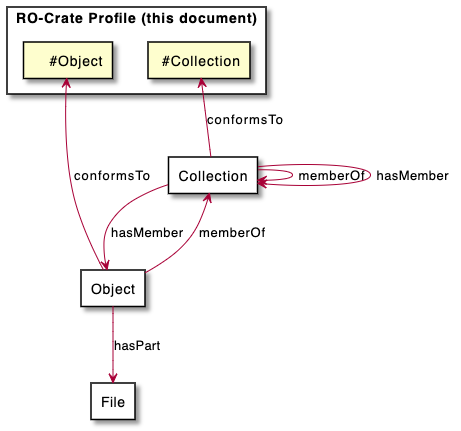
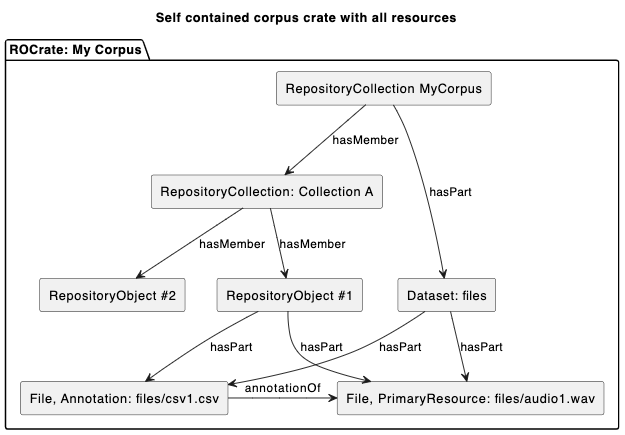
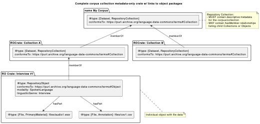
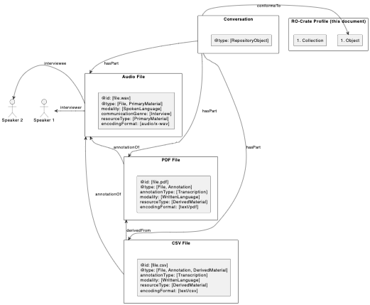
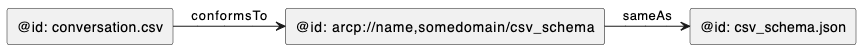

This document is a DRAFT RO-Crate profile for Language Data resources.
The profile specifies the contents of an RO-Crate Metadata Document and
gives guidance on how to structure language data collections both at the
RO-Crate package level and in a repository containing multiple packages.

This profile assumes that the principles and standards set out in the
Arkisto platform, or similar compatible approaches are being used.

The core metadata vocabularies for this profile are:

-   RO-Crate recommendations for data packaging and basic
    > discoverability metadata which is mostly Schema.org terms with a
    > handful of additions. Following RO-Crate practice, basic metadata
    > terms such as "who, what, where" and bibliographic-style
    > descriptions are chosen from schema.org (in preference to other
    > vocabularies such as Dublin Core or FOAF) where possible with
    > domain specific vocabularies used for things which are not common
    > across domains (such as types of language).

-   An updated version of the Open Language Archives community (OLAC)
    > vocabularies
    > [[http://www.language-archives.org]{.underline}](http://www.language-archives.org);
    > originally expressed as XML schemas. The new vocabulary is under
    > development under here:
    > [[https://purl.archive.org/language-data-commons/terms]{.underline}](https://purl.archive.org/textcommons/terms)

# Audience

This document is primarily for use by tool developers, data scientists
and metadata specialists developing scripts or systems for user
communities; this document is not intended for use by non-specialists.

# About this profile

This profile covers various kinds of crate metadata:

-   **Structural** RO-Crate metadata - how does the root dataset link to
    > files, and what is the abstract structure of nested collections
    > (eg collections/corpora or other curated datasets) and objects or
    > study; linguistic Items, Sessions or Texts). This profile assumes
    > that a repository (for example, an OCFL storage root, with an API
    > for accessing it) exists and that it can at a minimum support (a)
    > listing all items of the repository and returning their RO-Crate
    > metadata, and (b) retrieving an item given its ID. See [[Appendix
    > 1: Building and index or map of a repository that follows the
    > specifications here]{.underline}](#_r0r0md9rpt0u).

-   T**ypes of language data** - is this resource a dialogue? A written
    > text? A transcript etc - which file has which kind of data in it?
    > What is inside CSV and other structured files?

-   **Contextual metadata** - how to link people who had speaking,
    > authoring, collection roles, places, subjects.

Just as we would not expect repository users to type in DublinCore
metadata in XML format by hand we do not expect our users to have to
deal directly with the JSON-LD presented here, this document is for tool
developers to build systems that crosswalk data from existing systems,
or allow for user-friendly data entry.

# Structural metadata

The structural elements of a Text Commons RO-Crate are:

-   A Collection / Object hierarchy to allow language data to be
    > grouped - for example a corpus with sub-corpora, or collections of
    > items from a region or collection for data collected in the field.

-   Dataset and File entities (as per RO-Crate). Files may be referenced
    > locally or via URI - eg from an API. If an RO-Crate contains files
    > they MUST be linked to the root dataset using hasPart
    > relationships as per the RO-Crate specification.

NOTE: The terms Collection and Object are used here for brevity - these
are encoded in RO-Crate metadata using RepositoryCollection and
RepositoryObject types respectively. These in turn are re-named versions
of the Portland Common Data Model types,
[[pcdm:Collection]{.underline}](https://pcdm.org/2016/04/18/models#Collection)
and
[[pcdm:Object]{.underline}](https://pcdm.org/2016/04/18/models#Object).

-   Conformant Text Commons Crates MUST describe either an Object or a
    > Collection.

-   An RO-Crate which conforms to this profile may contain at its top
    > level root dataset that conformsTo one of the following:
    > [[https://purl.archive.org/language-data-commons/profile#Collection]{.underline}](https://purl.archive.org/textcommons/profile#Collection)
    > or
    > [[https://purl.archive.org/language-data-commons/profile#Object]{.underline}](https://purl.archive.org/textcommons/profile#Object)

{width="4.802083333333333in"
height="4.489583333333333in"}

A collection such as a corpus may be stored in a repository or
transmitted either as

-   A **distributed** collection: a set of individual RO-Crates which
    > reference separate collection records with ONE Object and one
    > Collection per crate

-   A **bundled** single crate which contains all the Collection and
    > Object data.

Distributed Collections MAY reference member collections or Objects in
hasMember property but SHOULD NOT include descriptions of Objects that
are stored elsewhere in the repository.

{width="6.510416666666667in" height="4.53125in"}

Objects MUST be linked to collections using memberOf and MAY
additionally be linked to collections using hasMember references.

Which linking strategy is used is an implementation choice for
repository developers.

{width="7.067708880139983in"
height="3.37784886264217in"}

## Access control and licensing

Repositories MAY implement access control in whatever way is required
for their operations but this profile aims to specify a standard way to
specify licenses that is independent of the implementation of an access
control system.

Both Object and Collections SHOULD have an open license OR a
[[DataReuseLicense]{.underline}](https://purl.archive.org/language-data-commons/terms#DataReuseLicense)
linked via the license property.

+-----------+-----------------------------+-------+-------------------+
| **Prop**  | **Value**                   | **Mu  | **Notes**         |
|           |                             | st?** |                   |
+===========+=============================+=======+===================+
| @id      | A URI                       | MUST  | -   An identifier |
|           |                             |       |     > which can   |
|           |                             |       |     > be used to  |
|           |                             |       |     > match with  |
|           |                             |       |     > an          |
|           |                             |       |                   |
|           |                             |       |   > authorization |
|           |                             |       |     > system.     |
+-----------+-----------------------------+-------+-------------------+
| @type    | ["File",                   | MUST  |                   |
|           | "DataReuseLicense"]        |       |                   |
+-----------+-----------------------------+-------+-------------------+
|           |                             |       |                   |
+-----------+-----------------------------+-------+-------------------+

A DataReuseLicense SHOULD describe a document which is included in the
Crate and specify:

-   Indicate whether the metadata for the item may be made openly
    > available

-   Indicate whether the item may be full-text indexed (or otherwise
    > indexed) for discovery.

## When to choose collection-as-crate ("bundled") vs collection-in-multiple crates ("distributed")

-   Choose to use a single bundled crate for a collection when:

    -   The collection final and is expected to be stable, ie here is
        > negligible chance of having to withdraw any of its contents or
        > files

    -   The collection and all its files can easily be transferred in a
        > single transaction - say 20Gb total

    -   All the material in the corpus shares the same license for reuse

-   Split a collection into fragmented RepositoryCollection and
    > RepositoryObject crates - with one crate per repository object
    > when:

    -   The collection is not yet stable

        -   New items being added or changed.

        -   There is a chance that some data may have to be taken down
            > or withdrawn at the request of participants.

    -   The total size of the collection will present challenges for
        > data transfer.

    -   There is more than one data reuse license applicable.

## Collection (#Collection)

A collection is a group of related Objects. Examples of collections
include corpora, and sub-corpora, as well as aggregations of cultural
objects such as PARADISEC collections which bring together items
collected in a region or on a session with informants. This follows the
Alveo usage:

> Items [*Objects* in this model] are grouped into collections which
> might correspond to curated corpora such as ACE or informal
> collections such as a sample of documents from the AustLit archive
> ([[http://www.austlit.edu.au/]{.underline}](http://www.austlit.edu.au/)).

When an RO-Crate is used to package a collection which is part of
another Collection it MUST have a memberOf property which references a
resolvable ID (within the context of a repository or service) of the
parent Collection. The Collection MAY list its members in a hasMember
property, but this is not required.

The root dataset must have at least these @type values: ["Dataset",
"RepositoryCollection"]

### A RepositoryCollection:

- MUST have an @id property and the value must be a valid URI or "./"

- MUST have a type value of “RepositoryCollection” and MUST NOT have a type of “RepositoryObject”

- MUST have a single name value which is a string with one or more characters

- MUST have a conformsTo which references the Collection profile URL

- MUST have  a `datePublished` property (per RO-Crate) exactly one value which is a string that parses as ISO-8601 to the level of at least a year. E.g.: 2000, 2000-10, 2000-10-01T12:34:56+10

- MUST have at least one `description` value which is a string with one or more characters

- MUST have a `license` property which has a value which references a DataReuseLicense entity@id which is a URL and which 

- MUST have a `publisher` property (per RO-Crate) which MUST be have an ID which is a URL

- MAY have one or more references to Collection or Object entities, which may be included in the crate or have MUST have @id properties which are URIs

- MAY have a `modality` property which SHOULD be a reference to one or more of the Language Data Commons Modality Terms: SpokenLanguage,  WrittenLanguage,  Song,  Gesture,  SignLanguage,  WhistledLanguage (this information may be summarisable from collection members)

- MAY have a `linguisticGenre` property which is a reference to one or more of the Langauge Data Commons LinguistGenre Terms:  Formulaic, Thesaurus, Dialogue, Oratory, Report, Ludic, Procedural, Narrative, Interview, Drama, Informational (this information may be summarisable from collection members)

- MAY have a `language` property which is a reference to one or more Language items

## Objects (#Object)

An Object is a single unit linked to tightly related files for example -
a dialogue or session in a speech study, a work (document) in a written
corpus. This is based on work in Alveo which used the term *Item*:

> The data model that we have developed for the storage of language
> resources is built around the concept of an item which corresponds
> (loosely) to a record of a single communication event. An item is
> often associated with a single text, audio or video resource but could
> include a number of resources, for example the different channels of
> audio recording or an audio recording and associated textual
> transcript. Items are grouped into collections which might correspond
> to curated corpora such as ACE or informal collections such as a
> sample of documents from the AustLit archive
> (http://www.austlit.edu.au/).
>
> [[https://www.researchonline.mq.edu.au/vital/access/services/Download/mq:37347/DS01]{.underline}](https://www.researchonline.mq.edu.au/vital/access/services/Download/mq:37347/DS01)

The definition of an object is necessarily loose and needs to reflect
what data owners have chosen to do with their collections in the past.

If an RO-Crate contains a single Object the Root Dataset must have a
@type property of (at least) "Dataset" and "RepositoryObject" with a
conformsTo property pointing to the language-data-commons Object profile
(this document).

{

"@id": "arcp://name,some-corpus/item/1-001",

"@type": ["Dataset","RepositoryObject"],

"name": "Text 1-001",

"conformsTo": { "@id":
"[[https://purl.archive.org/language-data-commons/profile#]{.underline}](https://purl.archive.org/textcommons/profile#Object)Object"}

},

If an RO-Crate contains an entire collection then each Object SHOULD
have "RepositoryObject" as one of its @type values and conformsTo
property referencing this document. For example:

{

"@id": "arcp://name,some-corpus/corpus",

"@type": ["Dataset","RepositoryObject"],

"name": "Text 1-001",

"conformsTo": { "@id":
"[[https://purl.archive.org/language-data-commons/profile#Collection]{.underline}](https://purl.archive.org/textcommons/profile#Object)"}

},

Objects SHOULD have files (which may be included in an RO-Crate for the
object, or as part of a collection crate).

In this example the Object in question is an interview from a speech
corpus with three files - the diagram shows the relationships between
the object and its files (and the contextual metadata of a Person who
takes the role of the speaker/informant (discussed in more detail
below).

{width="5.427083333333333in" height="4.46875in"}

There are a number of terms that can be used to characterize resources -
these use the schema.org mechanism of DefinedTerm and DefinedTermSet.

### A RepositoryObject:

- MUST have a conformsTo which references the Collection profile URL

- MUST have  a `datePublished` property (per RO-Crate) exactly one value which is a string that parses as ISO-8601 to the level of at least a year. E.g.: 2000, 2000-10, 2000-10-01T12:34:56+10

- MUST have a `license` property with reference to an entity of type [File, DataReuseLicense] with an `@id` property that starts with `LICENSE.` and a `URL` property that is a valid URL

- MUST have a `publisher` property (per RO-Crate) which MUST be have an ID which is a URL

- MAY have a `language` property which is a reference to one or more Language items

- SHOULD have a hasPart property referencing at least one item of type [File, PrimaryMaterial] and MAY have [File, Annotation] and [File, DerivedMaterial] items which are inter-related using annotionOf, derivedFrom properties.

## Files

There are three important @types of files (or references to other
works) that may be included - PrimaryMaterial - which is a recording or
original text, or a citation of or proxy for it, DerivedMaterial which
has been generated from a PrimaryMaterial by a process such as format
conversion or digitization, and Annotation, which contains any kind of
analysis of the PrimaryMaterial or DerivedMaterial.

### PrimaryMaterial

PrimaryMaterial MAY be a video or audio file if it is available (see
[[example]](#paradisec-item)) or MAY be a ContextualEntity
referencing a primary text such as a book (see
[[example](#primarymaterial-as-a-contextual-entity)[)](#cooee-item)].

TODO: Add examples

#### A [File, PrimaryMaterial]:

- MUST have a @type value of “PrimaryMaterial" and MAY have other @type values

- MAY have a `modality` property which SHOULD be a reference to one or more of the Language Data Commons Modality Terms: SpokenLanguage,  WrittenLanguage,  Song,  Gesture,  SignLanguage,  WhistledLanguage (this information may be summarisable from collection members)

- MUST a language property, or the RepositoryObject that is `partOf` MUST have a language property, referencing a Language item (language my be inhereted from the parent RepoObject)

### DerivedMaterial

DerivedMaterial MAY be a down-sampled or excepted video or audio file
(see [[example]{.underline}](#paradisec-item)) or MAY be a
ContextualEntity referencing a primary text such as a book (see
[[example](#primarymaterial-as-a-contextual-entity)[)](#paradisec-item)].

#### a [File, DerivedMaterial]:

- MUST have a @type value of “DerivedMaterial" and MAY have other @type values

- MAY have a `modality` property which SHOULD be a reference to one or more of the Language Data Commons Modality Terms: SpokenLanguage,  WrittenLanguage,  Song,  Gesture,  SignLanguage,  WhistledLanguage (this information may be summarisable from collection members)

- MUST a language property, or the RepositoryObject that is `partOf` MUST have a language property, referencing a Language item (language my be inhereted from the parent RepoObject)

- SHOULD have a derivedFrom property which references a PrimaryMaterial entity

### Annotation

An annotation is a description or analysis of other material. More than one type of annotation may be present in a file.

#### a [File, Annotation]:

- MUST have a @type value of “Annotation" and MAY have other @type values

- MAY have an `annotationType` property which SHOULD be a reference to one or more of the Language Data Commons Modality Terms: SpokenLanguage,  WrittenLanguage,  Song,  Gesture,  SignLanguage,  WhistledLanguage (this information may be summarisable from collection members)

- SHOULD have an `annotationOf` property which references another entity

## Languages

### A [Language] entity:

- MUST have an @id property and the value must start with `https://collection.aiatsis.gov.au/austlang/language/` or `https://glottolog.org/resource/`

## Places

TODO: Paradisec example

# Identifiers

Identifiers for Objects and Collections MUST be URIs - HTTP URIs SHOULD
be used but if that is not possible ARCP identifiers SHOULD be used.

Internally, identifiers for all entities that do not have their own URIs
MAY use the arcp scheme - which allows for a DNS-like namespacing of
identifiers. For example for the Sydney Speaks corpus the top level
collection would have the ID:

> arcp://name,[[http://www.dynamicsoflanguage.edu.au/sydney-speaks/corpus/]{.underline}](http://www.dynamicsoflanguage.edu.au/sydney-speaks/corpus/sydney-speaks)

A sub-corpus (collection) would have an ID like:

> arcp://name,[[http://www.dynamicsoflanguage.edu.au/sydney-speaks/corpus/collection/]{.underline}](http://www.dynamicsoflanguage.edu.au/sydney-speaks/corpus/sydney-speaks)SSP
> (TODO PROPER URI)

An object:

> arcp://name,[[http://www.dynamicsoflanguage.edu.au/sydney-speaks/corpus/object/]{.underline}](http://www.dynamicsoflanguage.edu.au/sydney-speaks/corpus/sydney-speaks)331(TODO
> PROPER URI)

A person:

> arcp://name,[[http://www.dynamicsoflanguage.edu.au/sydney-speaks/corpus/]{.underline}](http://www.dynamicsoflanguage.edu.au/sydney-speaks/corpus/sydney-speaks)person/TODO

Optionally, an arcp:// may have a version parameter ?version=2

## How to record people's contributions

Some corpora express ages and other demographics of participants - this
presents a modeling challenge as age and some other variables change
over time so if the same person appears over time then we need to have a
base Person with DoB etc and then time-based instances of the person
with an age, social status, gender etc AT THAT TIME.

There are three levels at which contributions to an object can be
modeled:

1.  Include one or more Person items as context in a crate and reference
    > them with properties such as schema:creator or the
    > language-data-commons contribution properties such as txc:compiler
    > or txc:depositor. The @id of the person MUST be a URI and SHOULD
    > be re-used where the same person appears in multiple objects in a
    > collection or repository.

2.  For longitudinal studies where it is important to record changing
    > demographic information for a Person, or where precision is
    > required in listing contributions to a work use
    > txc:ContributingPerson (new Class being proposed by Peter Sefton).
    > See the example in SydneySpeaks (TODO).

3.  If it is important to record lots of contributions to a work (eg in
    > analysis of a joint work) use schema:Action If more precision is
    > required in describing the provenance of items - eg this work on
    > [[The declaration of the rights of man and of the
    > citizen]{.underline}](https://www.uts.edu.au/about/faculty-design-architecture-and-building/staff-showcase/writing-rights)
    > (Lorber-Kasunic & Sweetapple ), showing contributions over time
    > such as edits, then we can use Actions - this approach is used by
    > preservation systems to keep track of contributions over time - it
    > can help to describe how a resource has been created and updated
    > in a series of events.

> NOTE: if this approach is used special care will have to be taken in
> developing user interfaces and/or training communities to use this way
> of modelling metadata - the user need not see the underlying
> structure. This profile does not give advice about how to do this as
> we have not seen a use case that requires it.

## Collection events such as "Sessions"

Where data is collected from participants in a speech study with
elicitation tasks such as "sessions" (see this [[IMDI
document]{.underline}](https://www.mpi.nl/ISLE/documents/draft/ISLE_MetaData_2.5.pdf))
or field interviews this can be recorded in metadata via the
CollectionEvent class.

TODO:

Elicitation tasks and collection protocols

To specify the protocol for collecting data

collectionProtocolType: Elicitation Task, CorpusCriteria (eg how
documents were selected TODO: make a set of DefinedTerms for these.

# Describing the columns in CSV or other tabular data

CSV or similar tabular files are often used to represent transcribed
speech or sign language data, sometimes also with time codes. To enable
automated location of which column is which, use a [[frictionless Table
Schema:]{.underline}](https://specs.frictionlessdata.io/table-schema/)

For example a file called art_schema.json:

  -----------------------------------------------------------------------------
  {     
  ----- -----------------------------------------------------------------------
        "fields": [

        {

        "name": "Person",

        "type": "string",

        "format": "default",

        "rdfType": "http://schema.org/Person"

        },

        {

        "name": "Speech",

        "type": "string",

        "format": "default",

        "rdfType":
        "https://purl.archive.org/language-data-commons/terms#Orthography",

        "description": "This column contains transcribed speech"

        },

        {

        "name": "events",

        "type": "any",

        "format": "default"

        }

        ],

        "missingValues": [

        ""

        ]

        }
  -----------------------------------------------------------------------------

The schema should be included in every Object stored in a repository,
whether the Collection is being stored as a bundled crate, in which case
there need only be one copy of the schema file or a fragmented crate
where there will be one per repository object.

A csv file that uses this profile MUST reference a Contextual Entity for
the schema (TODO: paste in actual examples from ART here.

{width="8.979166666666666in"
height="0.5208333333333334in"}

{

"@id": "conversation1.csv",

"@type" :["File"],

"encodingFormat": "text/csv",

"name": "Transcript of conversation 1".

"conformsTo": {"@id" : "arcp://name,ausnc.ary/csv_schema")

}

{

"@id": "arcp://name,ausnc.ary/csv_schema", ← REPOSITORY-UNIQUE NAME

"Type": "CreativeWork",

"Name": "Frictionless Table Schema for CSV transcription files in the
ART corpus"

"sameAs": "art_schema.json". ← Reference to the schema file above TODO:
is this the best link?

"conformsTo": {"@id" :
"https://specs.frictionlessdata.io/table-schema/")

}

{

"@id": "art_schema.json",

"@type" :["File"],

"encodingFormat": "text/csv",

"name": "Frictionless Table Schema **file** for CSV transcription files
in the ART corpus".

"conformsTo": {"@id" :
"https://specs.frictionlessdata.io/table-schema/")

}

## 

The indirection in this conforms-to relationship is to allow multiple
objects to have a conformsTo property which indicates that they conform
to the *same* schema while having a local copy of the schema, as per
RO-Crate best practice of having all local context to use a data
packages in the package where possible.

# References

Himmelmann, Nikolaus P. 2012. Linguistic data types and the interface
between language documentation and description. *Language documentation
& conservation*. University of Hawai'i Press 6. 187--207.

Paterson, Hugh Joseph. 2021. *Language Archive Records: Interoperability
of Referencing Practices and Metadata Models*. United States -- North
Dakota: The University of North Dakota M.A.
[[https://www.proquest.com/docview/2550236802/abstract/22686A0E508D4E5CPQ/1]{.underline}](https://www.proquest.com/docview/2550236802/abstract/22686A0E508D4E5CPQ/1)
(3 May, 2022).

# EXAMPLES

## PrimaryMaterial as a contextual entity

This example comes from COOEE, where the primary text

{

'@type' :[ 'CreativeWork', "PrimaryMaterial"],

partOf: { '@id': 'arcp://name,cooee-corpus/work/Hale1950' },

name: 'Hale, 1950',

'@id': 'arcp://name,cooee-corpus/work/Hale1950p120-27',

pageStart: '120',

pageEnd: '127'

},

{

'@type': 'CreativeWork',

author: 'Hale, John,',

datePublished: '1950',

name: 'Settlers: Being Extracts from the Journals and letters of early
colonists in Canada, Australia, South Africa and New Zealand,',

publisher: 'London: Faber & Faber.',

wordCount: '17,598',

'@id': 'arcp://name,cooee-corpus/work/Hale1950'

}

### PARADISEC Item

{

"@id": "NT1-004-004A.eaf",

"@type": ["File","Annotation"],

"contentSize": 115784,

"dateCreated": "2016-08-01T06:00:06.000Z",

"dateModified": "2019-04-11T15:04:12.000Z",

"encodingFormat": "application/xml",

"name": "NT1-004-004A.eaf",

"doi": "10.4225/72/579F720F4898C",

"essenceId": 1100497,

"annotationOf": [ { "@id": "NT1-004-004A.wav" }]

},

{

"@id": "NT1-004-004A.mp3",

"@type": ["File", "DerivedMaterial"],

"bitrate": 128007,

"contentSize": 45150336,

"dateCreated": "2012-09-27T10:08:00.000Z",

"dateModified": "2019-11-29T08:09:15.000Z",

"duration": 2821.73,

"encodingFormat": "audio/mpeg",

"name": "NT1-004-004A.mp3",

"channels": 2,

"doi": "10.4225/72/575C6E9CC9B6A",

"essenceId": 1010232,

"sampleRate": 44100,

derivedFrom: [ { @id: NT1-004-004A.wav }]

},

{

"@id": "NT1-004-004A.wav",

"@type": [ "File", "PrimaryMaterial"],

"bitrate": 4608000,

"contentSize": 1625299802,

"dateCreated": "2012-09-27T10:08:00.000Z",

"dateModified": "2019-11-29T08:13:31.000Z",

"duration": 2821.7,

"encodingFormat": "audio/x-wav",

"name": "NT1-004-004A.wav",

"channels": 2,

"doi": "10.4225/72/575C6EA269CE2",

"essenceId": 1010233,

"sampleRate": 96000,

"hasAnnotation": { "@id": "NT1-004-004A.eaf" }

},

### Example: Sydney Speaks

Example: Farms To Freeways

{

"@id":
"arcp://name,farms-to-freeways/interview-item/arcp://name,farms-to-freeways/collection/transcriptofinterviewwithjuditheastwell",

"@type": "RepositoryObject",

"name": "Interview with Judith Eastwell",

"speaker": {

"@id": "arcp://name,farms-to-freeways/collection/joywillis"

},

"hasPart": [

{

"@id": "files/530/original_80ded52c7051eaccb29939c8d829b92b.mp3"

},

{

"@id": "files/430/original_6475a7d80e7124941f0039730e570c04.pdf"

},

{

"@id": "files/430/original_6475a7d80e7124941f0039730e570c04.csv"

}

],

"conformsTo":
"https://purl.archive.org/language-data-commons/profile#Object",

"dateCreated": "1992-03-05",

"interviewer": "Robyn Arrowsmith",

"publisher": "University of Western Sydney",

"license": "Content in the Western Sydney Women's Oral History
Project: From farms to freeways collection is licensed under a Creative
Commons CC BY 3.0 AU licence
(https://creativecommons.org/licenses/by/3.0/au/).",

"contentLocation": {

"@id": "http://omeka.uws.edu.au/farmstofreeways/api/geolocations/10"

},

"description": "Judith Eastwell was born on 14th September, 1945, and
lived in Quakers Hill from age 2. Judith's father was the Postmaster at
Quakers Hill post office from about 1950 onwards. Judith married and had
six children, and eventually took over as Postmistress at Quakers
Hill.",

"language": {

"@id": "https://www.ethnologue.com/language/eng"

},

"encodingFormat": "audio/MPEG",

"linguisticGenre": {

"@id": "txc:Interview"

},

"indexableText": {

"@id": "files/430/original_6475a7d80e7124941f0039730e570c04.csv"

}

},

{

"@id": "files/430/original_6475a7d80e7124941f0039730e570c04.csv",

"@type": [

"File",

"Annotation"

],

"name": "Transcript of interview with Judith Eastwell full text
transcription (CSV)",

"encodingFormat": "text/csv",

"annotationType": [

{

"@id": "txc:Transcription"

},

{

"@id": "txc:TimeAligned"

}

],

"modality": {

"@id": "txc:Orthography"

},

"annotationOf": {

"@id": "files/530/original_80ded52c7051eaccb29939c8d829b92b.mp3"

},

"language": {

"@id": "https://www.ethnologue.com/language/eng"

},

"csvw:tableSchema": {

"@id": "#dialog_schema"

},

"size": 58117

},

TODO:
[[https://www.mpi.nl/ISLE/documents/docs_frame.html]{.underline}](https://www.mpi.nl/ISLE/documents/docs_frame.html)
